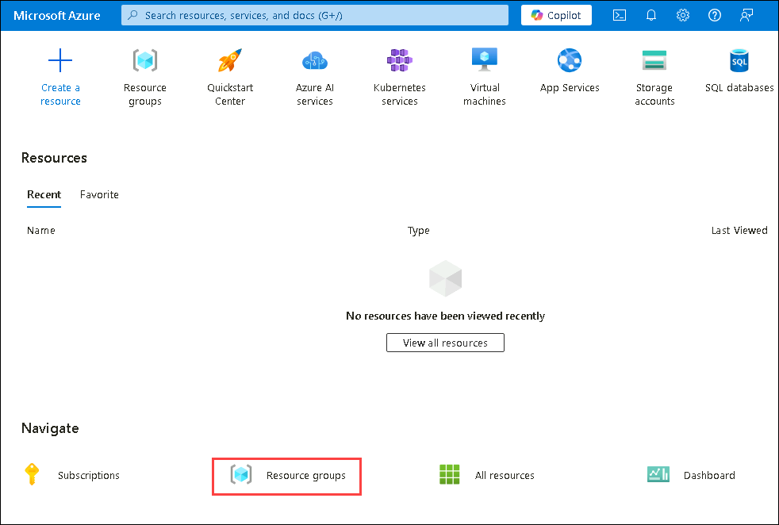
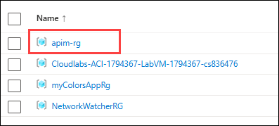
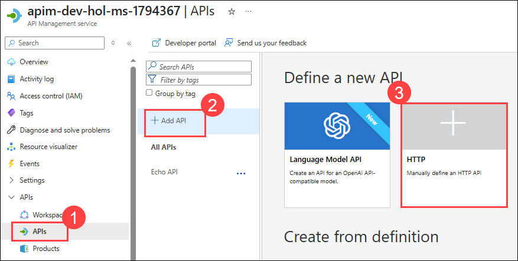
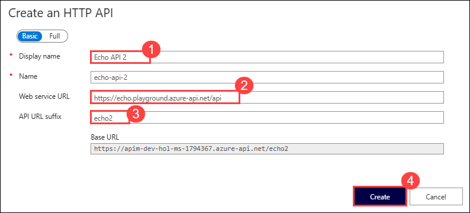
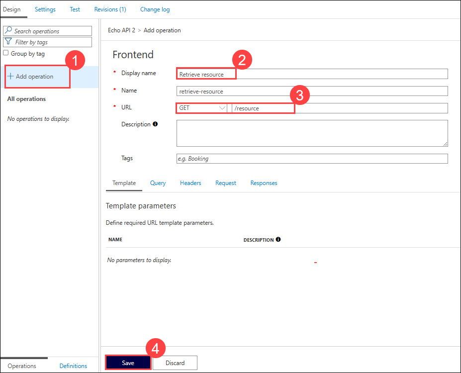
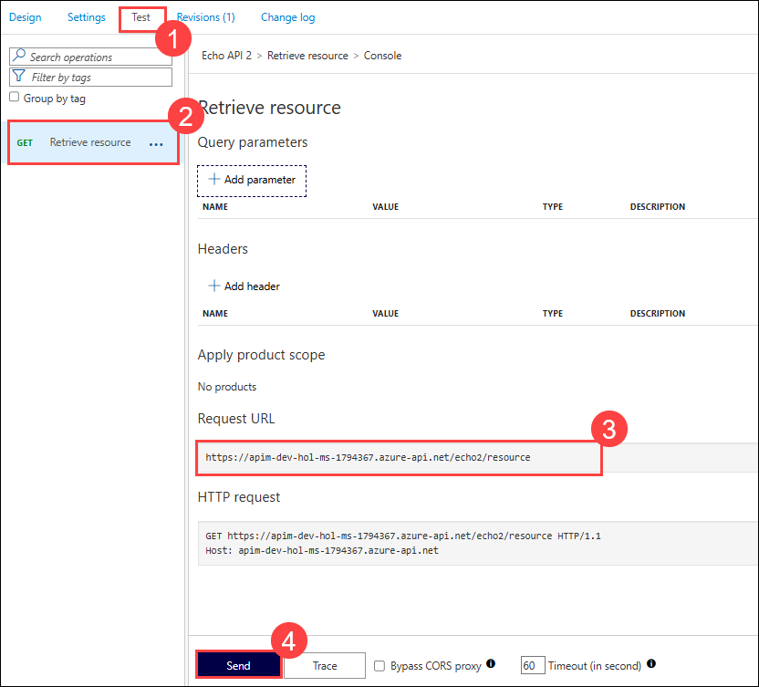
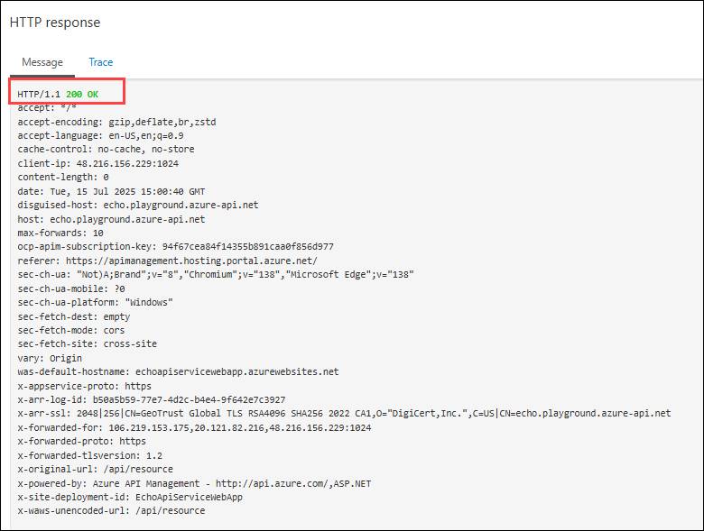
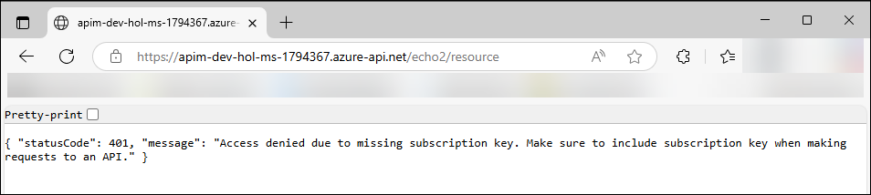
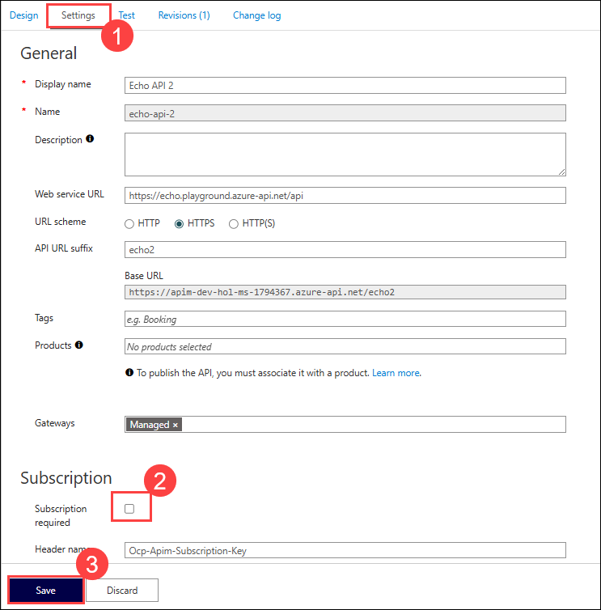
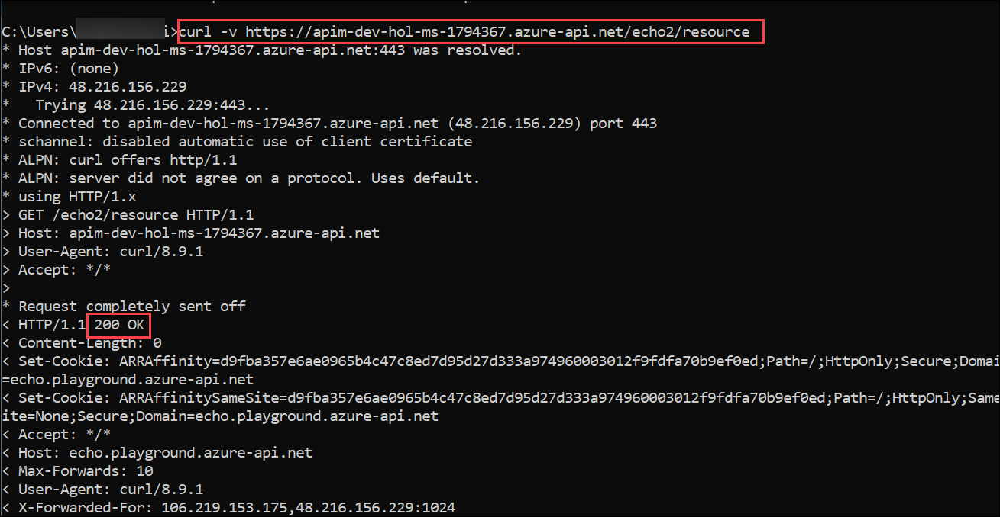

# Exercise 1: Verify API Management Instance

### Estimated Duration: 30 minutes

## Lab Overview

APIs enable digital experiences, simplify application integration, underpin new digital products, and make data and services reusable and universally accessible. With the proliferation and increasing dependency on APIs, organizations need to manage them as first-class assets throughout their lifecycle.
Azure API Management helps customers meet these challenges:

- Abstract backend architecture diversity and complexity from API consumers
- Securely expose services hosted on and outside of Azure as APIs
- Protect, accelerate, and observe APIs
- Enable API discovery and consumption by internal and external users

## Lab objectives

In this lab, you will perform:

- Task 1: Verifying the Azure API Management instance 

## Task 1: Verifying the Azure API Management instance 

Azure API Management instance has already been pre-deployed as part of the deployment for this lab.

1) Navigate to the **resource groups** in the Azure Portal and select the **apim-rg** resource group.

   

   

3) On the resource groups **apim-rg**, select API Management service resource type with name **apim-dev-hol-ms-<inject key="Deployment ID" enableCopy="false" />**. 
   
   

   > **Note:** Please verify that the Azure API Management instance functions correctly by following these steps:

      - Select the **APIs (1)** blade, click on **+ Add API (2)** and select **HTTP (3)**.

           

      - On the **Create and HTTP API** tab, enter the below values and select **Create (4)**.
   
          |  **Option**        | **Value**            |
          | ------------------ | -------------------- |
          | Display name       | Echo API 2 **(1)** |
          | Web service URL    | **https://echo.playground.azure-api.net/api** **(2)**|
          | API URL suffix     | **echo2** **(3)**|

           

      - On the Echo API 2, select **+ Add operation (1)**, to add a Get operation in the API, and enter the below details and click on **Save (4)**.
        
          |  **Option**        | **Value**            |
          | ------------------ | -------------------- |
          | Display name       | **Retrieve resource** **(2)** |
          | URL                | **GET /resource** **(3)**|

           

      - On the Echo API 2, press the **Test (1)** tab, then select the **GET Retrieve resource (2)** operation and note the **Request URL (3)** in a text editor for later use.
     
      - Press **Send (4)** to issue a simple request.  

           

      - Scroll down and observe the `200` Success HTTP response.  

           

You have successfully confirmed that Azure API Management is now set up!

## Verification Failure (and Path to Success)

You may have noticed the *Request URL* and may be tempted to put it in your browser, issue a CURL statement, etc. If you do, you may see a `401` error and wonder what's happening.

   

1. The reason for this unauthorized access status code is that the *Echo API* requires a subscription key to be set. Whereas tests originating in Azure API Management account for this automatically, external callers cannot (and, naturally, should not).

1. Navigate back to APIM in the portal, switch to the **Settings (1)** tab, uncheck **Subscription required (2)**, and press **Save (3)** at the bottom of the page.

1. Subscriptions are important and useful, but in this case, we just want to verify the Azure API Management instance is working as intended.

   

1. Now there should be no error when you access the link in your browser. In fact, in order to verify the 200, it's easiest to open your Developer Tools (F12), navigate to the **Network** tab, and look at **All** requests to see the 200.

   

1. Alternatively, search for the **Command Prompt (1)** in the **windows search bar**, Open the **Command Prompt (2)** and paste the command mentioned below you can issue a verbose (`-v`) CURL command against the **Echo API** and observe the `200` Success:

   ```
   curl -v https://apim-dev-hol-ms-<inject key="Deployment ID" enableCopy="false" />.azure-api.net/echo2/resource
   ```

   
     
   

   > **Congratulations** on completing the task! Now, it's time to validate it. Here are the steps:
   > - If you receive a success message, you can proceed to the next task.
   > - If not, carefully read the error message and retry the step, following the instructions in the lab guide. 
   > - If you need any assistance, please contact us at cloudlabs-support@spektrasystems.com. We are available 24/7 to help you out.

      <validation step="a68aef90-9b22-4d42-98cb-9ea25d35a217" />

## Summary

In this exercise, you verified the setup and functionality of the Azure API Management instance by testing the Echo API and handling any issues related to subscription keys. This ensures that your API management environment is correctly configured and ready for further use. You are now prepared to proceed to the next exercise to deepen your understanding and management of APIs.

### You have successfully completed the lab. Click on **Next >>** to proceed with the next exercise.
