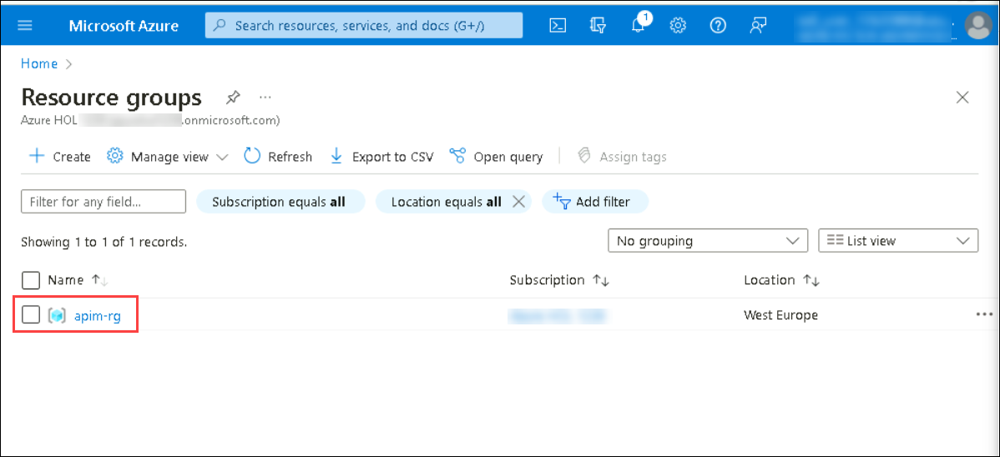

# Exercise 1: Create an API Management instance

Azure API Management instance has already been pre-deployed as part of the deployment for this lab.

1) Navigate to the resource groups in the Azure Portal and select the **apim-rg** resource group.

   

3) Select **apim-dev-hol-ms-<inject key="Deployment ID" enableCopy="false" />**
   
   
## Task 1: Verifying the Azure API Management instance

Please verify that the Azure API Management instance functions correctly by following these steps:

1) Navigate to the newly-created Azure API Management instance in the Azure Portal.  
2) Select the **APIs** blade, then select the *Echo API*.   
3) Press the **Test** tab, then select the **GET Retrieve resource** operation.  
4) Press **Send** to issue a simple request.  

  

5) Observe the `200` Success response.  

  

At this time you have successfully verified that Azure API Management is set up!

### Verification Failure (and Path to Success)

You may have noticed the *Request URL* and may be tempted to put it in your browser, issue a CURL statement, etc. If you do, you may see a `401` error and wonder what's happening.

The reason for this the unauthorized access status code is that the *Echo API* requires a subscription key to be set. Whereas tests originating in Azure API Management account for this automatically, external callers cannot (and, naturally, should not).

Back in APIM, switch to the **Settings** tab and uncheck **Subscription required** and press **Save** at the bottom of the page.

> Subscriptions are important and useful, but in this case, we just want to quickly verify the Azure API Management instance is working as intended.

Accessing the link in your browser should now show you no error message. In fact, in order to verify the 200, it's easiest to open your Developer Tools (F12), navigate to the **Network** tab, and look at **All** requests to see the 200.

Alternatively, you can issue a verbose (`-v`) CURL command against the **Echo API** and observe the `200` Success:
`curl -v https://<your azure api management instance>.azure-api.net/echo/resource?param1=sample`

