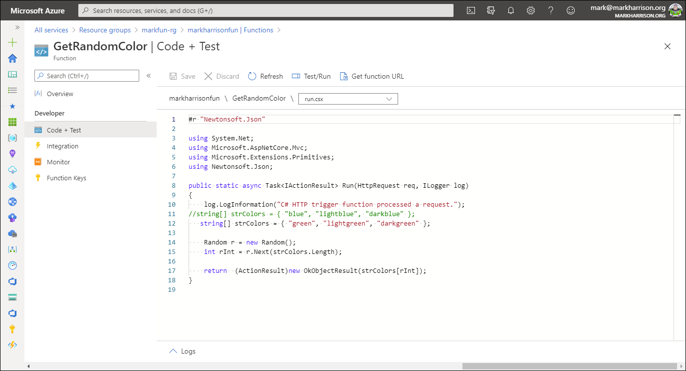
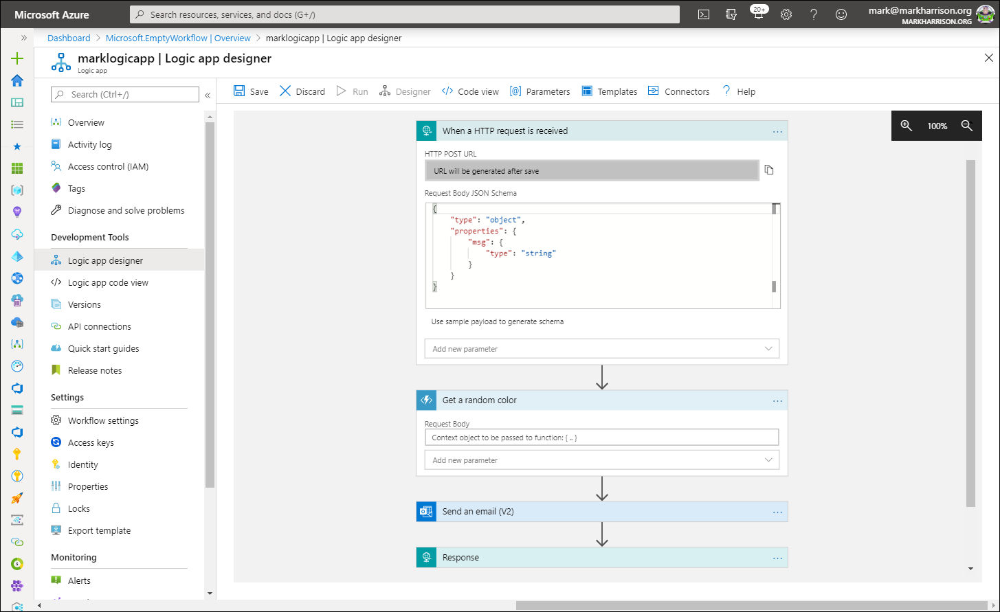

## Task 3: API Proxy to Serverless

Azure Serverless (Functions and Logic Apps) can be configured to benefit from the advantages of Azure API Management.

### Task 3.1: Azure Functions

- Create a simple function that is Triggered by an HTTP Request

Example:



```c#
    //string[] strColors = { "blue", "lightblue", "darkblue" };
    string[] strColors = { "green", "lightgreen", "darkgreen" };

    Random r = new Random();
    int rInt = r.Next(strColors.Length);

    return  (ActionResult)new OkObjectResult(strColors[rInt]);
```

Lets add the function to Azure API Management. In the API blade select [+Add API] and the [Function App] tile


- Select the [Browse] button to get a list of Functions in the subscription


- Select the Function App and then the Function


- Amend the Names / Descriptions, URL suffix and select the Products


- As previously add CORS policy

- Validate the function works - either from the Azure management portal or the developer portal


### Task 3.2: Azure Logic Apps

- Create a simple logic app that is Triggered by an HTTP Request

Example:




Use the following sample message to generate the schema of the Request body payload.  By specifying the schema, the individual fields (in this case `msg`) can be extracted and referred to in the subsequent logic

```json
{
  "msg": "text"
}
```

Lets add the function to API Managament. In the API blade select [+Add API] and the [Logic App] tile


- Select the [Browse] button to get a list of Logic Apps in the subscription


- Select the Logic App


- Amend the Names / Descriptions, URL suffix  and select the Products


 As previously add CORS policy

- Validate the Logic App works - either from the Azure management portal or the developer poral


- Check the Logic App audit


- Check the email was sent


