# Exericse 9 Task 4: Self-hosted Gateway

In this task, we will explore the Self-hosted Gateway feature of Azure API Management (APIM).

With the Azure API Management self-hosted gateway, organizations have the ability to deploy an instance of the Azure API Management gateway component to the environments where they host their applications and/or APIs - for example, in an on-premise data center.

The self-hosted gateways are hosted in a Docker or Kubernetes environment and are managed from the Azure API Management service they are connected to.

This part of the lab requires that the user has Docker Desktop installed. we have already pre-installed Docker Desktop in the Jump VM.

There are two terms to become familiar with:

- Gateway Deployment ... This is a set of Azure API Management configuration details that will be used by the Gateway Node(s)
- Gateway Node ... This is a running instance of an Azure API Management gateway proxy i.e. a containerized instance of the gateway

There can be multiple Gateway Deployments and multiple Gateway Nodes.  The Gateway Deployments are chargeable - the Gateway Nodes are free i.e. an organization pays for the management control plane, but the compute is free (you are running on the organization's own hardware)

### Task 4.1: Deploy the Self-hosted Gateway

1. In the **API Management service**, select the **Self-hosted Gateways** **(1)** option from the menu under **Deployment + infrastructure**, and click **+ Add** **(2)**

    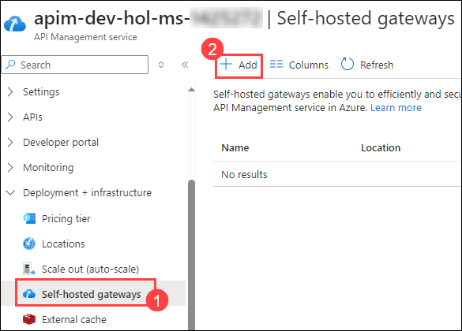

1. On the **Gateway** page, enter the following details:

    - Name - **OnPremiseGateway** **(1)**
    - Location - **OnPremise** **(2)**
    - Under API, click on **+** and select the required APIs from those that are configured in the Azure API Management instance
    - Our lab will use the **Colors API** **(3)** - this was configured in an earlier module
    - Click on **Add** **(4)** button

      

1. The added Gateway will appear in the list.

   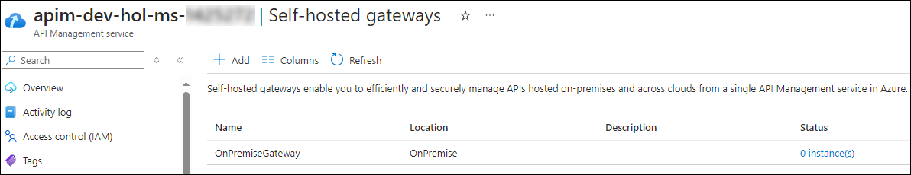

1. Select the **OnPremiseGateway** gateway from the list, and a blade will appear allowing for further configuration.

1. From the left side menu, under Settings, select the **Deployment (1)** option.

    >**Note:** Here you can find the scripts for deploying on Docker and Kubernetes, for this lab, we will be using the Docker option.

1. Download the **env.conf (2)** file by clicking on it as shown in the below image, and it will be saved automatically in the following path: `C:/Users/demouser/Downloads`.

1. Copy the Docker run command under Deployment scripts.
  
    ```text
    docker run -d -p 80:8080 -p 443:8081 --name OnPremiseGateway --env-file env.conf mcr.microsoft.com/azure-api-management/gateway:v2
    ```

    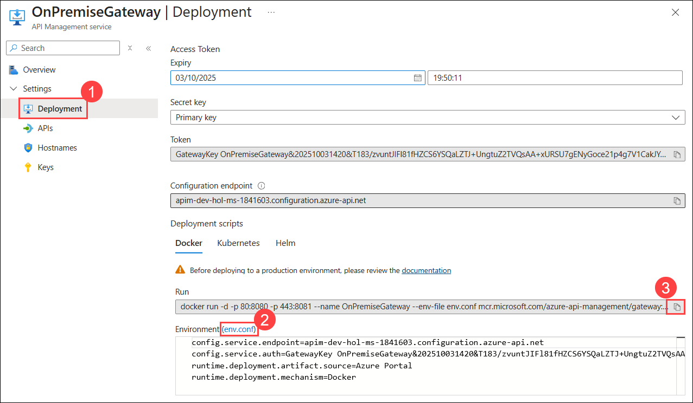  

1. Launch Docker Desktop by using the shortcut available on the Lab VM desktop. After launching Docker Desktop, **accept the terms**, click **Continue without signing in**, and **skip** the survey. Docker Engine may take about 2-3 minutes to start. 

    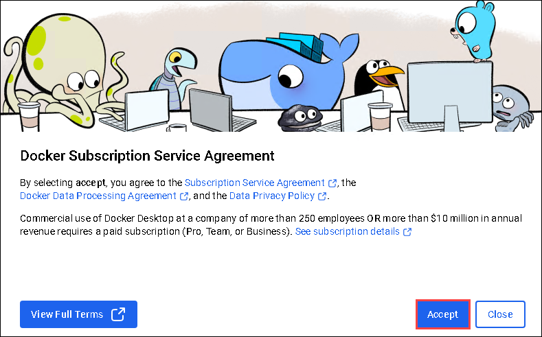    

1. Minimize Docker Desktop and then open the PowerShell in the Lab VM and run the following commands:

    - Navigate to the location where the *env.conf* is located:

      ```
      cd C:/Users/demouser/Downloads
      ```
      ```
      cat env.conf
      ```

    - Run the Docker run command

      ```
      docker run -d -p 80:8080 -p 443:8081 --name OnPremiseGateway --env-file env.conf mcr.microsoft.com/azure-api-management/gateway:v2
      ```

      >**Note:** The first time this is executed, it will need to pull down the Docker image. So there will be a small delay.  Subsequently - if restarted - it will just use the downloaded image.

1. Navigate to the **Gateway** in Azure portal, we can see the status in thr **Overview** page.. It will show there is one healthy Gateway Node connected to the Deployment. The Gateway Node will keep in sync, and be automatically updated should any of the Gateway Deployment config changes.

    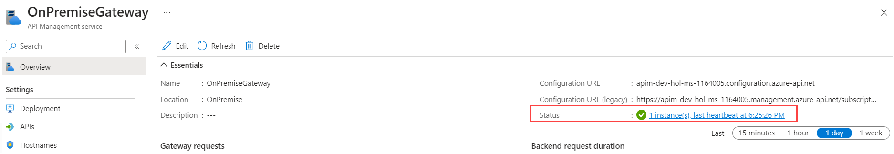

## Task 4.2: Testing the API

1. Navigate back to the **APIM instance**, click on **Subscriptions (1)** under **APIs** from left pane. Click on the ellipsis **... (2)** (three dots) next to the **Unlimited** subscription and select **Show/hide keys (3)**.

    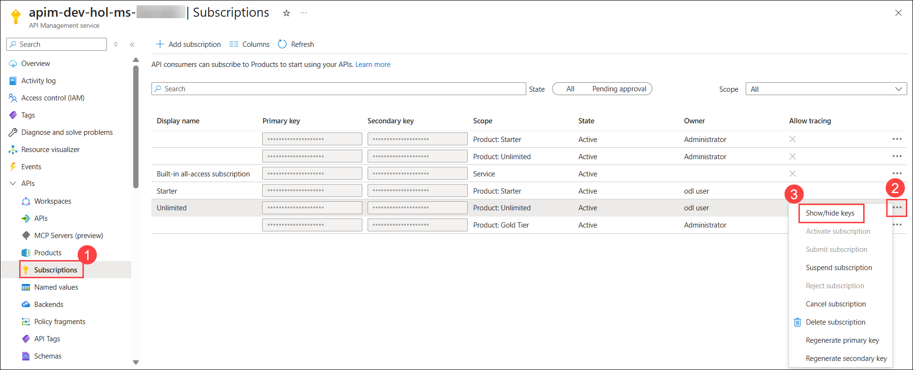

1. Click on the copy icon to copy the **primary key** and paste it into Notepad for later use.

    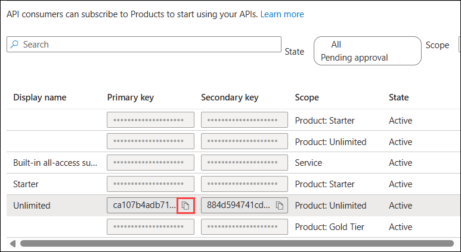
  
1. In the Notepad, copy the below URL and replace **Unlimited-Key** with the primary key that you copied in the revious step.

    ```  
    https://localhost/colors/random?key=Unlimited-Key
    ```

    

1. We will be using Postman to test the API. Open **Postman** using the shortcut on the Lab VM desktop and click on **Create an account**.

1. Postman will open in web browser to create the account. Use the **Work email: <inject key="AzureAdUserEmail"></inject>** and **Password: <inject key="AzureAdUserPassword"></inject>**, log in to the postman.

    > **Note**: If you encounter an error like **"Only alphanumeric characters and hyphens are allowed,"** remove any **'*'** or other special characters from the user name.

    > **Note:** If Postman prompts for an OTP during login, go to [**Outlook.com**](https://outlook.com), click **Sign in**, and use the **Username: <inject key="AzureAdUserEmail"></inject>** and **Password: <inject key="AzureAdUserPassword"></inject>** to access the inbox and retrieve the OTP code.

    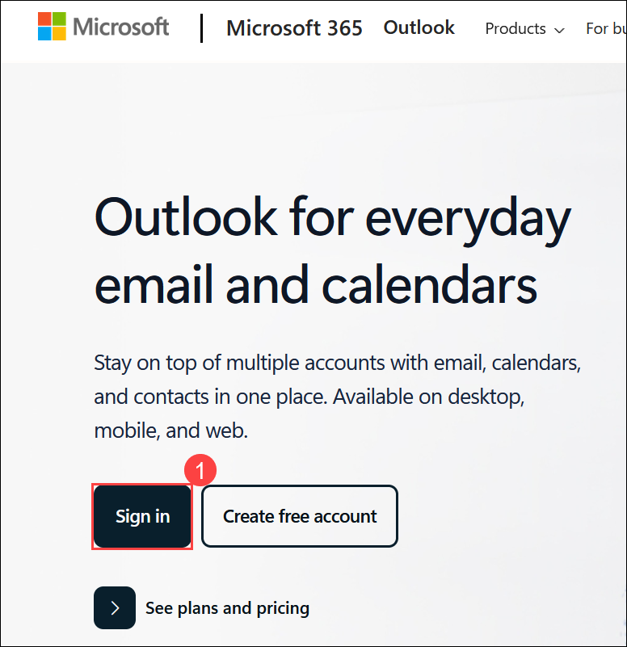 

1. After successful sign in, it will open the Postman app on desktop. On the **Welcome to Postman!** page, enter **Odl_User (1)** as **your name**, select your role (2), and click on **Continue (3)**. Click on **Continue with free plan**.

    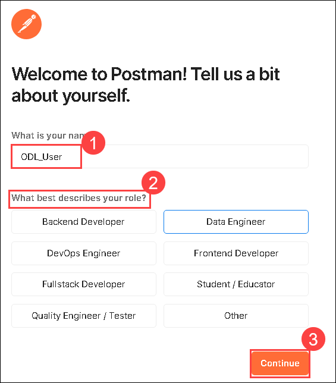


1. Inside the **Postman**, click on **Workspaces (1)** drpo-down and select **odl-user- (2)** workspace

    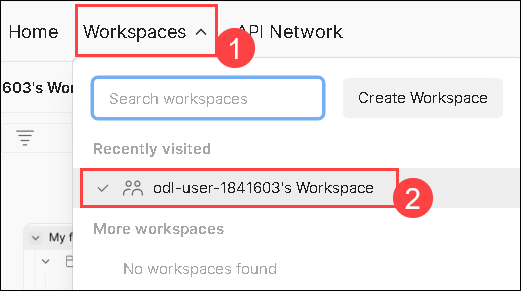

1. On the **My Workspace** page, select **New (1)** and select **HTTP (2)**.

    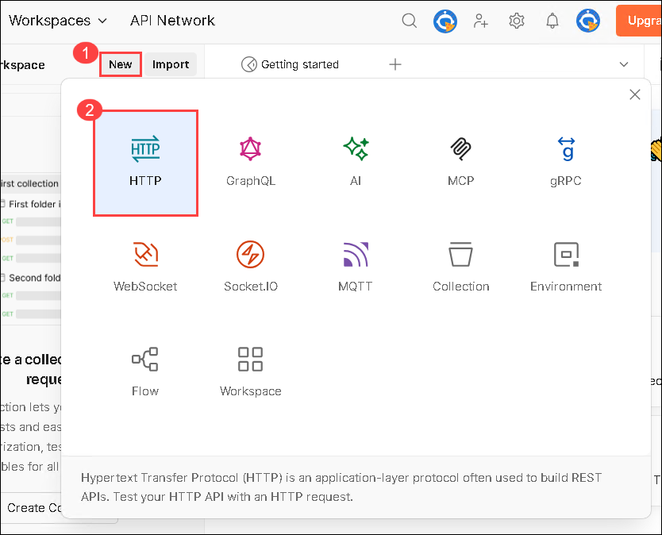

1. Now, in the **Enter URL or paste text (1)**, enter the URL you copied earlier and select **Send (2)**. Observe the response (3).

    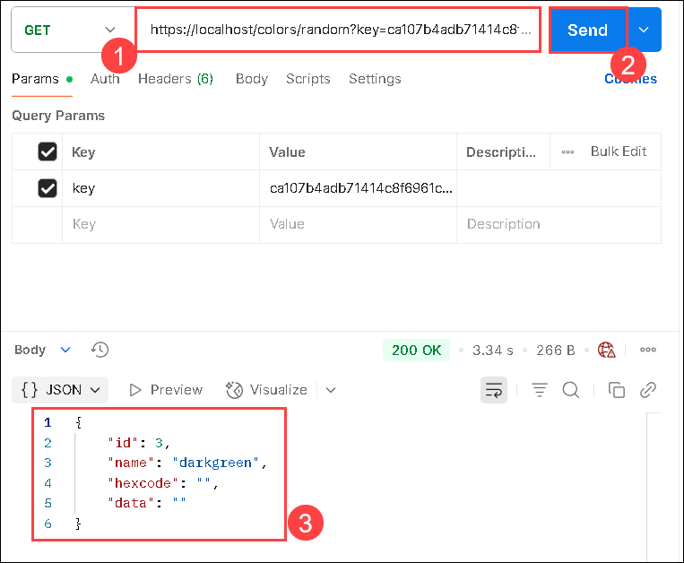


### Summary

In this task, you have deployed a self-hosted gateway for Azure API Management, enabling the hosting of API gateway nodes in Docker or Kubernetes environments. Then you have configured the gateway deployment, downloaded configuration files, and executed Docker commands to start the gateway node. Finally, tested the API using Postman, confirming the proper functionality of the self-hosted gateway.

## You have successfully completed the lab

By completing this Azure API Management lab, you have gained hands-on experience in deploying and managing APIs using Azure API Management. You have learned how to create and configure an API Management instance, import and manage APIs, apply policies for security and transformation, and monitor API usage. Additionally, you have explored advanced features such as versioning, and self-hosted gateways. This knowledge equips you with the skills needed to effectively manage APIs in a cloud environment, ensuring secure and efficient access to your services.
