# Excercise 2: Developer Portal

### Estimated Duration : 60 Minutes

## Overview
In this exercise, you will learn how to publish and customize the Developer Portal in Azure API Management. You will also explore the user experience by registering for an account, subscribing to products, and trying out APIs.

## Objectives

In this Exercise, you will perform:

- Task 1: Publishing the Developer Portal
- Task 2: Enabling CORS for the Developer Portal
- Task 3: User Experience

   - Task 3.1: Register for an account
   - Task 3.2: Approving Subscriptions
   - Task 3.3: Try an API
- Task 4: Customizing the Developer Portal (Read-Only)

   - Task 4.1: Site Configuration and Customization
   - Task 4.2: Email Configuration
   - Task 4.3: Product Management
   
### Task 1: Publishing the Developer Portal

The Azure API Management Developer Portal uses role-based access control (RBAC). After creating the Azure API Management instance, you need to first **access the Developer Portal using the admin role**, which will trigger its activation.

1. In the Azure Portal, navigate to the Azure API Management instance on the **Overview (1)** page and click on the **Developer Portal (2)** to open it in a new tab.

   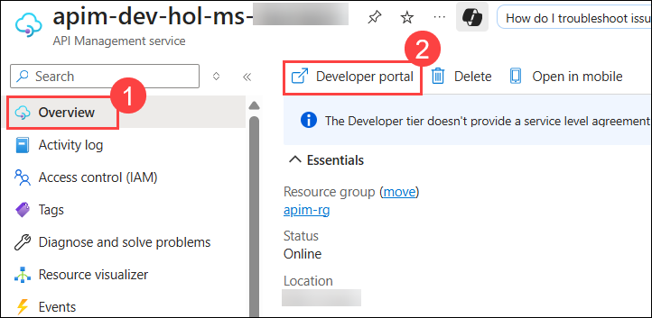

   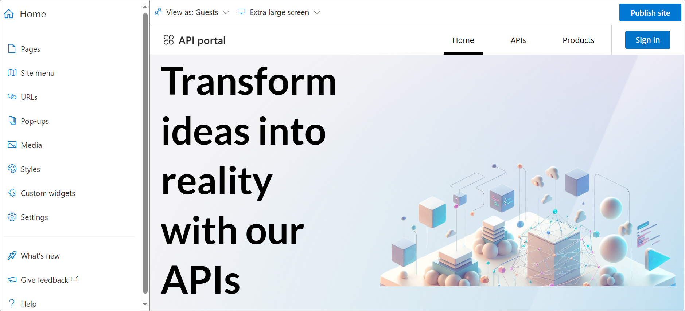

   >**Note:** If the **Introducing the improved developer portal and API
   and product details pages!** pop-up appears, close it.

   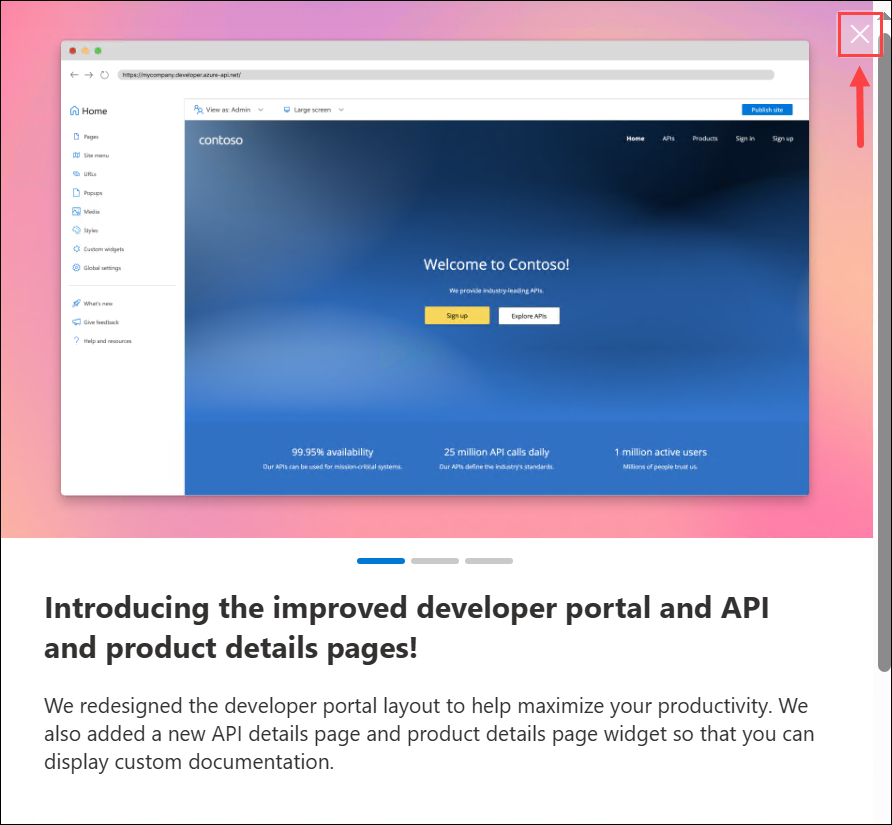

1. You will now proceed with publishing the Developer Portal to allow anonymous and authenticated roles. 

1. Navigate back to the Azure Portal, expand the  **Developer Portal (1)** in the left-hand resource menu, then click on **Portal overview (2)**. Press the **Publish (3)** button and confirm with **Yes (4)** in the popup. The portal will then be available for users to access.

   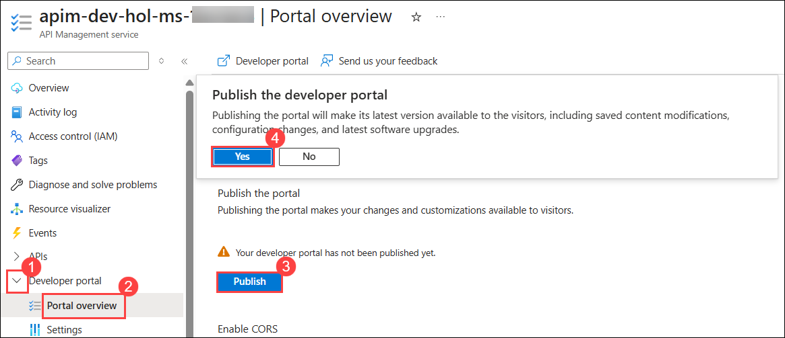  

1. You will see confirmation once the Developer Portal has been published.

   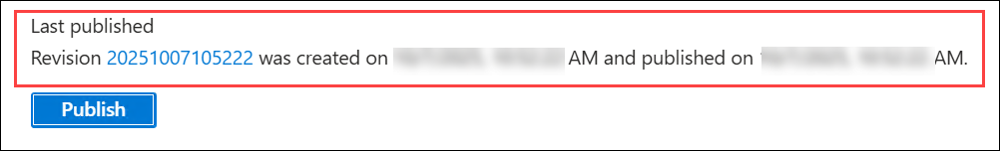

---

   > **Congratulations** on completing the task! Now, it's time to validate it. Here are the steps:
   > - If you receive a success message, you can proceed to the next task.
   > - If not, carefully read the error message and retry the step, following the instructions in the lab guide. 
   > - If you need any assistance, please contact us at cloudlabs-support@spektrasystems.com. We are available 24/7 to help you out.

   <validation step="3b8a26c1-5a63-401b-805b-ac1d6498c3b9" />

### Task 2: Enabling CORS for the Developer Portal
In this task, you will enable Cross-Origin Resource Sharing (CORS) for the Developer Portal.

Cross-origin resource sharing (CORS) is a mechanism that allows resources on a web page to be requested from another domain, outside the domain from which the first resource was served. CORS is required to let portal visitors use the interactive console in the API reference pages and should be enabled for domains, including custom domains.

CORS is enabled by using policies. We will go deeper on this topic in later exercises. For now, we will enable this using a built-in UI.

1. In the Azure Portal, navigate to the Azure API Management instance, expand **Developer portal (1)** in the left-hand resource menu, then click on **Portal overview (2)**.

      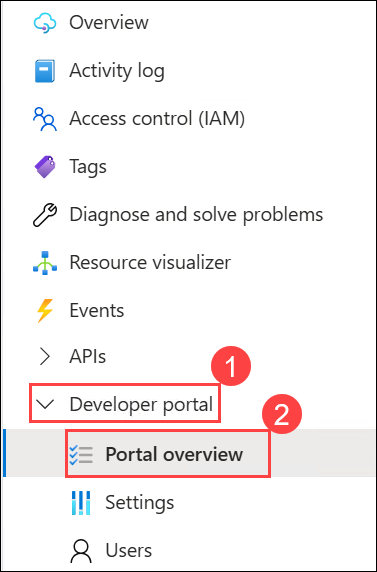

1. Now click on **Enable CORS (1)** button, and confirm **Yes (2)** in the popup.

      

---

   > **Congratulations** on completing the task! Now, it's time to validate it. Here are the steps:
   > - If you receive a success message, you can proceed to the next task.
   > - If not, carefully read the error message and retry the step, following the instructions in the lab guide. 
   > - If you need any assistance, please contact us at cloudlabs-support@spektrasystems.com. We are available 24/7 to help you out.

   <validation step="d4b92395-ee33-451e-9dad-898856cea431" />

### Task 3: User Experience

In this task, you will explore the Developer Portal from an end-user perspective. You will register for an account, subscribe to products, and try out APIs.

In order to do this, we recommend opening the **Developer portal** in a **private tab (incognito tab)** in your browser or using another browser to avoid seeing the admin/edit version of the portal.

1. Navigate to **https://apim-dev-hol-ms-<inject key="Deployment ID" enableCopy="false" />.developer.azure-api.net** in the browser window in InPrivate mode.
      
      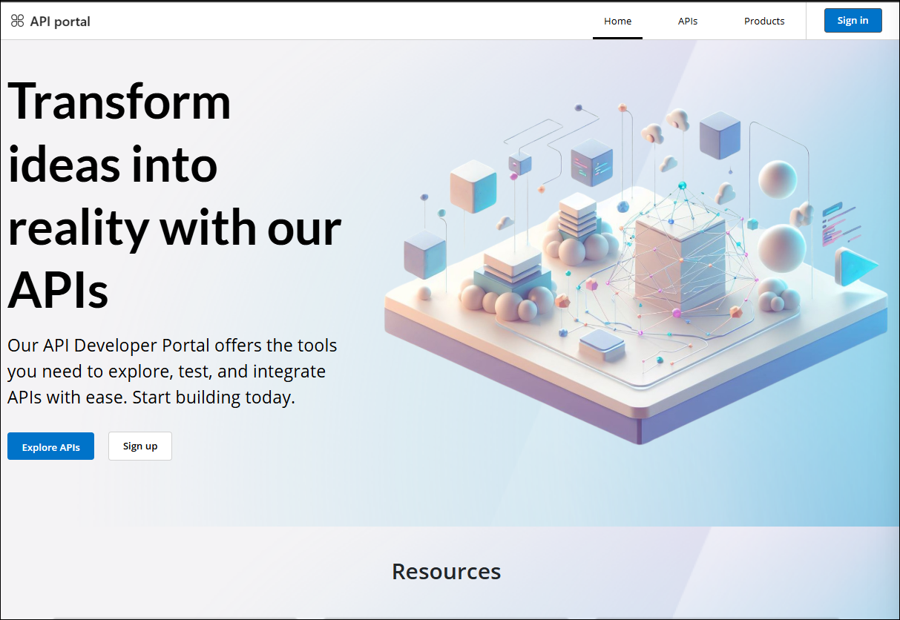

      > **Note:** Keep this browser session open as we will use it frequently throughout our labs.

1. Explore the portal by clicking on the 'APIs' and 'Products' links located in the top right corner to view the available **APIs (1)** and **Products (2)**.

      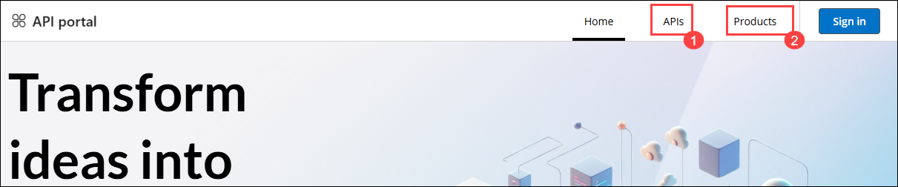

1. Check out the APIs. As you can see, all operations exposed are described and can also be tested directly within the portal.

      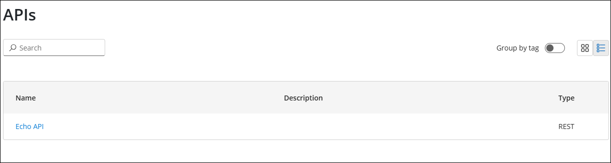

1. In the **Products (1)** see the two products that were created in the previous exercise: `Starter` and `Unlimited`.

      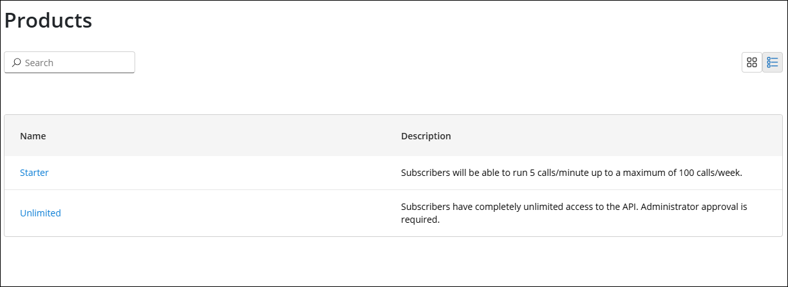

### Task 3.1: Register for an account

1. Click the **Sign in** button at the top right corner, then select **Sign up** to create a new account. For this lab, you can use either a personal or work email address, but be sure to use one that is **different** from the email linked to your Azure subscription.

      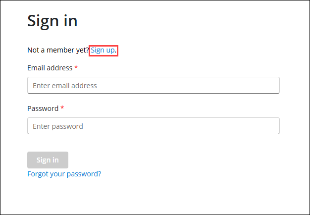

      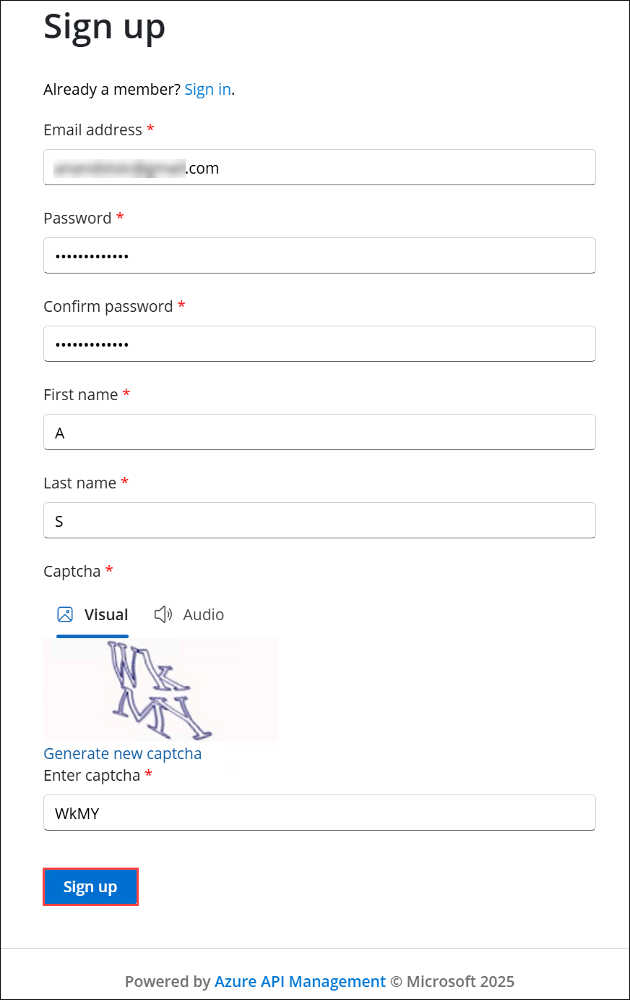

1. Check your inbox for the acceptance email and confirm to activate your account.

      

1. Back in the private browser, sign in with your new credentials.

      

1. Click on **Products**, then select the **Starter** product.

      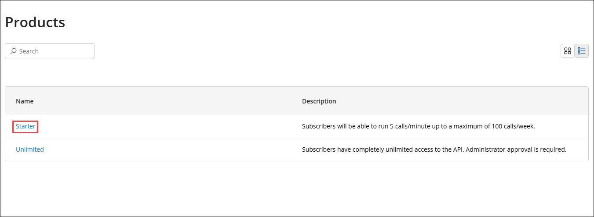

1. Enter `Starter` **(1)** as the subscription name, then press **Subscribe (2)**. You should receive a confirmation email shortly.

      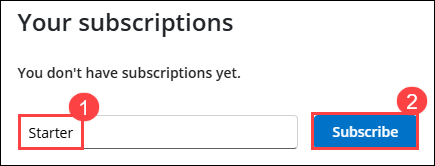

1. Next, click back on **Products**, then select the  **Unlimited** product.

      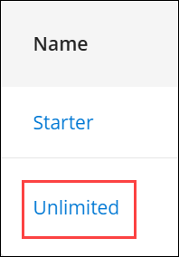

1. Enter `Unlimited` **(1)** as the subscription name, then press **Subscribe (2)**.

      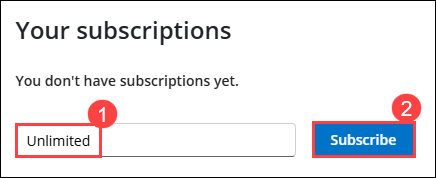

      > **Note:** The `Unlimited` subscription requires admin approval.

1. You should receive an email confirming your subscription request.

### Task 3.2: Approving Subscriptions

1. Navigate back to Azure Portal, from the left navigation pane, expand **APIs**, click on **Subscriptions (1)** blade to see the two new subscriptions `Starter` and `Unlimited` that were just added.

      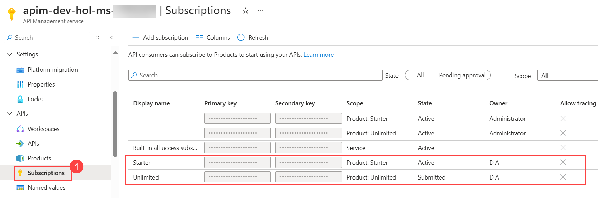

1. Click on  **ellipsis (...)** **(1)** for the **Unlimited** subscription in submitted state, then select **Activate subscription (2)**.

      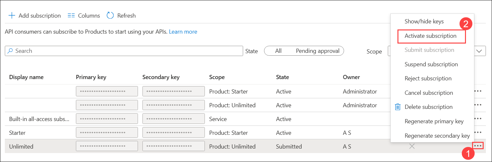

1. Provide additional comments, if you like, then **Confirm** the activation. By default, this will send an activation confirmation email to the user.

      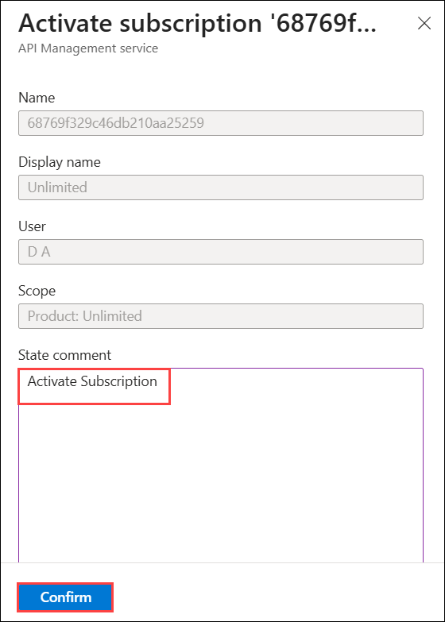

1. Back in the Developer portal in the private browser, refresh the profile page to see the activated **Unlimited** subscription.

      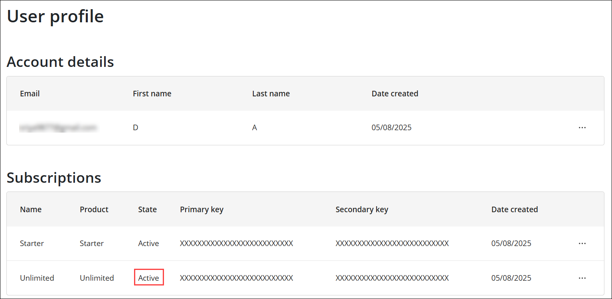

### Task 3.3: Try an API

It's now time to test one of the published APIs.

1. Return to the browser tab with the API Management Service open, select **APIs (1)** from the left pane, and then click **Echo API (2)**.

1. Test the **Echo API (3)** using the POST verb by pressing **Test (4)** tab, using the defaults, then pressing **Send (5)** at the bottom.

      

1. You should see a successful `200` HTTP response.

      a.png)

## Summary

In the above Tasks, you accessed, configured, and tested the Azure API Management Developer Portal, allowing users to explore APIs, sign up for accounts, manage subscriptions, and perform API testing.

### Now, click on Next from the lower right corner to move on to the next page for further tasks of Exercise 2.

  
