# Excercise 2: Developer Portal

## Overview

The Developer Portal is an automatically generated, fully customizable website with the documentation of your APIs. It is where API consumers can discover your APIs, learn how to use them, request access, and try them out.

## Task 1: Publishing the Developer Portal

The Azure API Management Developer Portal uses role-based access control (RBAC). After creating the Azure API Management instance, you need to first **access the Developer Portal using the admin role**, which will trigger its activation.

1. In the Azure Portal, Navigate to the Azure API Management instance, and locate the Developer Portal in the overview section. Click to open the **Developer Portal**.

   

   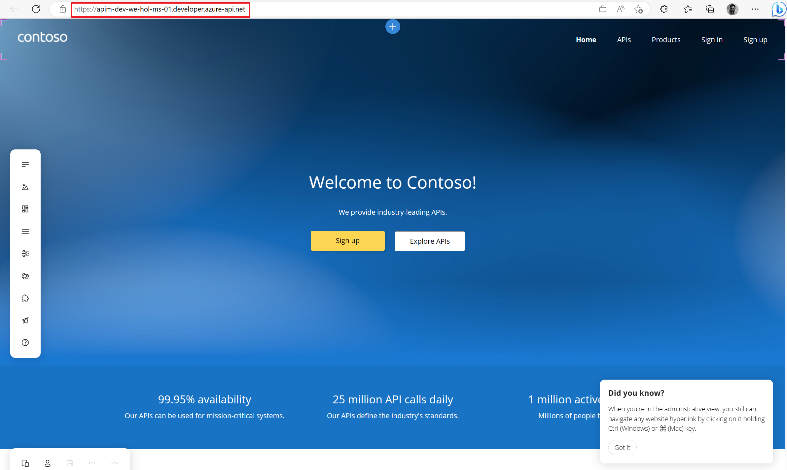

1. You can now proceed with publishing the Developer Portal to allow anonymous and authenticated roles. Navigate back to the Azure Portal, locate **Developer Portal** in the left-hand resource menu, then click on **Portal overview (1)**. Press the **Publish (2)** button and confirm with **Yes** in the popup. The portal will then be available for users to access.

   

1. You will see confirmation once the Developer Portal has been published.

   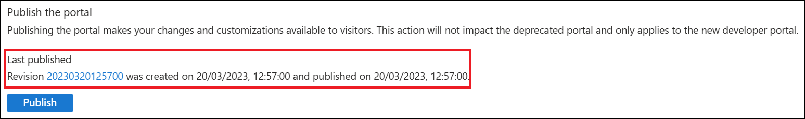

---

> **Congratulations** on completing the task! Now, it's time to validate it.

<validation step="3b8a26c1-5a63-401b-805b-ac1d6498c3b9" />

## Task 2: Enabling CORS for the Developer Portal

Cross-origin resource sharing (CORS) is a mechanism that allows resources on a web page to be requested from another domain, outside the domain from which the first resource was served. CORS is required to let portal visitors use the interactive console in the API reference pages and should be enabled for domains, including custom domains.

1. CORS is enabled by using policies. We will go deeper on this topic in later exercises. For now, we will enable this using a built-in UI. In the Azure Portal, Navigate to the Azure API Management instance, locate **Developer Portal** in the left-hand resource menu, then click on **Portal overview (1)**.

   

1. Now click on **Enable CORS (1)** button, and confirm **Yes (2)** in the popup.

   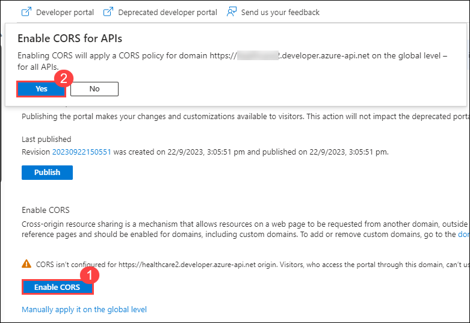

---

> **Congratulations** on completing the task! Now, it's time to validate it.

<validation step="d4b92395-ee33-451e-9dad-898856cea431" />

## Task 3: User Experience

Let's experience how your users will navigate through your portal. In order to do this, **we recommend opening in a private tab in your browser or using another browser to avoid seeing the admin/edit version of the portal.**

1. Navigate to **https://apim-dev-hol-ms-<inject key="Deployment ID" enableCopy="false" />.developer.azure-api.net** .

   > **Note**: Keep this browser session open as we will use it frequently throughout our labs.

   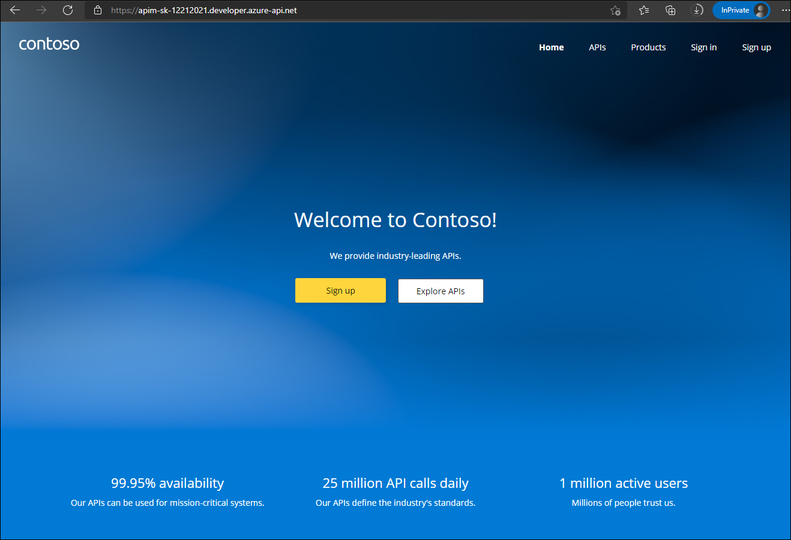

### Anonymous User

1. As an unauthenticated user, explore the portal by clicking on the 'APIs' and 'Products' links located in the top right corner to view the available **APIs** and **Products**.

   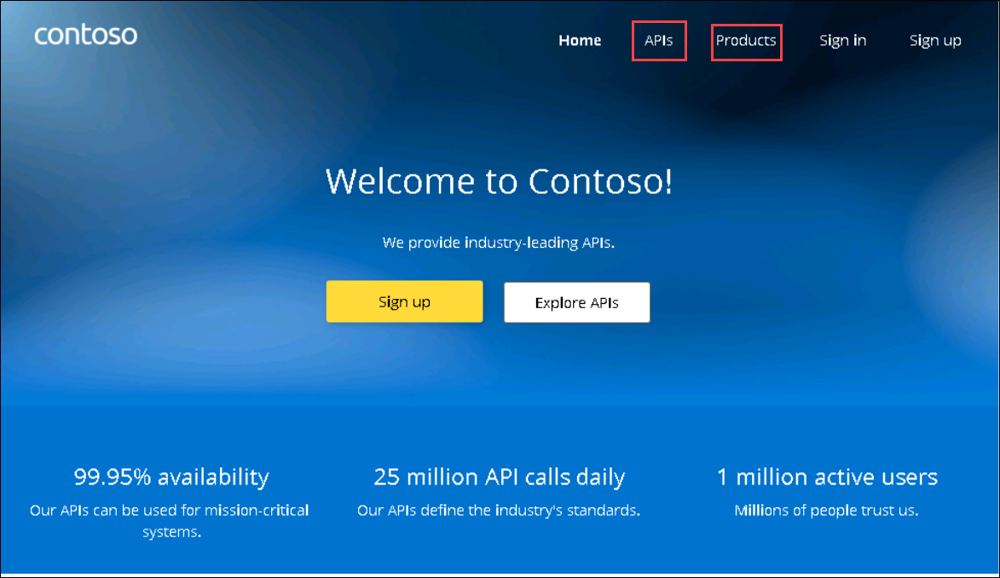

   > **Note**: Notice the difference between the Starter & Unlimited products.

   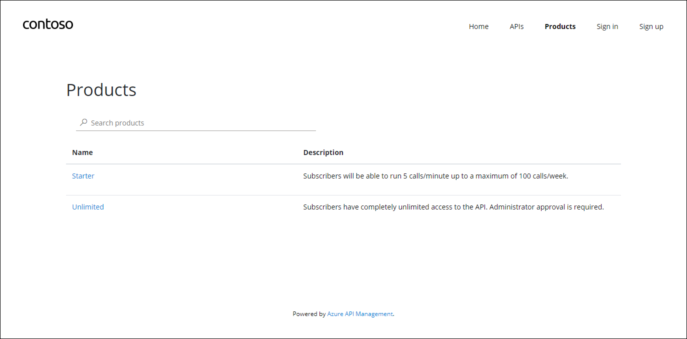

1. Check out the APIs. As you can see, all operations exposed are described and can also be tested directly within the portal.

   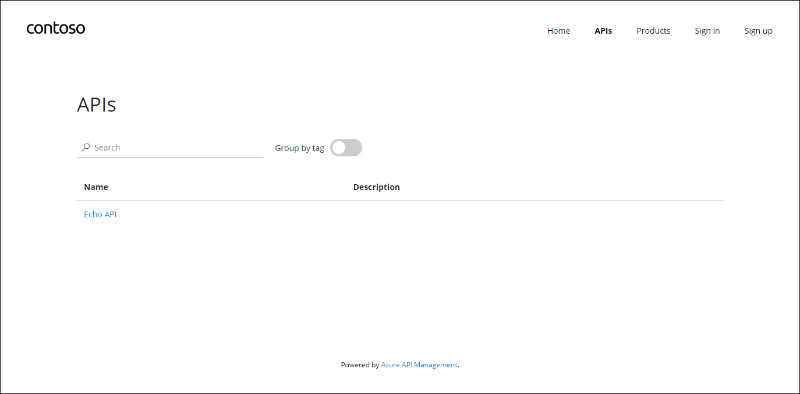

### Register for an account

1. Let's create a new account by clicking the **Sign up** button in the top right corner. For this lab, the email can be either personal or work-related, but please make sure to use a different email from the one associated to your Azure subscription.

   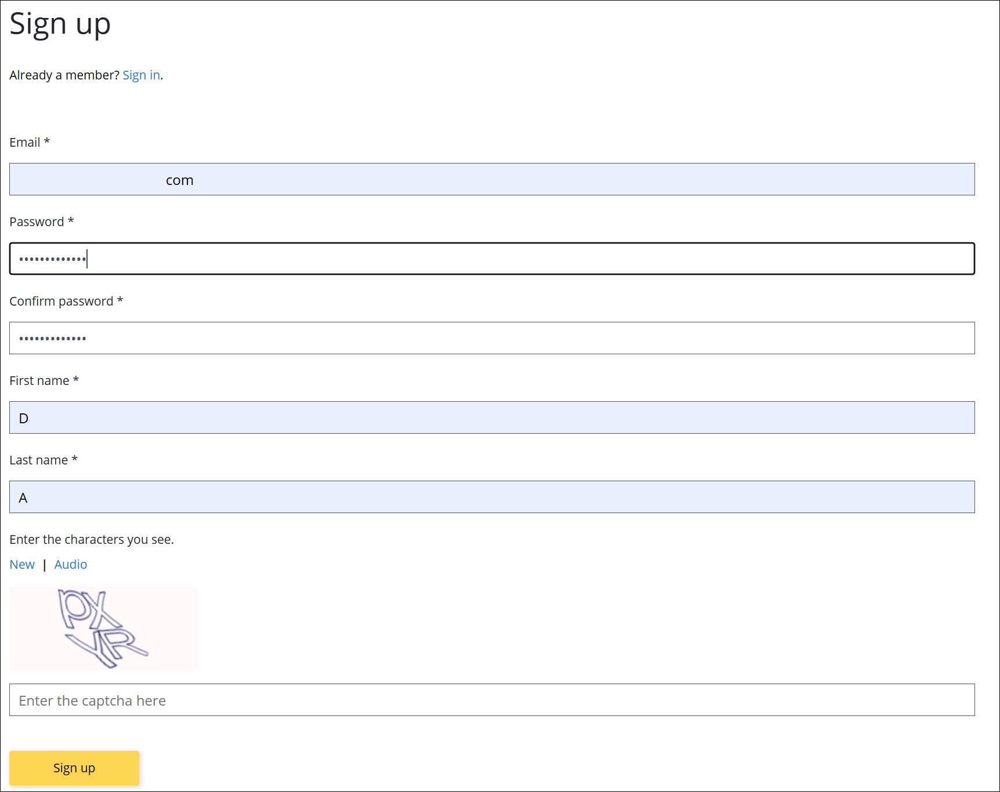

1. Check your inbox for the acceptance email and confirm to activate your account.

   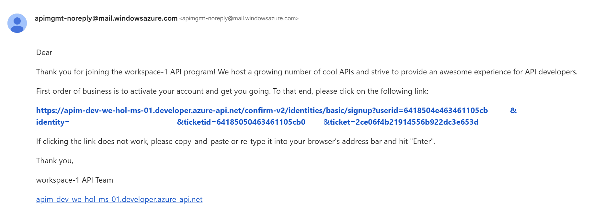

### Sign into account

1. Back in the private browser, sign in with your new credentials.

   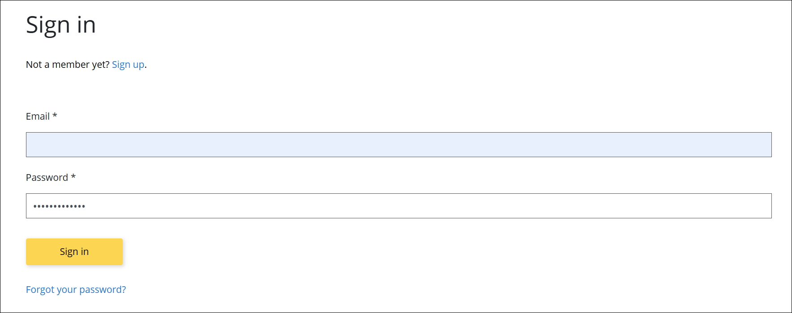

1. Click on **Products**, then **Starter**.
1. Enter `Starter` as the subscription name, then press **Subscribe**. You should receive a confirmation email shortly.

   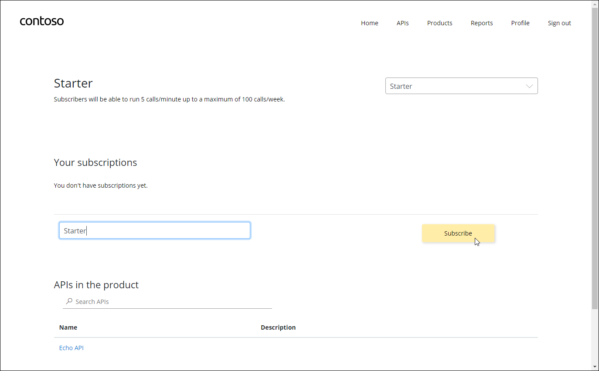

1. Next, click back on **Products**, then **Unlimited**.
1. Enter `Unlimited` as the subscription name, then press **Subscribe**.
   > Note that the `Unlimited` subscription requires admin approval.
1. You should receive an email confirming your subscription request.

### Approving Subscriptions

1. Navigate back to Azure Portal, under APIs click on **Subscriptions (1)** blade to see the two new subscriptions `Starter` and `Unlimited` that were just added.

   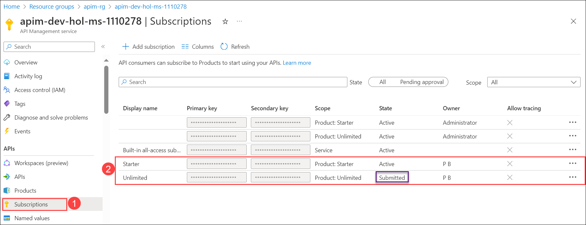

1. Click on Hamburger buttons for the **Unlimited** subscription in submitted state, then select **Activate subscription**.

   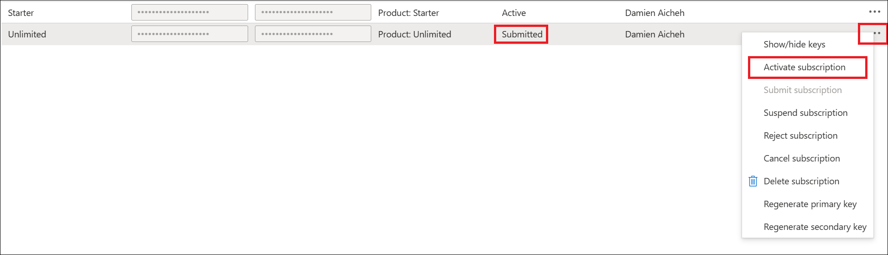

1. Provide additional comments, if you like, then **Confirm** the activation. By default, this will send an activation confirmation email to the user.

   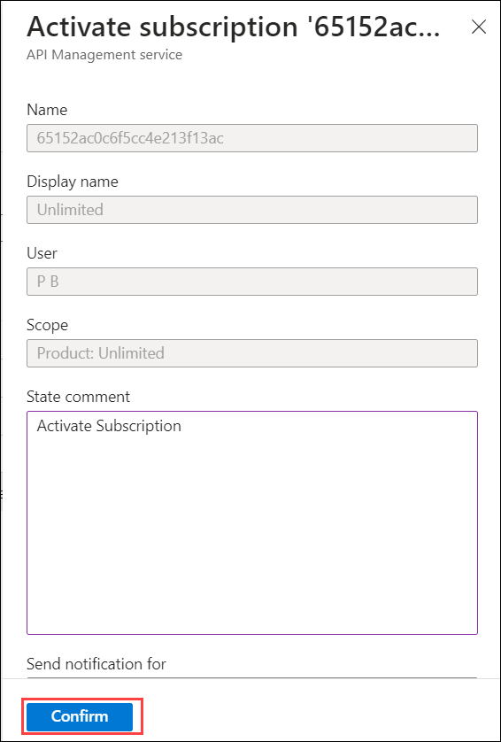

1. Back in the private browser, refresh the profile page to see the activated **Unlimited** subscription.

   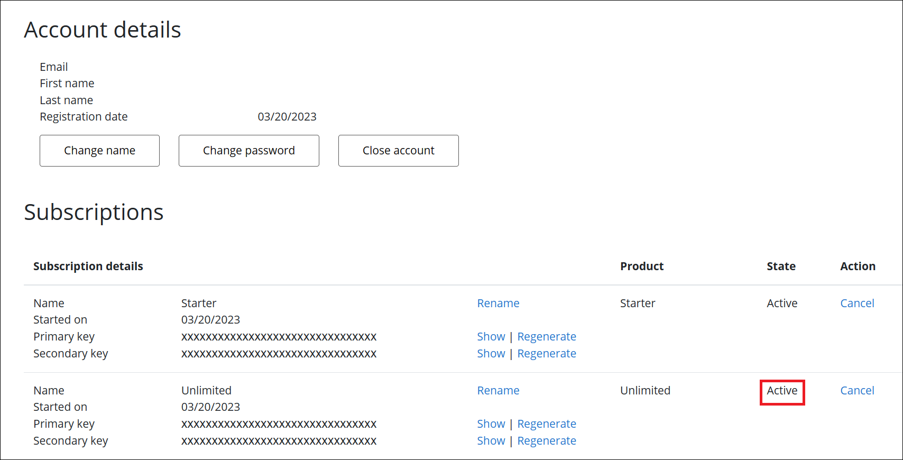

### Try an API

It's now time to test one of the published APIs.

1. Open the **APIs** page and Click on the **Echo API**:
1. Notice the developer information
1. Test the Echo API using the POST verb by pressing **Test** tab, using the defaults, then pressing **Send** at the bottom.

   .png>)

1. You should see a successful `200` HTTP response.

   .png>)

### Summary

In this Task, you accessed, configured, and tested the Azure API Management Developer Portal, allowing users to explore APIs, sign up for accounts, manage subscriptions, and perform API testing. Now, click on Next from the lower right corner to move on to the next page.
