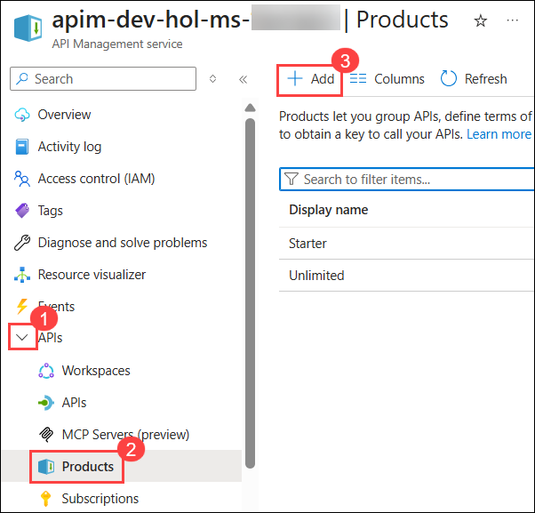
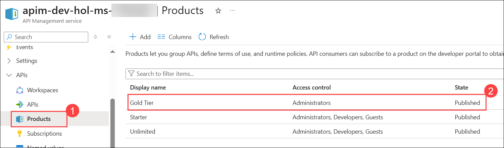
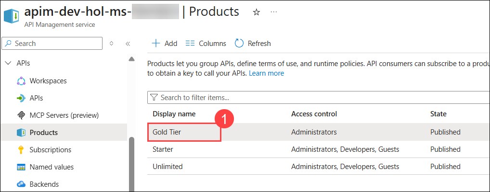
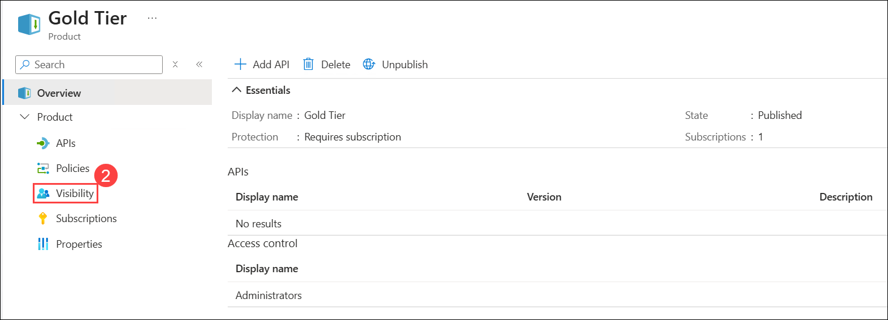
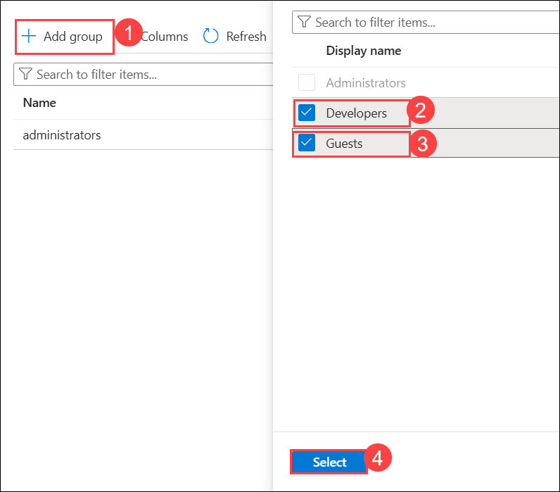
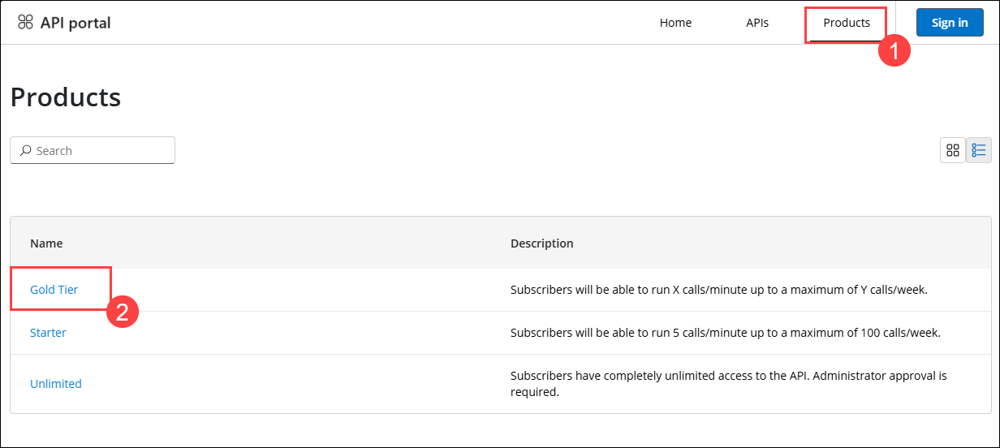

## Exercise 2 Task 4.3: Product Management

In this task, you will create a new product tier in Azure API Management and modify its access control settings.

A product contains one or more APIs as well as a usage quota and the terms of use. Once a product is published, developers can subscribe to the product and begin to use the product's APIs.

1. In the Azure Portal, navigate to the Azure API Management instance. Expand the **APIs (1)** section and select the **Products (2)**. Click on **+ Add (3)** to add a new product.

   

1. On the Add Product page, enter the following details and click on **Create (4)**.

   - Display Name : **Gold Tier** **(1)**
   - Description: **Subscribers will be able to run X calls/minute up to a maximum of Y calls/week.** **(2)**
   - Published : **Check** **(3)**

     

   - You can view the recently created **Gold Tier (2)** product from **Products (1)** section.

      

1. Next, we'll change the access control by clicking on **Gold Tier (1)** and selecting **Visibility (2)** from the left pane.

   

   

1. Click on **+ Add group (1)** to add a new group, check **Developers (2)** and **Guests (3)**, then press **Select (4)**.

   

1. The two added roles should be visible now in **Visibility** in Gold Tier.

     

1. Back in the private browsing session of the Developer portal, browse to **Products (1)** and observe the new product **Gold Tier (2)** is available.

   

   > **Congratulations** on completing the task! Now, it's time to validate it. Here are the steps:
   > - If you receive a success message, you can proceed to the next task.
   > - If not, carefully read the error message and retry the step, following the instructions in the lab guide. 
   > - If you need any assistance, please contact us at cloudlabs-support@spektrasystems.com. We are available 24/7 to help you out.
   
      <validation step="8a9c8766-7111-4091-9f67-2fadaa51d74d" />

## Summary

In this task, you created a new product tier called "Gold Tier" in Azure API Management and modified the access control settings for this product by adding the "Developers" and "Guests" groups, allowing them access to this product. This allows developers to subscribe to the "Gold Tier" product and access its associated APIs, establishing control and access policies for different user groups.

### You have successfully completed the Exercise. Click on **Next >>** to proceed with the next exercise.

  

