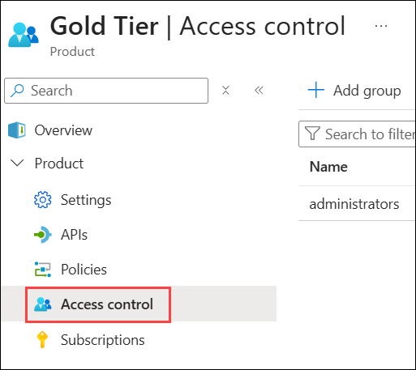
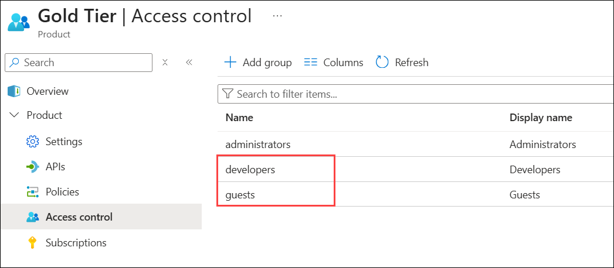

## Continuation for Exercise 2,Task 4: Product Management

A product contains one or more APIs as well as a usage quota and the terms of use. Once a product is published, developers can subscribe to the product and begin to use the product's APIs.

### Task 4.1: Product definition

1. In the Azure Portal, open the resource menu item `Products` (1). Click on **+ Add (2)**.

   

1. Let's add a new product tier called `Gold Tier`.

   - Display Name : **Gold Tier** **(1)**
   - Description: **Subscribers will be able to run X calls/minute up to a maximum of Y calls/week.** **(2)**
   - Published : **Check** **(3)**.
   - Click on **Create** **(4)**.

     

   - You can view the recently created **Gold Tier (2)** from **product (1)**.

      

1. Next, we'll change the access control by clicking on **Gold Tier** and selecting **Access control** in the left pane.

   

1. Click on **Add group (1)** to add a new group, check **Developers (2)** and **Guests (3)**, then press **Select (4)**.

   

   - The two added roles are shown now.

     

1. Back in the private browsing session, browse to **Products** and observe the new **Gold Tier**.

   

   > **Congratulations** on completing the task! Now, it's time to validate it. Here are the steps:
   > - If you receive a success message, you can proceed to the next task.
   > - If not, carefully read the error message and retry the step, following the instructions in the lab guide. 
   > - If you need any assistance, please contact us at cloudlabs-support@spektrasystems.com. We are available 24/7 to help you out.
   
      <validation step="8a9c8766-7111-4091-9f67-2fadaa51d74d" />

## Summary

In this task, you created a new product tier called "Gold Tier" in Azure API Management. You also modified the access control settings for this product by adding the "Developers" and "Guests" groups, allowing them access to this product. This allows developers to subscribe to the "Gold Tier" product and access its associated APIs, establishing control and access policies for different user groups.

### You have successfully completed the lab. Click on **Next >>** to proceed with the next exercise.
