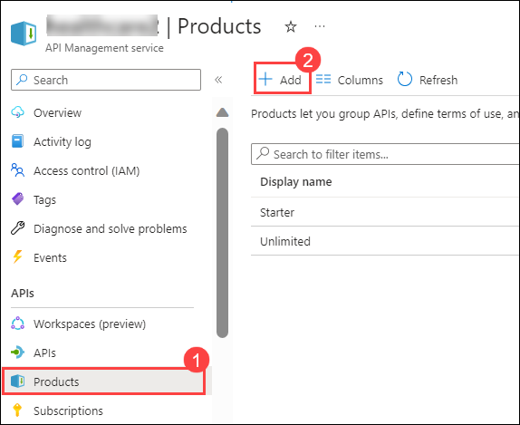
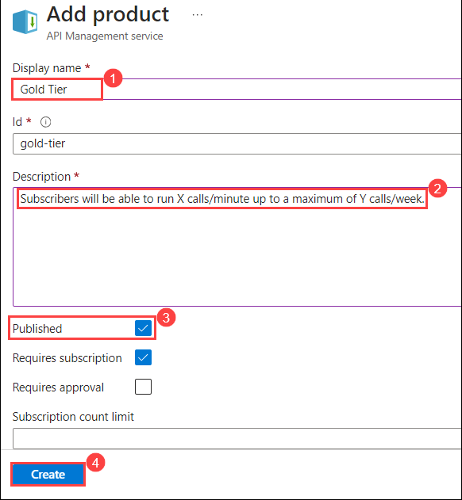
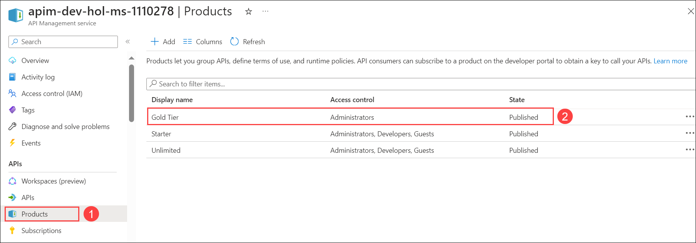
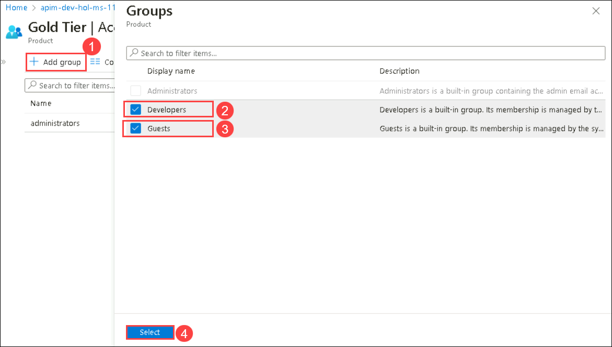
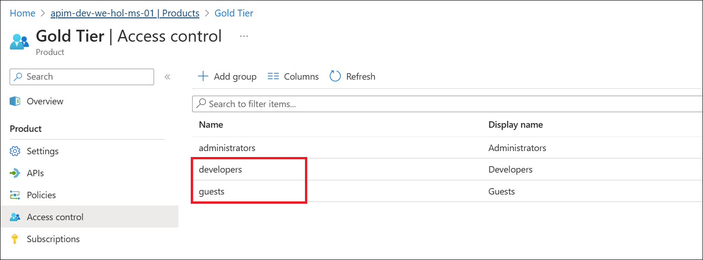
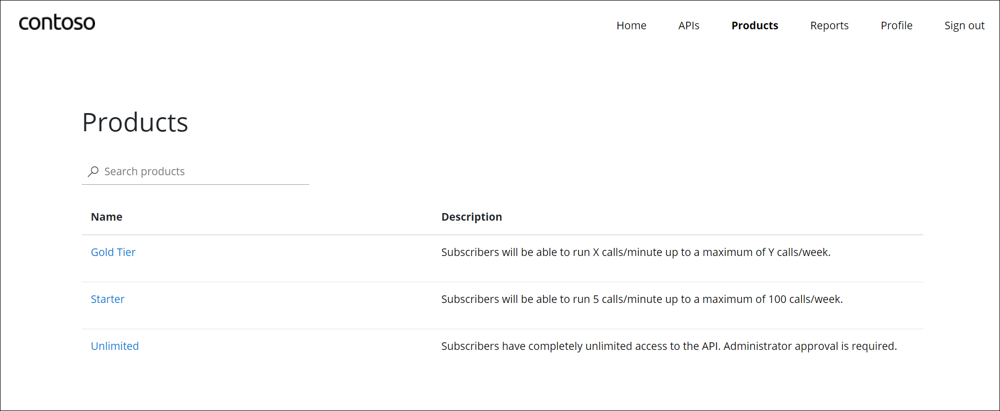

## Task 5: Product Management

A product contains one or more APIs as well as a usage quota and the terms of use. Once a product is published, developers can subscribe to the product and begin to use the product's APIs.

### Task 5.1: Product definition

1. In the Azure Portal, open the resource menu item `Products`. Click on **+ Add**.

  

1. Let's add a new product tier called `Gold Tier`.

  Display Name : **Gold Tier** **(1)**

  Description: **Subscribers will be able to run X calls/minute up to a maximum of Y calls/week.** **(2)**
  
  Published : **Check** **(3)**.

   Click on **Create** **(4)**.

  

  You can view the recently created Gold Tier product.

  

1. Next, we'll change the access control by clicking on **Gold Tier** and selecting **Access control** in the left pane.

  

1. Click on **Add group (1)** to add a new group, check **Developers (2)** and **Guests (3)**, then press **Select (4)**. 

  

  The two added roles are shown now.

  

  Back in the private browsing session, browse to **Products** and observe the new **Gold Tier**. 

  

 ### Summary
  In this task, you created a new product tier called "Gold Tier" in Azure API Management. You also modified the access control settings for this product by adding the "Developers" and "Guests" groups, allowing them access to this product. This allows developers to subscribe to the "Gold Tier" product and access its associated APIs, establishing control and access policies for different user groups.
- Now, click on Next from the lower right corner to move on to the next page.
