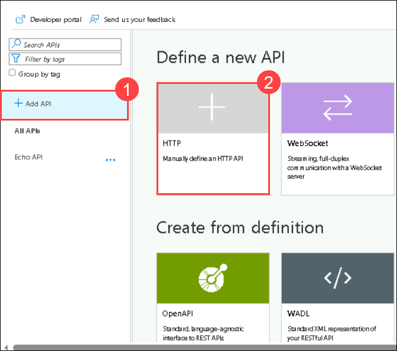
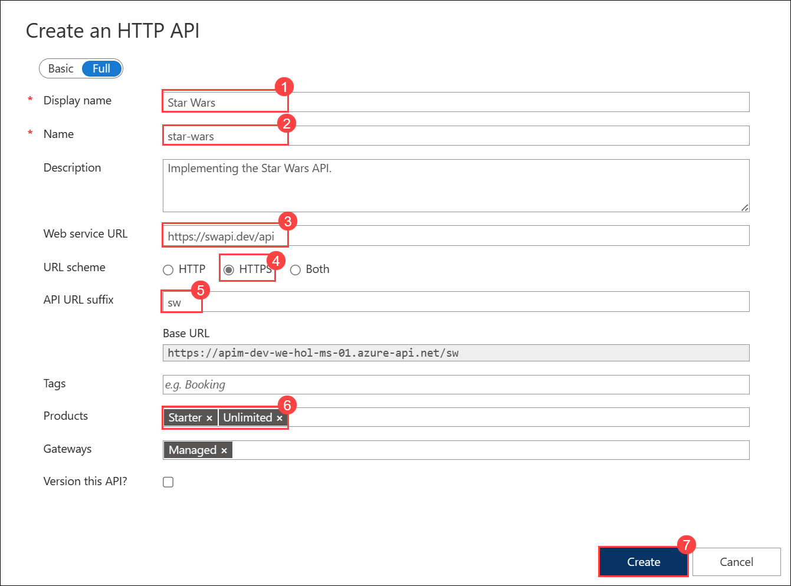
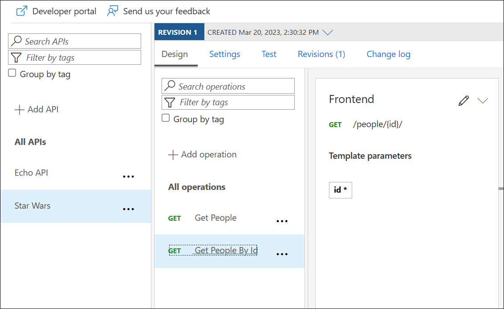
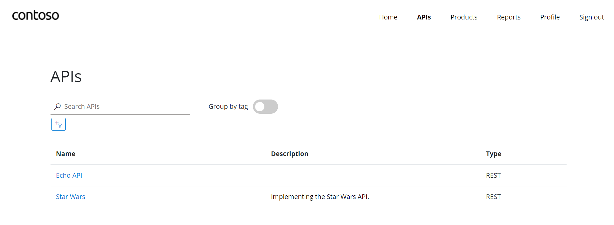
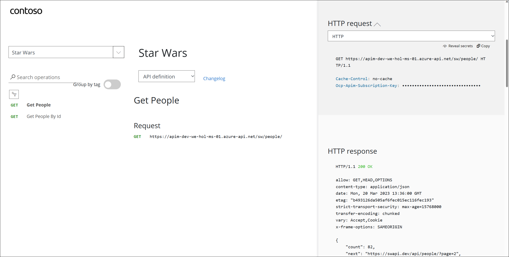
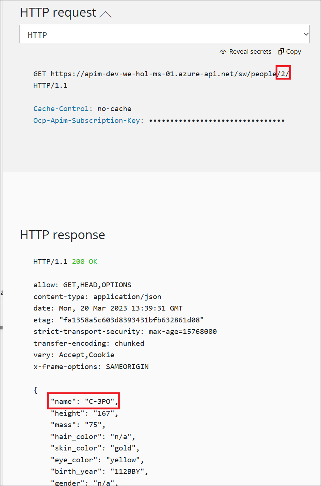

## Exercise 3: Adding APIs
### Overview
An API represents a set of operations that can be invoked. New APIs are defined, and then the desired operations are added. An API is added to a product and can be published; it may then be subscribed to and used by developers.
- On the left menu, open the ***APIs*** blade. You will see all APIs, and the possibility to add new ones, but also to customize existing ones.

  

### Task 1: Add API from Scratch

Instead of developing an API, for this lab, you will use the existing [*Star Wars* API](https://swapi.dev):

1) Click on **Add API**.  
2) Click on **HTTP - Manually define an HTTP API**.

  

4) Select the **Full** option in the **Create an HTTP API** dialog.  
5) **Display name** : `Star Wars`
6) **Name** : `star-wars`
7) **Description** : Implementing the Star Wars API
8) **Web service URL** : `https://swapi.dev/api`  .  
9) **URL scheme** : `HTTPS` as we strive to enforce HTTPS only.  
10) **API URL suffix** : `sw`. This allows us to compartmentalize the Azure API Management URLs for distinct APIs.  
11) **Products** : Assign **Starter** and **Unlimited**   
12) Click on **Create**.  

  > While it is conventionally a good idea to version APIs from the onset, we are omitting this step here for brevity of the labs.

  

- Once created, inside the *Star Wars* API press **+ Add operation (1)** to declare two new operations:

  1) **Get People**  
    - Display name: **Get People (2)**  
    - Name will be populated with: **get-people**  
    - URL: **GET /people/ (3)**
    - Click on **Save (4)**.
      
  

  Again click on **+ Add operation** to add another operation and give the following details

  2) **Get People By Id**  
    - Display name: **Get People By Id**  
    - Name will be populated with: **get-people-by-id**  
    - URL: **GET /people/{id}/**

  

### Task 2: Access Star Wars API from Developer Portal

- Now switch to the **Developer Portal** and sign in as a developer with a subscription. 
- Select **Explore APIs**. You should see both **Echo API** and **Star Wars**.

  

- Click on **Star Wars**. Try the **Get People** operation. Observe a successful `200` response.

  

- Now try the **Get People By Id** operation with `id = 2`

  

- Examine the successful `200` response with `C-3PO`'s details in the response body payload.
  
  

---
### Summary
In this task, you added the Star Wars API to Azure API Management and configured two operations:

1)Get People: This operation retrieves a list of people from the Star Wars API.
       
2)Get People By Id: This operation retrieves detailed information about a specific person from the Star Wars API based on their ID.
       
- Now, click on Next from the lower right corner to move on to the next page.
