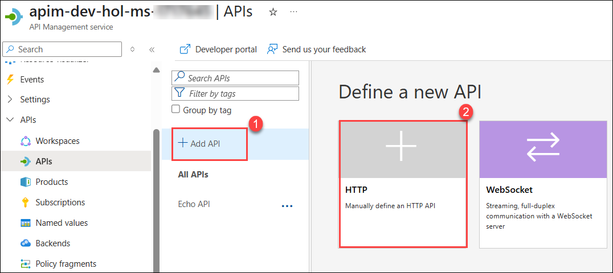
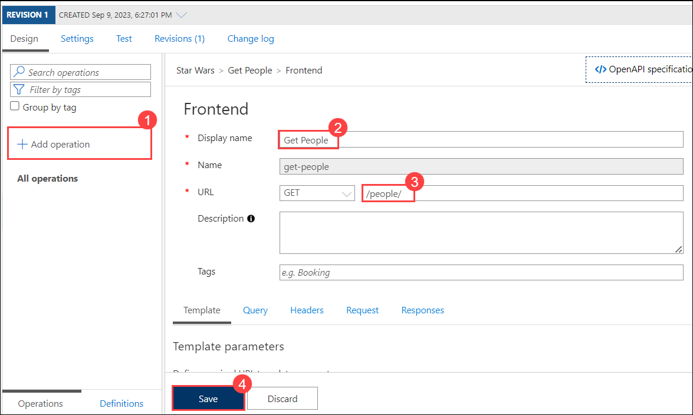
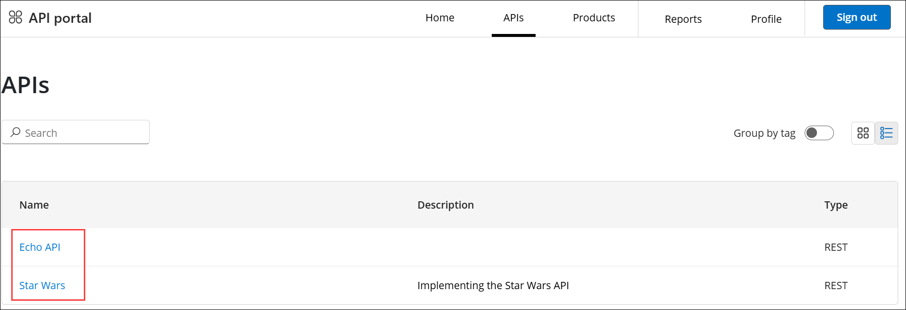
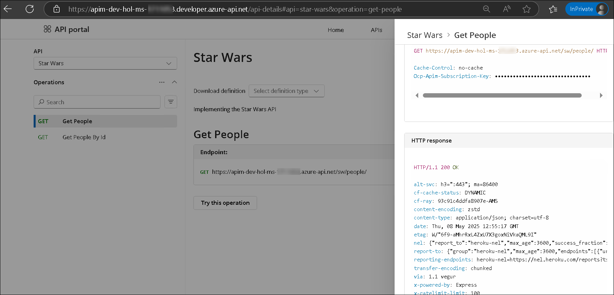
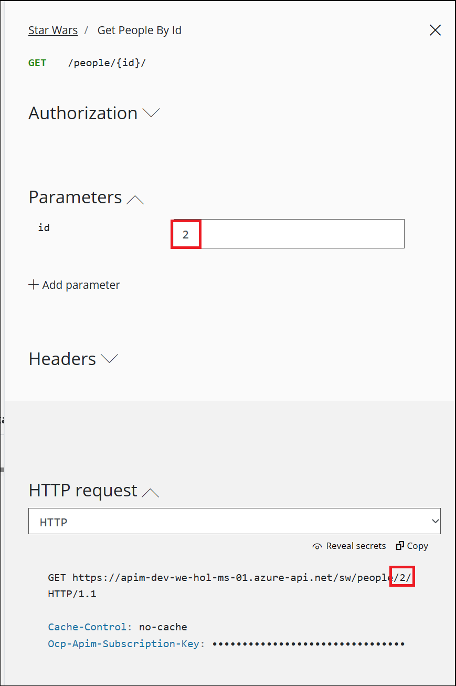
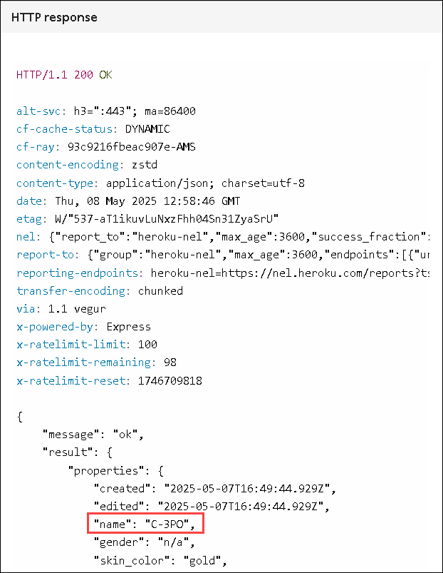

# Exercise 3: Adding APIs

### Estimated Duration: 50 minutes

## Lab Overview

An API represents a set of operations that can be invoked. New APIs are defined, and then the desired operations are added. An API is added to a product and can be published; it may then be subscribed to and used by developers.

- Navigate back to the Azure portal, on the left menu, select the **_APIs_** blade. You will see all APIs, and the possibility to add new ones, but also to customize existing ones.

  

## Lab objectives

In this lab, you will perform:

- Task 1: Add API from Scratch
- Task 2: Access Star Wars API from Developer Portal
- Task 3: Import API using OpenAPI
- Task 4.1: Calling API and testing Subscription Keys
- Task 4.2: Rate limit

## Task 1: Add API from Scratch

Instead of developing an API, for this lab, you will use the existing [_Star Wars_ API](https://swapi.dev):

1. Click on **+ Add API (1)**.
2. Click on **HTTP - Manually define an HTTP API (2)**.

   

3. Enter the following details in the **Create an HTTP API** dialog and click on **Create** **(8)**.

   - Select the **Full** option.
   - Display name: **Star Wars** **(1)**.
   - Name: **star-wars** **(2)**.
   - Description: **Implementing the Star Wars API** **(3)**.
   - Web service URL: **https://swapi.tech/api** **(4)**.
   - URL scheme: **HTTPS** **(5)** as we strive to enforce HTTPS only.
   - API URL suffix: **sw** **(6)**. This allows us to compartmentalize the Azure API Management URLs for distinct APIs.
   - Products : Assign **Starter** and **Unlimited** **(7)**.

     > **Note**: While it is conventionally a good idea to version APIs from the onset, we are omitting this step here for the brevity of the labs.

     .png>)

4. Once created, inside the _Star Wars_ API press **+ Add operation (1)** to declare two new operations:

   - Display name: **Get People (2)**
   - Name will be populated with: **get-people**
   - URL: **GET /people/ (3)**
   - Click on **Save (4)**.

     

5. Again click on **+ Add operation (1)** to add another operation and give the following details

   - Display name: **Get People By Id (2)**
   - Name will be populated with: **get-people-by-id**
   - URL: **GET /people/{id}/ (3)**
   - Click on **Save (4)**.

     

   > **Congratulations** on completing the task! Now, it's time to validate it. Here are the steps:
   > - If you receive a success message, you can proceed to the next task.
   > - If not, carefully read the error message and retry the step, following the instructions in the lab guide. 
   > - If you need any assistance, please contact us at cloudlabs-support@spektrasystems.com. We are available 24/7 to help you out.

      <validation step="5394ae8d-6ce9-4ef8-ba57-e7dbff0a416b" />

## Task 2: Access Star Wars API from Developer Portal

1. Now switch to the **Developer Portal** in the **In-Private** window where you were previously signed in.

2. Select **APIs** on the **Home** page. You should see both **Echo API** and **Star Wars**.

      

3. Click on **Star Wars**, then select the **Get People** operation. Click **Try this operation**, scroll down, and click **Send**. You should see a successful `200` response. After reviewing it, go ahead and close the panel.

      

4. Now try the **Get People By Id** operation by entering `id = 2` in the **Parameters** section. Then scroll down and click **Send**.

      

5. Examine the successful `200` response with `C-3PO`'s details in the response body payload.

      

---

## Summary

In this task, you added the Star Wars API to Azure API Management, configuring operations for retrieving a list of characters and details by ID. This demonstrates the ability to integrate and manage APIs effectively within the Azure environment

### You have successfully completed the lab. Click on **Next >>** to proceed with the next exercise.
