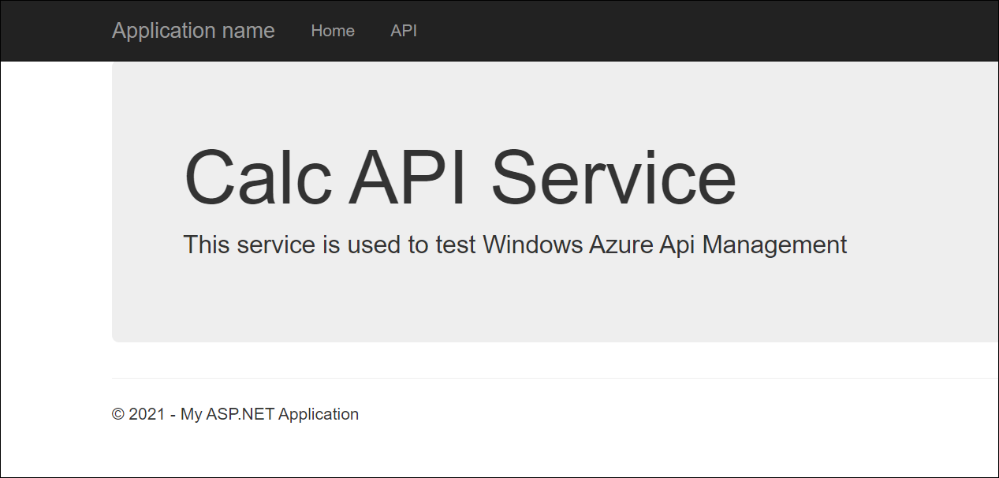
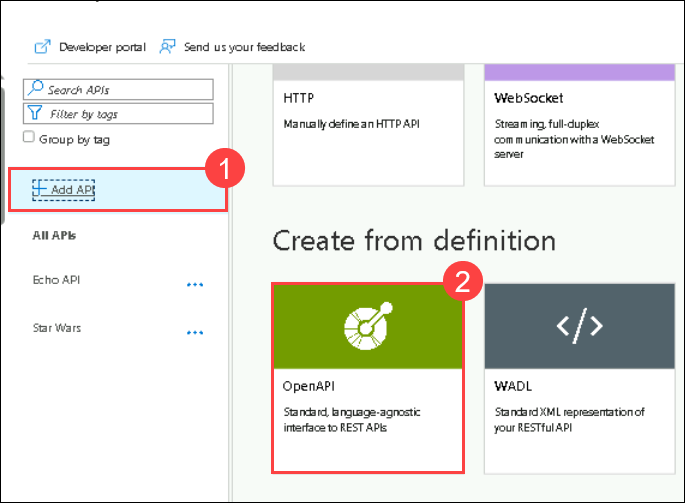
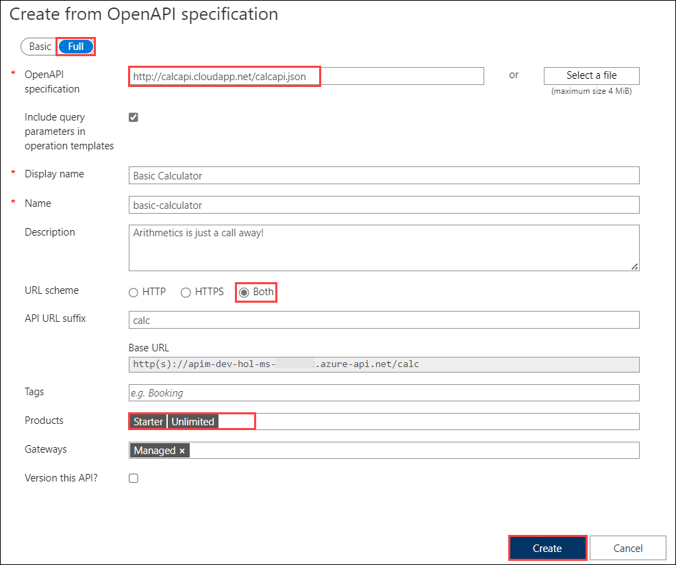
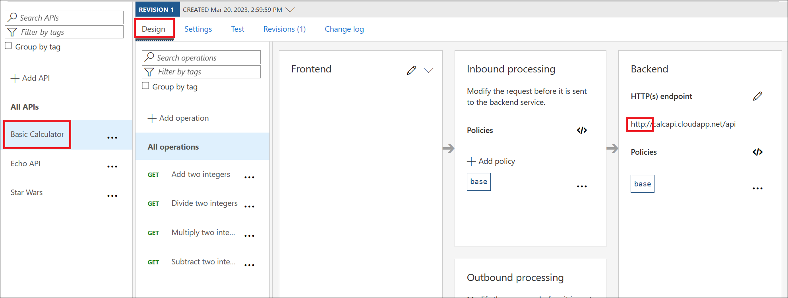
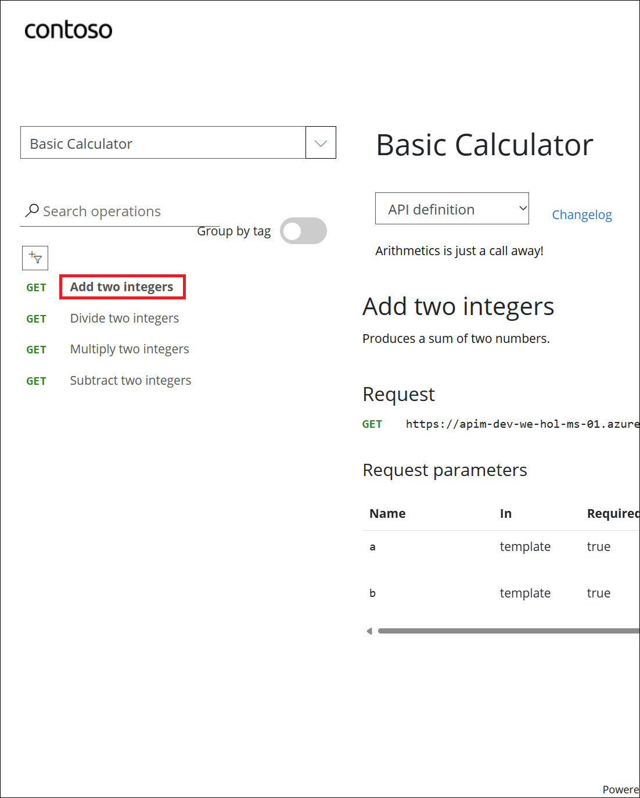
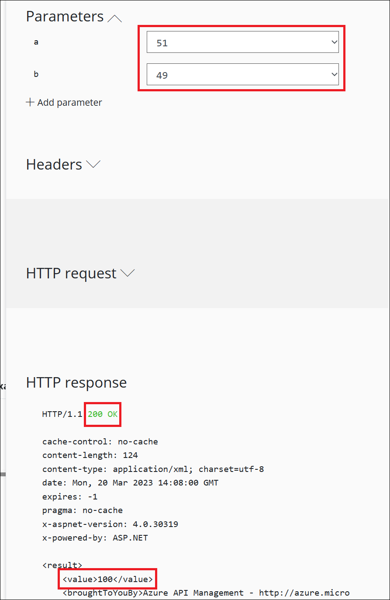
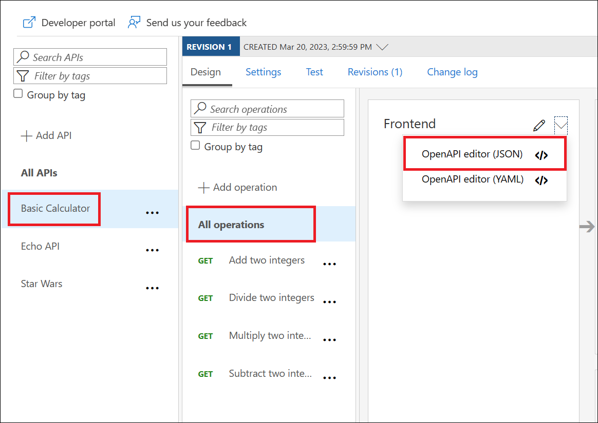

## Continuation for Exercise 3,Task 3: Import API using OpenAPI

Instead of importing operations one-by-one, you can also import a full API. The [OpenAPI specification](https://www.openapis.org/) (aka [Swagger](https://swagger.io)) is a definition format to describe RESTful APIs. The specification creates a RESTful interface for easily developing and consuming an API by effectively mapping all the resources and operations associated with it.

As a demo, we will use an API that offers a simple calculator service : [Calc API](http://calcapi.cloudapp.net)

> This is an older API and is only available via `HTTP`. Azure API Management provides a means for fronting access to it via `HTTPS`, which further demonstrates how Azure API Management can help with a secure, uniform facade while the backend implementation can be reworked and upgraded.

   

- Navigate back to your Azure API Management instance.

1. On the left menu, open the **APIs** blade.  
1. Click on **Add API**.  
1. Under **Create from definition** select **OpenAPI**.

      
   
1. Select the **Full** option in the **Create from OpenAPI specification** dialog.  
1. Enter `http://calcapi.cloudapp.net/calcapi.json` as the **OpenAPI specification** value. You should subsequently see **Display name**, **Name**, and **Description** populate.  

   > **Note the intentional use of `http` instead of `https` as this backend does not presently support `https`.**  

1. While the backend service only runs on `HTTP`, we need to **set URL scheme to `Both`** to allow for Azure API Management ingress to occur on HTTPS for callers such as the Developer Portal.  
1. Set the **API URL suffix** to `calc`.  
1. Assign **Starter** and **Unlimited** products.  
1. Press **Create**.  

      

1. Once the API is created, it will show in the list of APIs along with all of its operations.

   > Ensure that the backend shows as `HTTP`. If that is not the case, navigate to the **Settings** tab and update the **Web service URL** accordingly.

      

1. Back in the Developer Portal, try out the **Basic Calculator** API via the **Add two integers** GET method, then examine the response. Click on **Try it** by accepting the default values and hit **Send**.

   > **Note**: Ensured you are signed up with your account in the **Developer Portal**.

   > Accepting the defaults of `49` and `51` suffices. There's presently an issue where defaults are shown in a dropdown. If you want to change the values, add new `a` and `b` parameters and values, then remove the dropdown values.

      

      

    > Accepting the defaults of `49` and `51` suffices. There's presently an issue where defaults are shown in a dropdown. If you want to change the values, add new `a` and `b` parameters and values, then remove the dropdown values.

1. Navigate back to the **Azure API Management Portal**, we can inspect/edit the Open API definition by selecting the *OpenAPI Editor (JSON)* option from the dropdown in the Frontend block:

      

      

---

> **Congratulations** on completing the task! Now, it's time to validate it.
<validation step="d33e0436-d40e-45c1-9efb-88a15365af11" />

## Troubleshooting

### Unable to complete the request

This is likely a mixed-content CORS error in which you are attempting a call to an Azure API Management endpoint that is only set up for *HTTP*. It fails as the Developer Portal runs on *HTTPS*. Please check the setup steps above for the _URL scheme_.

---
## Summary

In this task, you imported the "Calc API" using the OpenAPI specification in Azure API Management, allowing HTTPS access to an HTTP-only backend service. You configured the API, tested it in the Developer Portal, and explored its OpenAPI definition.Then, you added and configured the "Products" feature in Azure API Management, creating a "Gold Tier" product and managing access control for developers and guests, thereby allowing users to subscribe and access the associated APIs and products in the Developer Portal.

### Now, click on Next from the lower right corner to move on to the next page for further tasks.
