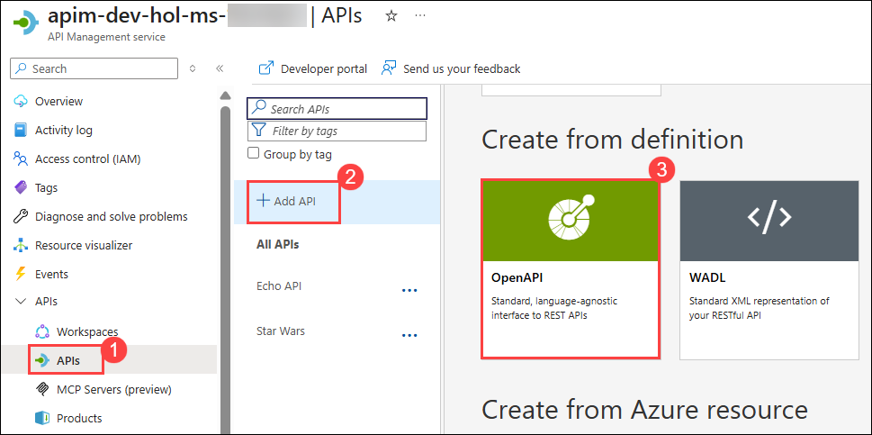
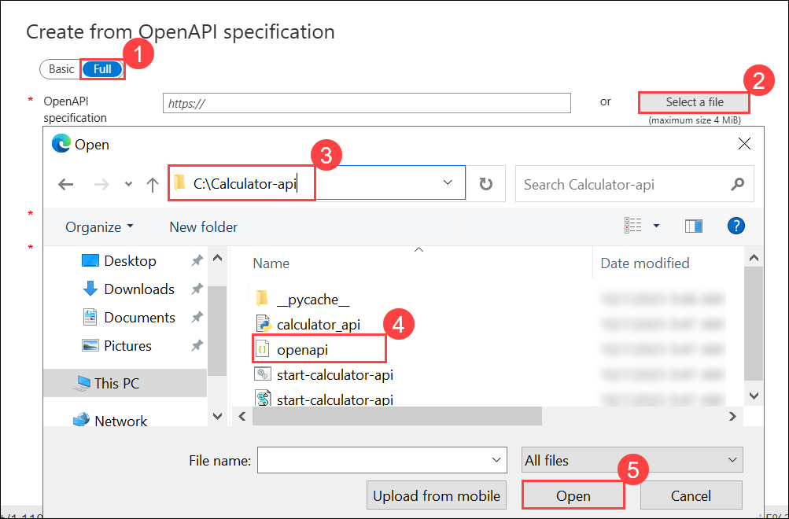
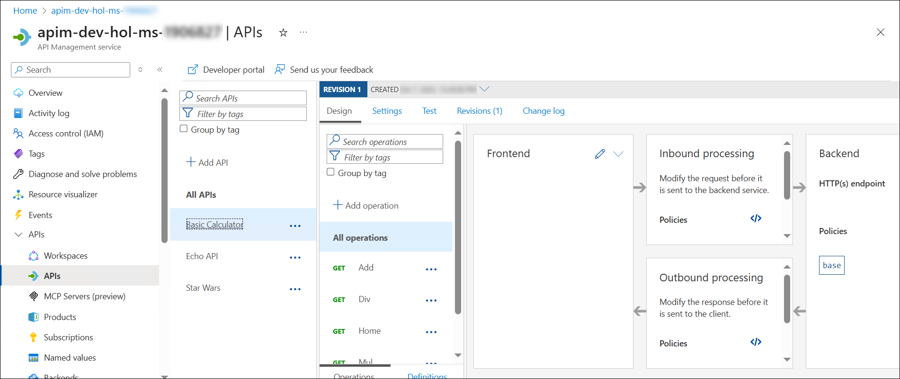
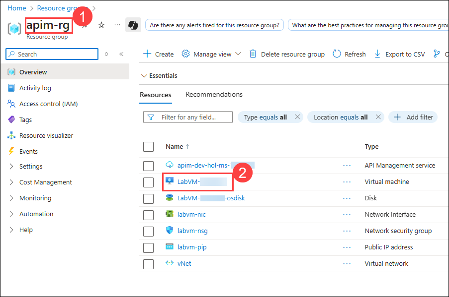
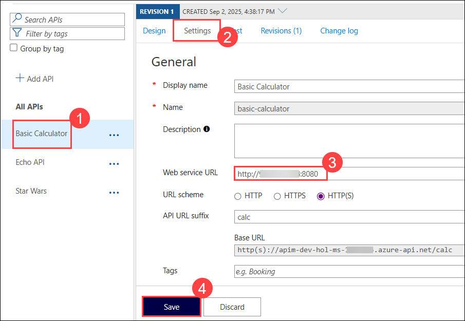
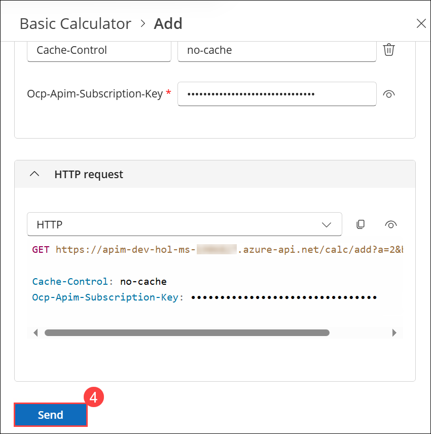
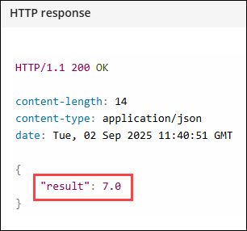
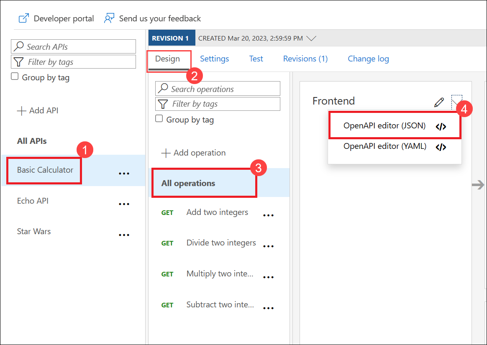

## Exercise 3 Task 3: Import API using OpenAPI 

In this task, you will import an existing API which is hosted locally in your lab VM using the OpenAPI specification. 

Instead of importing operations one-by-one, you can also import a full API. The [OpenAPI specification](https://www.openapis.org/) (aka [Swagger](https://swagger.io)) is a definition format to describe RESTful APIs. The specification creates a RESTful interface for easily developing and consuming an API by effectively mapping all the resources and operations associated with it.

1. Navigate back to your **Azure API Management** instance in Azure Portal.

1. From the left menu, navigate to the **APIs (1)** section and click on **+ Add API (2)**. Select **OpenAPI (3)** under Create from definition. 

     

1. On the **Create from OpenAPI specification** window select **Full (1)** option, enter the following details:

   - OpenAPI specification: Click on **Select a file (2)**, navigate to `C:\Calculator-api` **(3)** location and select the **openapi.json (4)** file and click on **Save (5)**.
   
        

   - Display name: **Basic Calculator (6)**.
   - URL Scheme : **Both (7)**.
   - API URL suffix: **calc (8)**.
   - Products : Assign **Starter** and **Unlimited (9)**.
   - Click on **Create (10)**.

      .png) 
     
1. Once the API is created, it will show in the list of APIs along with all of its operations.

    

1. Now as our **Basic Calculator API** is hosted locally on the Lab VM, we will need to use the Lab VM public IP address to access it. To do this, we will need to change the **Web service URL** of the **Basic Calculator API** to use the Lab VM public IP address. 

   - First, we navigate to our **apim-rg (1)** resource group and select the **Lab VM-<inject key="Deployment ID" enableCopy="false" /> (2)** and copy the **Public IP address (3)**.

      

      

   - Navigate back to the Azure API Management instance. Go to the **Settings (2)** section of the newly created **Basic Calculator (1)** API and enter the **Web service URL (3)** as `http://<vm-public-ip>:8080` and click on **Save (4)**.

      > **Note**: Ensure to replace `<vm-public-ip>` with the actual public IP address of your Lab VM.

      

1. Navigate to the Developer Portal and try out the **Basic Calculator** API. Select the **Add (1)** GET method and click on **Try this operation (2)**. In the **Parameters (3)** and add two parameters `a` and `b` and enter any interger value for both.

      

1. Click on **Send (4)** to make the API call. You should get a `200 OK` response with the result of the addition operation.

      

            

1. Navigate back to the **Azure API Management Portal**, we can inspect/edit the Open API definition by selecting the *OpenAPI Editor (JSON)* option from the dropdown in the Frontend block:

      

      

## Summary

In this task, you imported an existing API using the OpenAPI specification into Azure API Management. You configured the API to point to a locally hosted backend service and successfully tested it through the Developer Portal, demonstrating the ability to manage and consume APIs effectively.

### Now, click on Next from the lower right corner to move on to the next page for further tasks of Exercise 3.

  

