## Task 4.1: Calling API and testing Subscription Keys

Let's add another API, the [Colors API](https://colors-api.azurewebsites.net/swagger/v1/swagger.json).

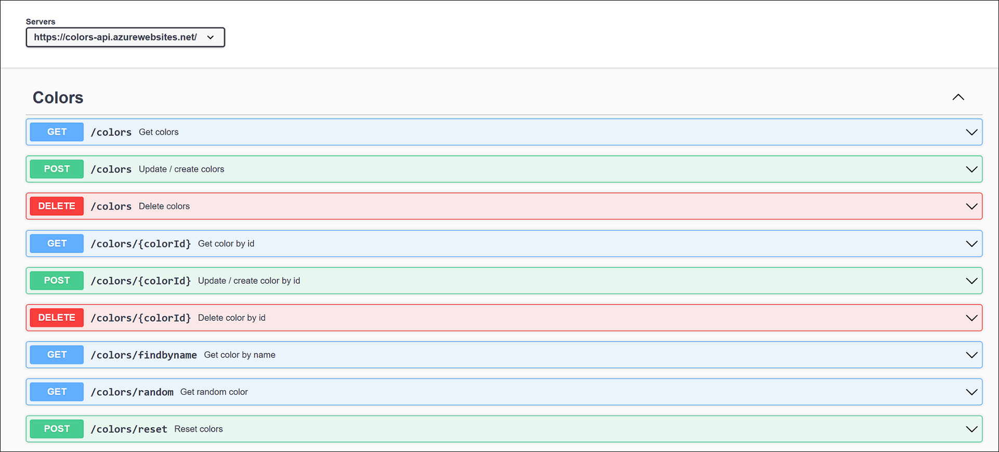

1. Create a new API with OpenAPI specification and import swagger from <https://colors-api.azurewebsites.net/swagger/v1/swagger.json>.
1. To create new API navigate to **APIs (1)**, click on **Add API (2)** and under Create from definition click on **OpenAI (3)**.

      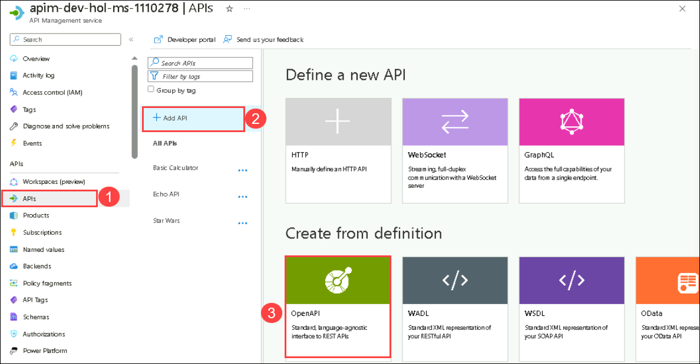
  
1. This time we will choose to not provide API URL suffix. Without an API URL suffix, there could be endpoint conflicts, you can always leverage [rewrite-uri](https://learn.microsoft.com/en-us/azure/api-management/api-management-transformation-policies#RewriteURL) policy to convert a request URL form to the form expected by the backend web service.

    - OpenAPI specification: `https://colors-api.azurewebsites.net/swagger/v1/swagger.json` **(1)**.
    - Display Name: `Colors API` **(2)**
    - Name: **colors-api** **(3)**
    - click on **create** **(4)**.

        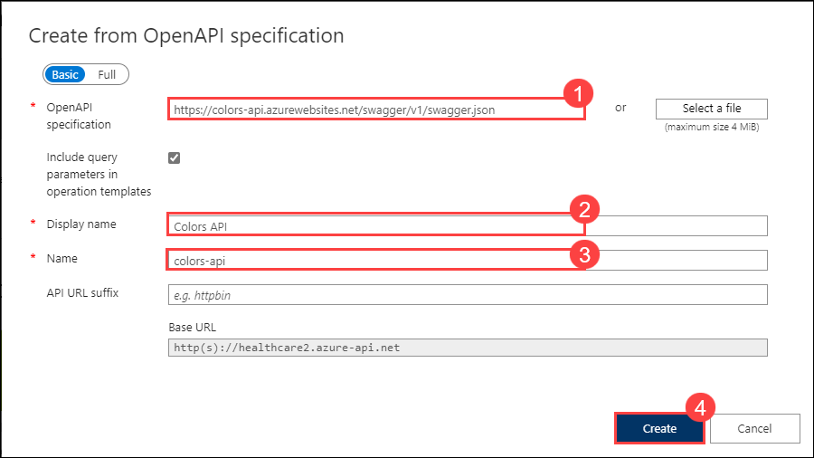

        

1. We can test the newly-added API from the **Test** **(1)** tab, select **Get Random Color** **(2)** and click on **Send** **(3)**.

      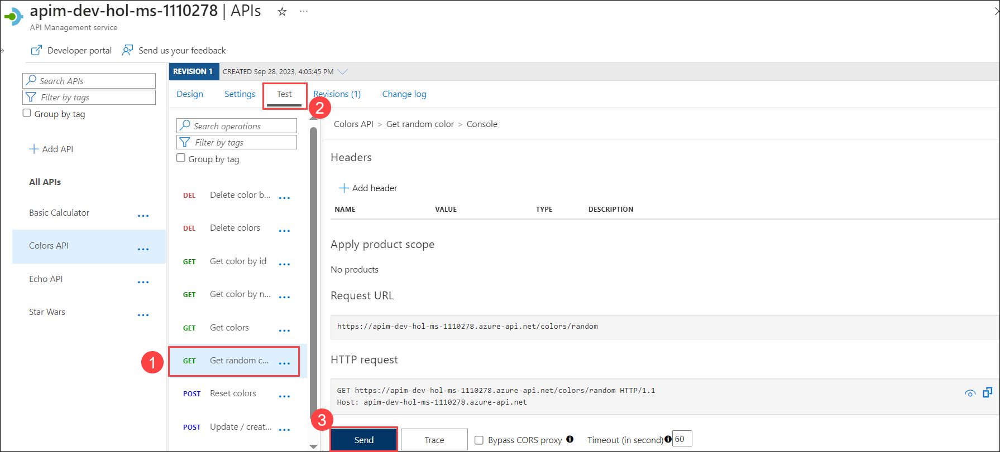

1. Now scroll down and note the successful `200` response.

      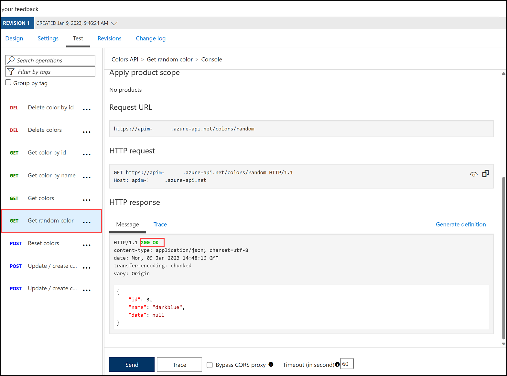

1. Products can be configured after the API is initially created as well. On the **Settings** tab, set **Products** to include **Starter** and **Unlimited**, then press **Save**.

      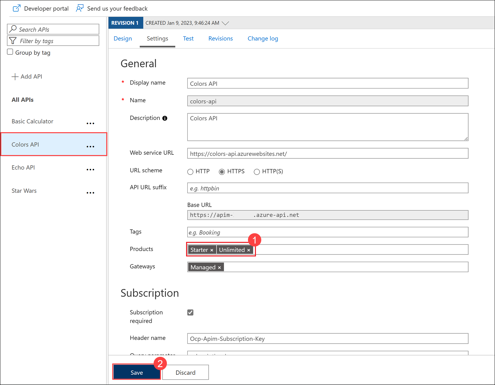

1. Switch to the Developer portal and look at the **Colors API**.
1. Try the **Get random color** operation.
1. Notice the successful `200` response and the returned random color.

      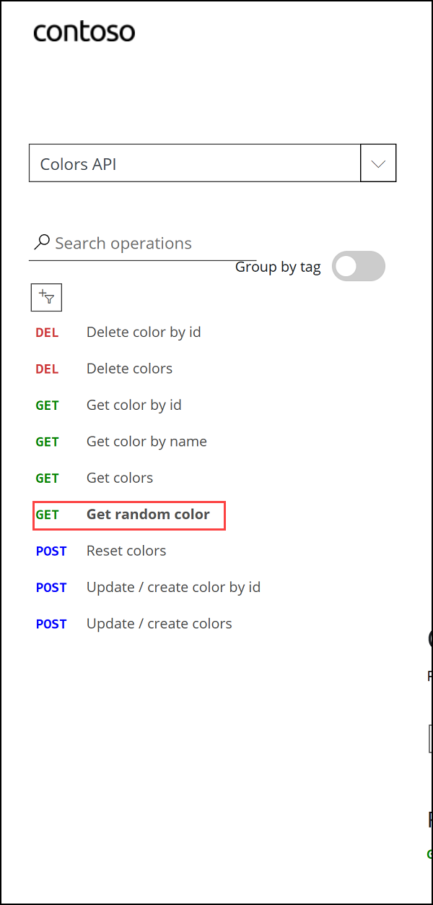

      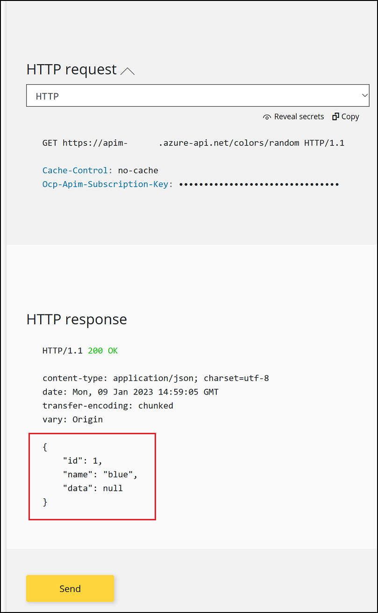

> **Congratulations** on completing the task! Now, it's time to validate it.
<validation step="11eb4759-b54b-4e41-a546-e2fa3d86e8e9" />

### Task 4.2: Rate limit

Azure API Management uses rate limiting to protect APIs from being overwhelmed and helps prevent exposure to DDoS attacks. As Azure API Management sits in between your API and their callers, it effectively governs access to your APIs.  

We are going to use the [Colors](https://colors-web.azurewebsites.net) website to demonstrate how rate limiting is applied. The website displays 500 lights. Each light will randomly make a call to the Get random color API and then apply the returned color to the lights.

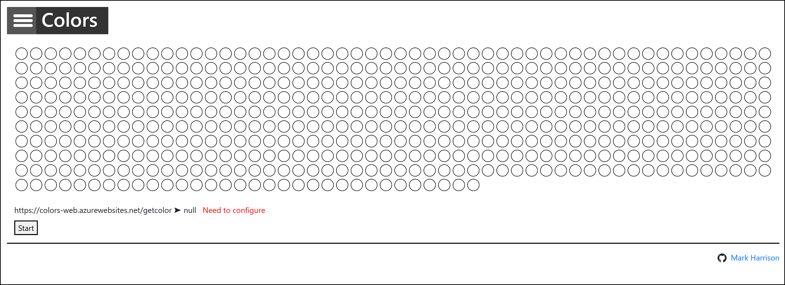

First, we need to enable CORS for the domain name of the front end. To achieve this we have to do the following in APIM:

-  Navigate back to the **Azure Portal**, On the side menu, click on `APIs`, then select the `All APIs` option.
- Inside the `Inbound processing` area you will see the `cors` policy, which we added in part 2 by pressing the `Enable Cors` button.
- Click on the **pencil icon** next to that policy to edit it.

  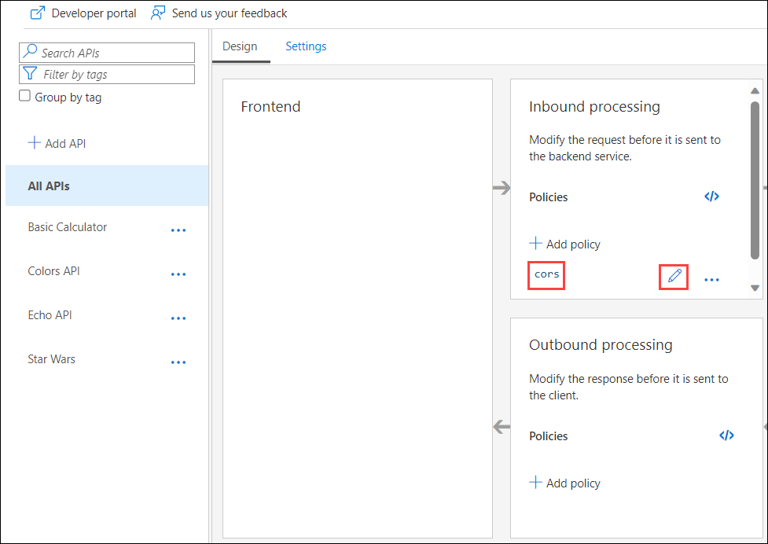  

- Here we will see this form where we can add the domain name of our frontend `https://colors-web.azurewebsites.net` or the `*` for all domains. Press **Add allowed origin**, enter the URL, then press **Save**.

  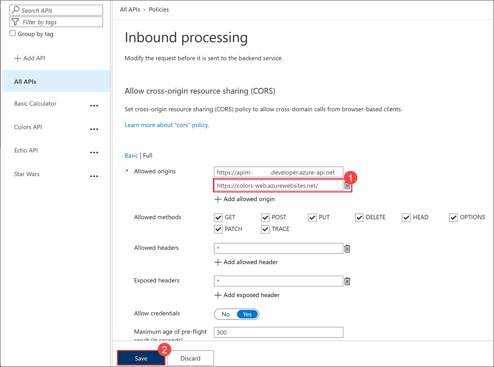

- After enabling CORS in Azure API Management let's go back to our frontend <https://colors-web.azurewebsites.net> and follow these steps:
- Copy this URL <https://colors-web.azurewebsites.net> and paste in the browser.

- Click on the hamburger menu next to *Colors* in the top left corner.
- Click on **Config**.
- Replace the **API URL** with: https://apim-dev-hol-ms-<inject key="Deployment ID" enableCopy="false" />.azure-api.net/colors/random.
- Click on **Submit**
- Press **Start** to see how the frontend is calling the API. You should see a **401** response, indicating an auth error. This happens as our API requires a subscription, but we have not yet entered a subscription key.

  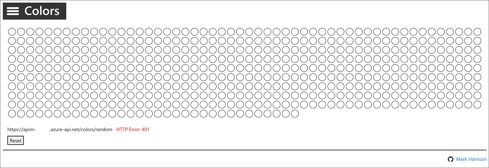

- The subscription keys can be fetched from the Developer Portal. Open the main Developer Portal page, then click on **Profile** in the top menu. 

- Prepare the URL in a text editor:
Concat the base URL and the subscription key for the **Starter** and **Unlimited**:

    
    **https://apim-dev-hol-ms-<inject key="Deployment ID" enableCopy="false" />.azure-api.net/colors/random?key=STARTER_PRIMARY_KEY_HERE**
  
    **https://apim-dev-hol-ms-<inject key="Deployment ID" enableCopy="false" />.azure-api.net/colors/random?key=UNLIMITED_PRIMARY__KEY_HERE**
    

- To see that **Unlimited** product has no rate limits:
  - Configure the Colors website to use the Unlimited URL.
  - Select **Start**.
  - Notice there is no rate limit - every light is randomly and continuously updated. 

    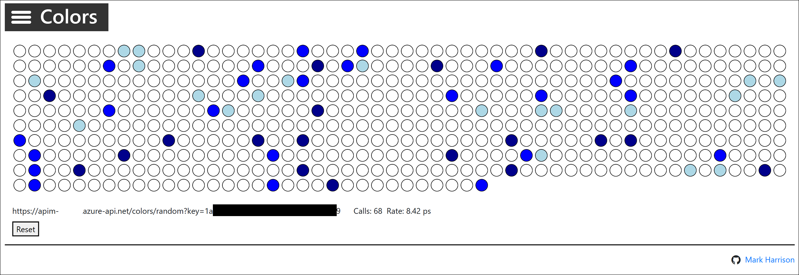

- To see that **Starter** product is limited to 5 calls per minute:
  - Configure the Colors website to use the Starter URL.
  - Select **Start**.
  - Notice that only 5 lights get colored.

    

- Try the same **Starter** URL directly in your web browser and notice the error status/message returned:

    

### Summary
In this Task, you imported and configured the "Colors API" in Azure API Management, successfully tested it in the Developer Portal, and added rate limits to different subscription tiers (Starter and Unlimited).
- Now, click on Next from the lower right corner to move on to the next page.
