## Exercise 3 Task 4: Test Rate Limiting Policy

In this task you will import and configure the "Colors API" in Azure API Management, successfully test it in the Developer Portal, and add rate limits to different subscription tiers (Starter and Unlimited).

### Task 4.1: Calling API and testing Subscription Keys

In this task, you will import the Colors API into your API Management instance and test it in the Developer Portal.

1. Navigate back to your **Azure API Management** instance in Azure Portal.

1. From the left menu, navigate to the **APIs (1)** section and click on **+ Add API (2)**. Select **OpenAPI (3)** under Create from definition. 

    
  
1. On the **Create from OpenAPI specification** window select **Basic (1)** option, enter the following details:

   - OpenAPI specification: `https://colors-api.azurewebsites.net/swagger/v1/swagger.json` **(2)**.
   - Display Name: `Colors API` **(3)**
   - Name: **colors-api** **(4)**
   - Click on **Create (5)**.

      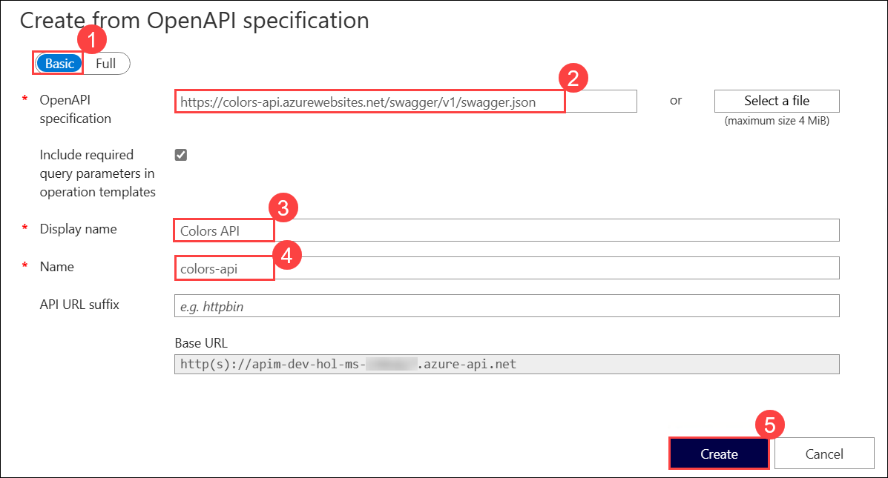

1. We can test the newly-added API from the **Test** **(2)** tab, select **Get Random Color** **(1)** and click on **Send** **(3)**.

      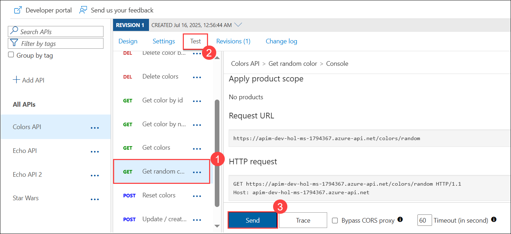

1. Now scroll down and note the successful `200` response.

      

   > **Note:** If you encounter with **401 error**, switch to the **Settings** tab, **uncheck** Subscription required, and press **Save** at the bottom of the page and reperform step 4.

1. We will now add **Products** to the API. On the **Settings** tab, set **Products** to include **Starter** and **Unlimited** **(1)**, then press **Save (2)**.

      

1. Switch to the **Developer portal**, select **APIs** and select the **Colors API**.

1. Select the **Get random color (1)** operation. Click on **Try this operation (2)** and hit **Send (3)**. 

      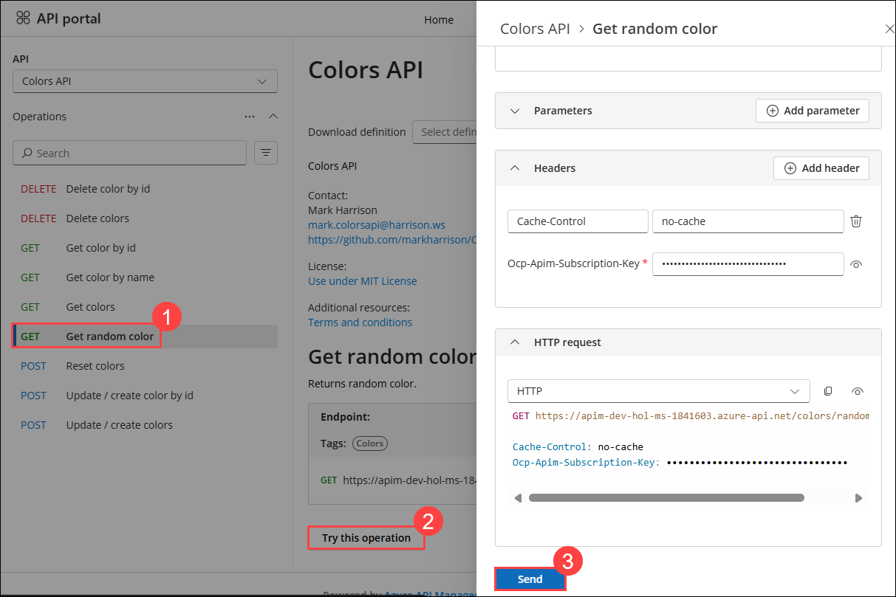

1. Notice the successful `200` response and the returned random color.

      ![]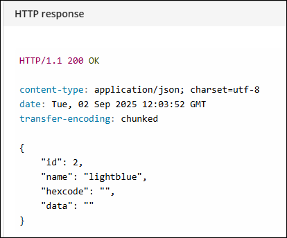

   > **Congratulations** on completing the task! Now, it's time to validate it. Here are the steps:
   > - If you receive a success message, you can proceed to the next task.
   > - If not, carefully read the error message and retry the step, following the instructions in the lab guide. 
   > - If you need any assistance, please contact us at cloudlabs-support@spektrasystems.com. We are available 24/7 to help you out.

      <validation step="11eb4759-b54b-4e41-a546-e2fa3d86e8e9" />

### Task 4.2: Rate limit

In this task, you will explore how to apply rate limits to different subscription tiers in Azure API Management.

Azure API Management uses rate limiting to protect APIs from being overwhelmed and helps prevent exposure to DDoS attacks. As Azure API Management sits in between your API and their callers, it effectively governs access to your APIs.  

We are going to use the [Colors](https://colors-web.azurewebsites.net) website to demonstrate how rate limiting is applied. The website displays 500 lights. Each light will randomly make a call to the Get random color API and then apply the returned color to the lights.

First, we need to enable CORS for the domain name of the front end. To achieve this we have to do the following in APIM:

1. Navigate back to the **Azure API Management** instance, and from the left menu, click on **APIs (1)**, then select the **All APIs (2)** option.

1. Inside the `Inbound processing` area you will see the `cors` policy, which we added in part 2 by pressing the `Enable Cors` button.

1. Click on the **pencil icon (3)** next to that policy to edit it.

      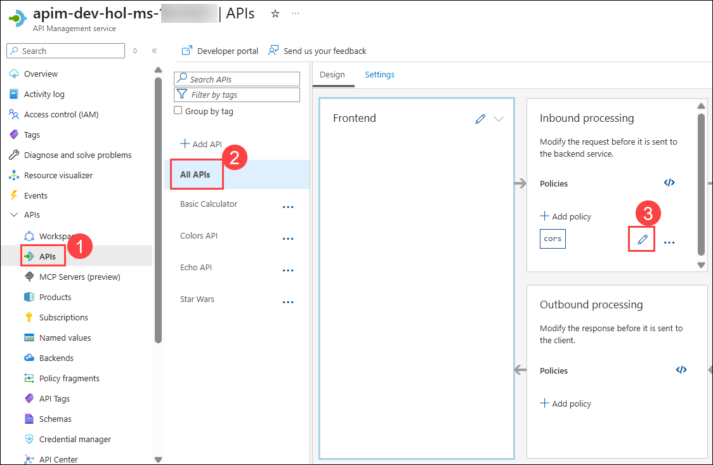  

1. Click on **+ Add allowed origin (1)**, enter the URL as `https://colors-web.azurewebsites.net`  **(2)** and then press on **Save (3)**

      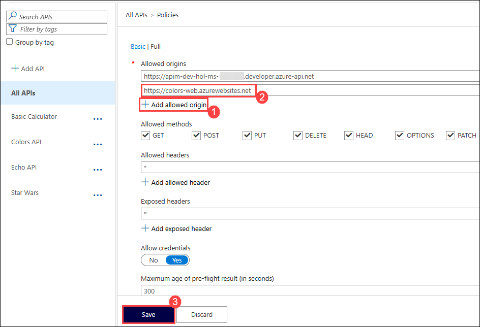 

1. After enabling CORS in Azure API Management, copy this frontend URL `https://colors-web.azurewebsites.net` and paste in the browser.

1. Click on the hamburger menu next to *Colors* in the top left corner.

      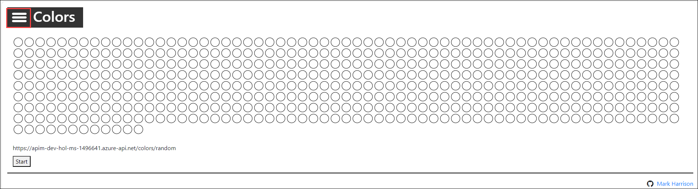
   
1. Click on **Config**.

      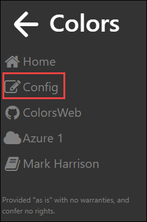
   
1. Replace the **API URL** with: **https://apim-dev-hol-ms-<inject key="Deployment ID" enableCopy="false" />.azure-api.net/colors/random** **(1)** and click on **Submit (2)**.

      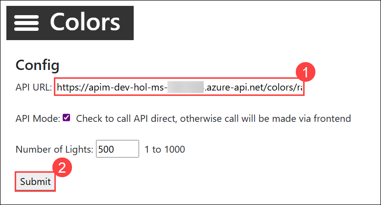

1. Press **Start** to see how the frontend is calling the API. You should see a **401** response, indicating an auth error. This happens as our API requires a subscription, but we have not yet entered a subscription key.

      

1. Navigate back to the developer portal to fetch subscription keys. Open the main Developer Portal page, then click on **Profile (1)** in the top menu.

1. Click on the **Show (2)** and copy the Primary key **(3)** of **Starter** and **Unlimited** product subscription and paste it in a text editor for later use.

      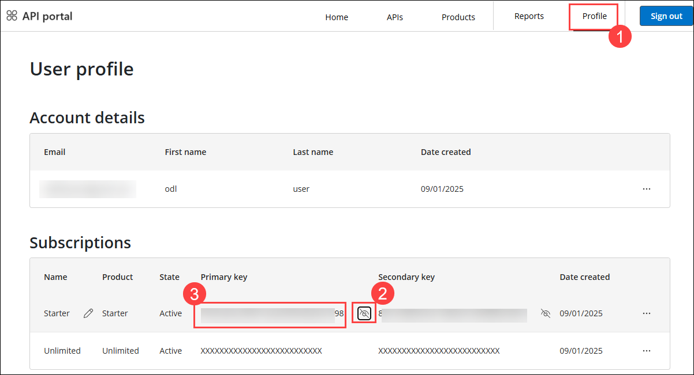
        
1. Prepare the URL in a text editor:

      - Concat the base URL and the subscription key for the **Starter** and **Unlimited** product subscription:
      
      - Starter: **https://apim-dev-hol-ms-<inject key="Deployment ID" enableCopy="false" />.azure-api.net/colors/random?key=STARTER_PRIMARY_KEY_HERE**
        
      - Unlimied: **https://apim-dev-hol-ms-<inject key="Deployment ID" enableCopy="false" />.azure-api.net/colors/random?key=UNLIMITED_PRIMARY__KEY_HERE**
    
        >**Note:** Ensure to replace `STARTER_PRIMARY_KEY_HERE` and `UNLIMITED_PRIMARY__KEY_HERE` with the actual primary keys copied in step 11.

1. To see that **Unlimited** product has no rate limits:
    
      - Click on the **hamburger** menu on the Colors website, select **config** and provide the **url (1)** created for the **Unlimited** product subscription and click on **Submit (2)**.

        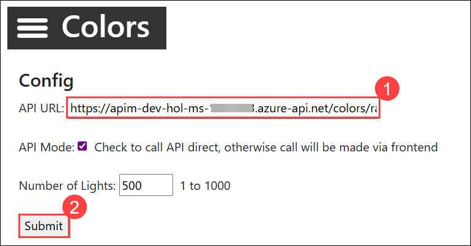
      
      - Select **Start**.
    
      - Notice there is no rate limit - every light is randomly and continuously updated. 

         

1. To see that **Starter** product is limited to 5 calls per minute:
   
      - Click on the **hamburger** menu on the Colors website, select **config** and provide the **url (1)** created for the **Starter** product subscription and click on **Submit (2)**.

        
    
      - Select **Start**.
    
      - Notice that only 5 lights get colored.

         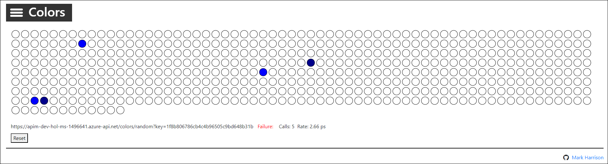

1. Try the same **Starter** URL directly in your web browser and notice the error status/message returned:

      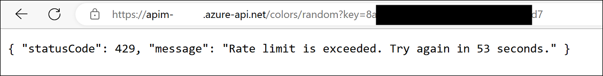

   > **Congratulations** on completing the task! Now, it's time to validate it. Here are the steps:
   > - If you receive a success message, you can proceed to the next task.
   > - If not, carefully read the error message and retry the step, following the instructions in the lab guide. 
   > - If you need any assistance, please contact us at cloudlabs-support@spektrasystems.com. We are available 24/7 to help you out.

      <validation step="1f76f1e2-0059-4133-a585-99bc3ec5846e" />

## Summary

In this Task, you imported and configured the "Colors API" in Azure API Management, successfully tested it in the Developer Portal, and added rate limits to different subscription tiers (Starter and Unlimited).

### You have successfully completed the Exercise. Click on **Next >>** to proceed with the next exercise.

  
