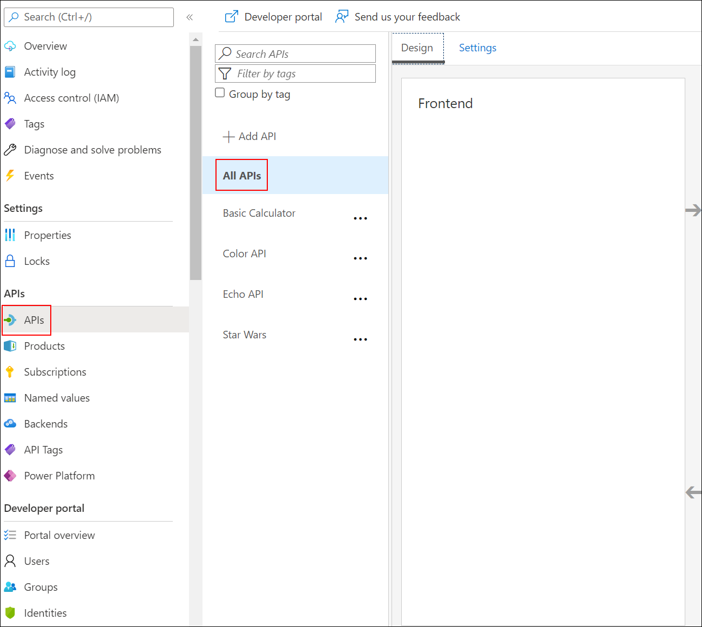

## Lab objectives

You will be able to complete the following tasks:

**Task 1**: Cross-origin resource sharing (CORS) policy

**Task 2**: Caching policy

**Task 3**: Transformation policies

Task 3.1: Transformation - replace string

Task 3.2: Transformation - conditional

Task 3.3: Transformation - XML to JSON

Task 3.4: Transformation - Delete response headers

Task 3.5: Transformation - Amend what's passed to the backend

**Task 4**: Named Values

**Task 5**: Mock policy

**Task 6**: Send One Way policy

**Task 7**: Abort processing policy


## Task 1: Cross-origin resource sharing (CORS) policy

The [cors policy](<https://docs.microsoft.com/en-us/azure/api-management/api-management-cross-domain-policies#CORS>) adds cross-origin resource sharing (CORS) support to an operation or an API to allow cross-domain calls from browser-based clients.

1. We have already configured the **CORS** policy for our APIs in labs 2 & 3. Below is the resulting XML:

      

1. Click on the **Edit button** to view the XML present within the **CORS** policy.

      

    ```xml
    <policies>
        <inbound>
            <cors allow-credentials="true">
                <allowed-origins>
                    <origin>https://apim-sk-12212021.developer.azure-api.net</origin>
                    <origin>https://colors-web.azurewebsites.net/</origin>
                </allowed-origins>
                <allowed-methods preflight-result-max-age="300">
                    <method>*</method>
                </allowed-methods>
                <allowed-headers>
                    <header>*</header>
                </allowed-headers>
                <expose-headers>
                    <header>*</header>
                </expose-headers>
            </cors>
        </inbound>
        <backend>
            <forward-request />
        </backend>
        <outbound />
        <on-error />
    </policies>
    ```

- Now, click on Next from the lower right corner to move on to the next page.
