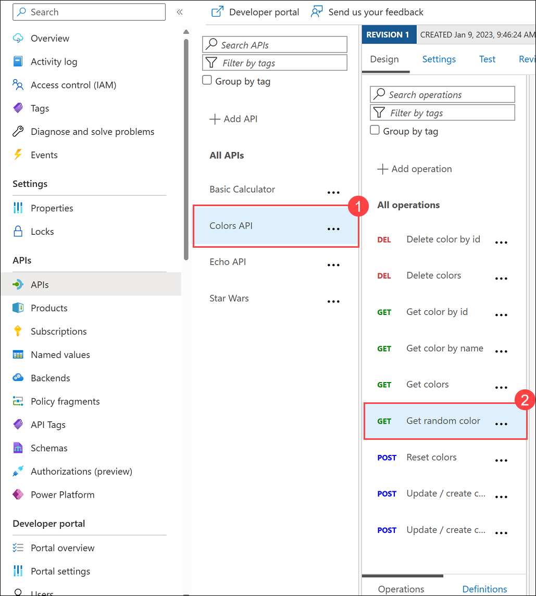
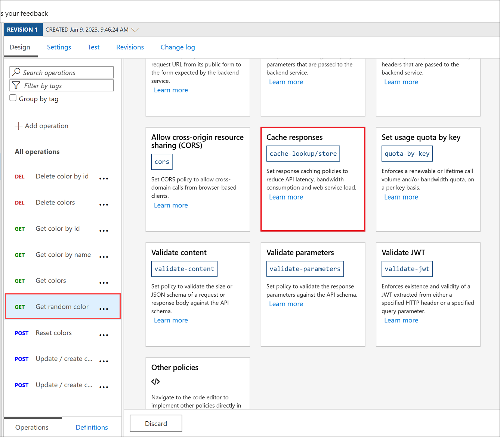
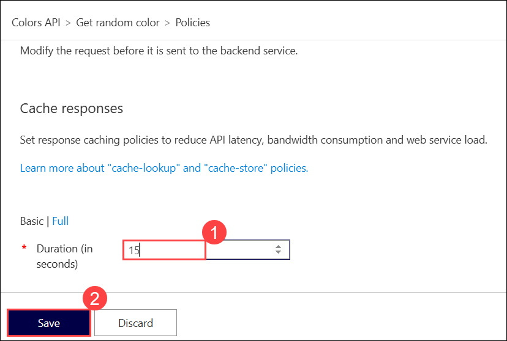
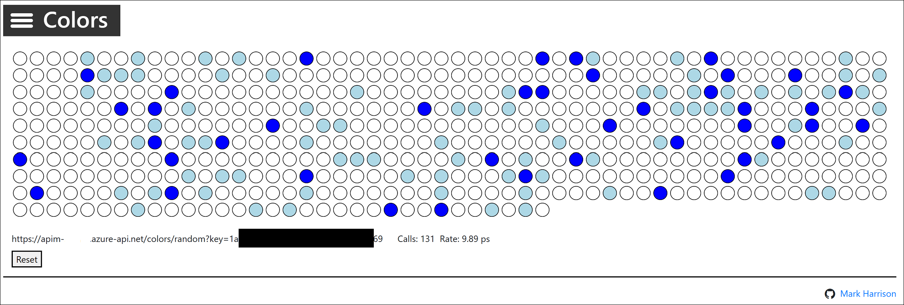
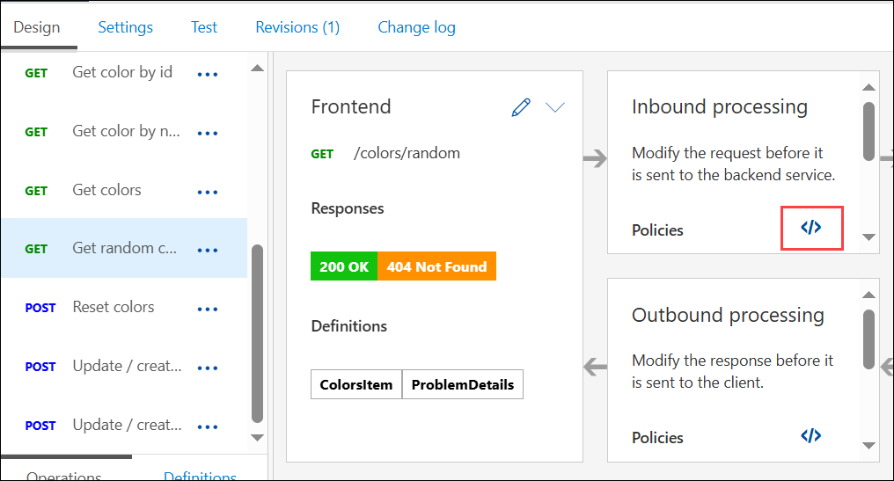
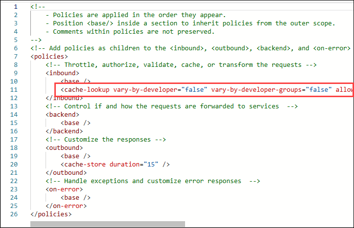

## Exercise 4 Task 2: Caching policy

In this task, you will explore and apply the caching policy to your API.

Azure API Management can be configured for response caching which can significantly reduce API latency, bandwidth consumption, and web service load for data that does not change frequently.

1. Navigate to **All API's** section in the API management resource. We will now apply caching to the **Colors API** we created in Exercise 3.

1. Go to the **Colors API (1)** and select the **Get random color (2)** call:

      

1. Under **Inbound processing**, click on **+ Add policy**.
    
      

1. Scroll down and select **Cache responses**.

      

1. Set a caching duration of `15` **(1)** seconds and **Save (2)**.

      

1. Navigate back to the website and configure the Colors website from Exercise 3(Task 4.2) to use the Unlimited subscription URL.

1. Select **Start**.

1. Notice that for each 15-second period, the same color is set.

    > **Note:** If you are unable to see colors, please refresh the page once. 

    

1. Looking at the **Get Random color** GET API policies in the **Policy Code editor**, you'll see the caching policy defined:

    

    

   > **Congratulations** on completing the task! Now, it's time to validate it. Here are the steps:
   > - If you receive a success message, you can proceed to the next task.
   > - If not, carefully read the error message and retry the step, following the instructions in the lab guide. 
   > - If you need any assistance, please contact us at cloudlabs-support@spektrasystems.com. We are available 24/7 to help you out.
         
      <validation step="d664d71f-012a-4e5b-b703-4db013ab1b98" />

## Summary

In this task, you configured response caching for the "Get random color" call in the Colors API using Azure API Management.

### Now, click on Next from the lower right corner to move on to the next page for further tasks of Exercise 4.

  

