## Exercise 4 Task 3: Transformation policies

In this task, you will explore and apply various transformation policies to your APIs. You will learn how to modify API responses and requests using find-and-replace, conditional logic, format conversion (XML to JSON), header manipulation, and dynamic parameter updates. These techniques help tailor API behavior to meet different requirements and improve compatibility, security, and flexibility.

### Task 3.1: Transformation - replace string

The **find-and-replace** policy finds a substring in a request or response and replaces it with a different string.

1. From your Azure API Management instance, open **APIs (1)** and click the **Colors API (2)**, then select the **Get random color (3)** operation.

      
  
1. In the **Outbound processing (1)** section, select **Policy code editor** symbol **</> (2)**.

      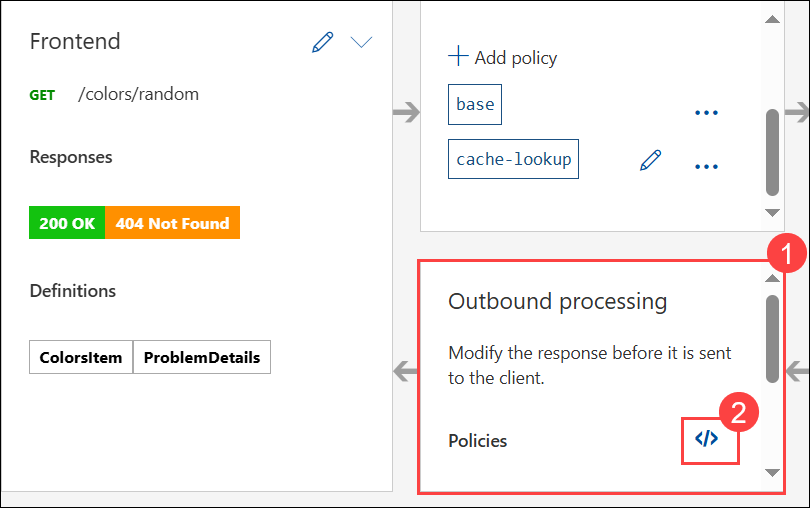
  
1. Place the cursor after the `<base />` **(1)** element in the `<outbound>` section and click on the **Show snippets (2)** button in the top right corner.

      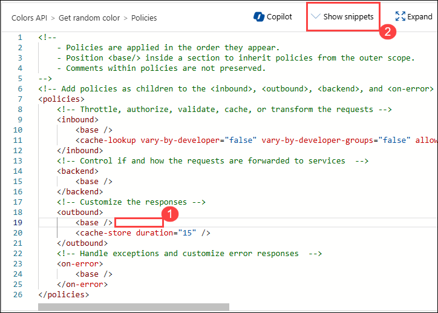

1. From the Show snippets dorpdown, select the **Find and replace string in body** transformation policy which will insert the `<find-and-replace>` element in the `<outbound>` section. 

      

1. Enter **blue** for the `from` value and **green** for the `to` value in the find and replace element. Click on **Save (2)**. Your outbound section should now look like below.

     ```xml  
    <outbound>
       <base />
       <find-and-replace from="blue" to="green" />
       <cache-store duration="15" />
   </outbound>
     ```

      

1. Go back to the tab where you have the **Colors** API test console open. Invoke the API using the Unlimited subscription key.You should see that the color blue is replaced with green.

      

   > **Congratulations** on completing the task! Now, it's time to validate it. Here are the steps:
   > - If you receive a success message, you can proceed to the next task.
   > - If not, carefully read the error message and retry the step, following the instructions in the lab guide. 
   > - If you need any assistance, please contact us at cloudlabs-support@spektrasystems.com. We are available 24/7 to help you out.
   
      <validation step="45b2075d-29c8-4f18-8ec1-c67ed80a1934" />

---

### Task 3.2: Transformation - conditional

Policies can be applied very granularly. In this task, you are modifying the **Star Wars** API to return a limited set of information if the caller is using the **Starter** subscription. Other products, such as the **Unlimited** subscription, will receive the full response.  

The [context variable](https://docs.microsoft.com/en-us/azure/api-management/api-management-policy-expressions#ContextVariables) that is implicitly available in every policy expression provides access to the `Response` and `Product` below. 

> **Note**: After saving any changes in the policy if you see this below pop-up, click on **Discard**.

  

1. From your **Azure API Management** instance, click **Star Wars (1)** API, then select the **Get People By Id (2)** operation and then open **Policy code editor (3)** under **Outbound processing**.

      
  
1. Similarly to the **Colors** API, we will add the outbound policy to conditionally change the response body. Replace the existing entries in the operation with the entire `<policies>` code below and click **Save**. 

    >**Note:** The inbound `Accept-Encoding` header is set to `deflate` to ensure that the response body is not encoded as that causes the JSON parsing to fail.  

    ```xml
        <policies>
          <inbound>
              <base />
              <set-header name="Accept-Encoding" exists-action="override">
                  <value>deflate</value>
              </set-header>
          </inbound>
          <backend>
              <base />
          </backend>
          <outbound>
              <base />
              <choose>
                  <when condition="@(context.Response.StatusCode == 200 && context.Product?.Name != "Unlimited")">
                      <set-body>@{
                          var response = context.Response.Body.As<JObject>();
                          var props = response["result"]?["properties"] as JObject;
      
                          if (props != null) {
                              foreach (var key in new [] {"hair_color", "skin_color", "eye_color", "gender"}) {
                                  var prop = props.Property(key);
                                  if (prop != null) {
                                      prop.Remove();
                                  }
                              }
                          }
      
                          return response.ToString();
                      }</set-body>
                  </when>
              </choose>
          </outbound>
          <on-error>
              <base />
          </on-error>
      </policies>
    ```

    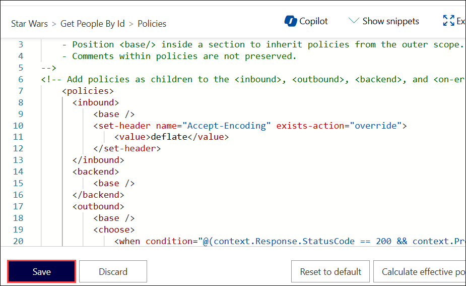

1. Test the API by going to the **Test** **(1)** tab, enter the **id** as 1 **(2)** and apply the appropriate **Starter** or **Unlimited** **(3)** product scope. Click on **Send (4)**. Examine the different responses.

      

1. With **Starter** or **None** product scope:

      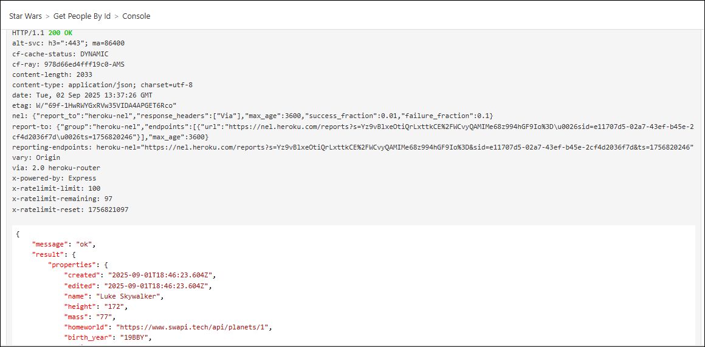

1. With **Unlimited** product scope. Notice the four properties in red that are not included in the **Starter** scope response.

      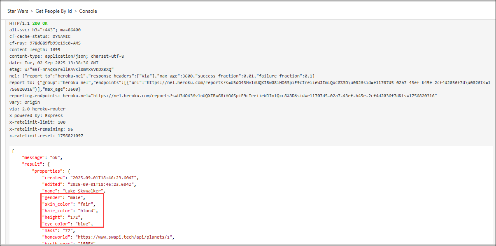

      > **Note:** If you encounter with **401 error**, switch to the **Settings** tab, **uncheck** Subscription required, and press **Save** at the bottom of the page and reperform step 3.

### Task 3.3: Transformation - XML to JSON 

A frequent requirement is to transform content, especially to maintain compatibility with legacy APIs. For this task we are going back to the **Basic Calculator** API that returned an XML response. 

1. From you **Azure API Management** instance, select the **Basic Calculator API**. 

1. On **Design tab (1)**, select **Add (2)** operation, then in **Outbound processing** section click on **Policy code editor `</>` (3)** to transform the response body to JSON.

      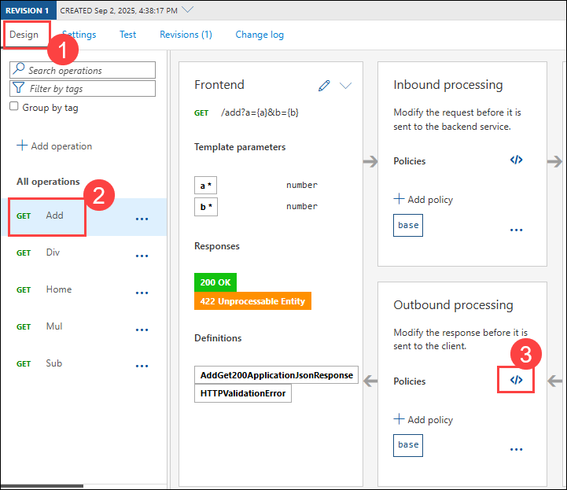

1. Add the following outbound policy **(1)** to transform the XML response to JSON and click on **Save (2)**.

    ```xml
    <outbound>
        <base />
        <xml-to-json kind="direct" apply="always" consider-accept-header="false" />
    </outbound>
    ```

      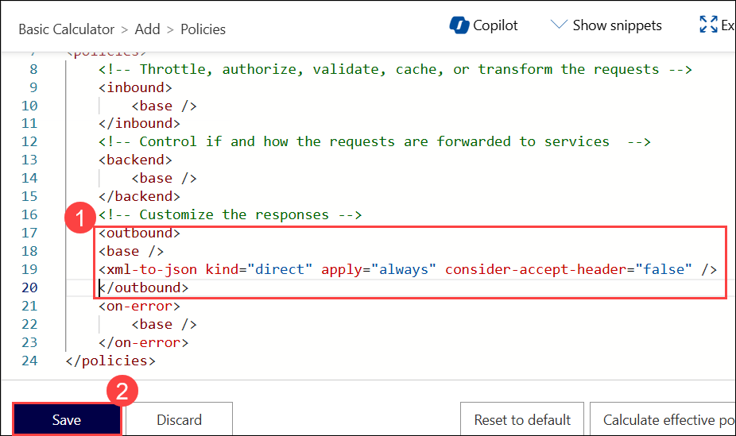

1. Go to the **Test (1)** section and in the Template parameters section, in the value column, add any integers **(2)** for parameters **a** and **b**, and then click **Send (3)**.

    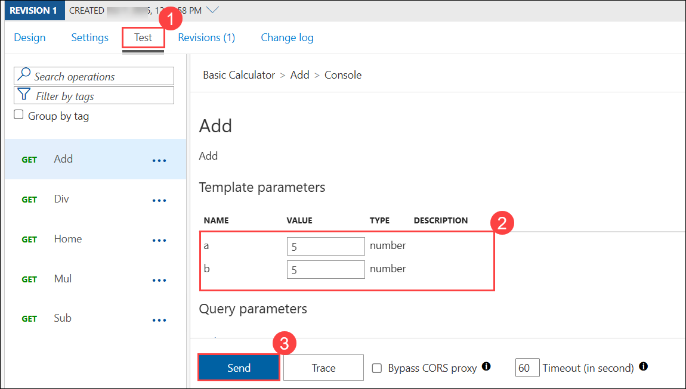

1. Now examine the response. Note that it's now JSON.

      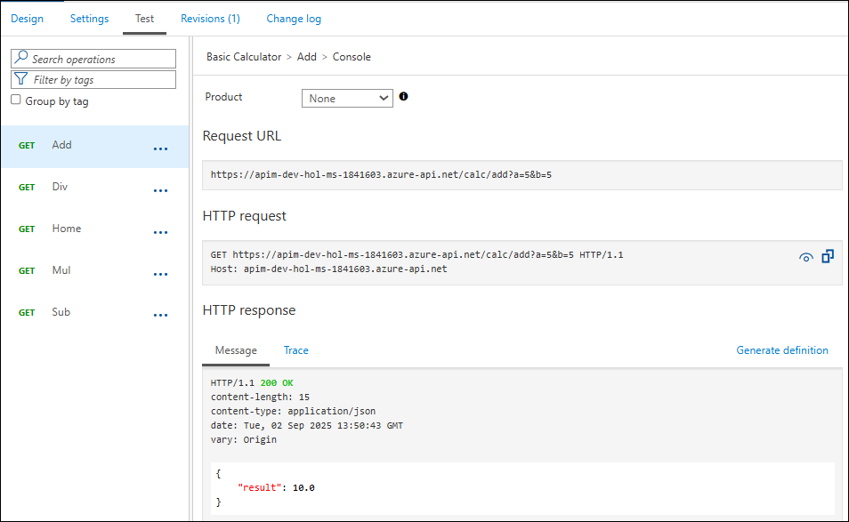

### Task 3.4: Transformation - Delete response headers

In this task, you will remove specific response headers from the **Basic Calculator** API.

A frequent requirement is to remove headers, especially ones that return security-related or superfluous information.

1. Go back to the same **Basic Calculator** API. **Add** operation and open the **Policy code editor** under **Outbound processing**.

1. Add the following outbound policy **(1)** to the **Add** operation to remove specific response headers and click on **Save (2)**.

    ```xml
    <outbound>
        <base />
        <xml-to-json kind="direct" apply="always" consider-accept-header="false" />
        <set-header name="x-aspnet-version" exists-action="delete" />
        <set-header name="x-powered-by" exists-action="delete" />
    </outbound>
    ```
      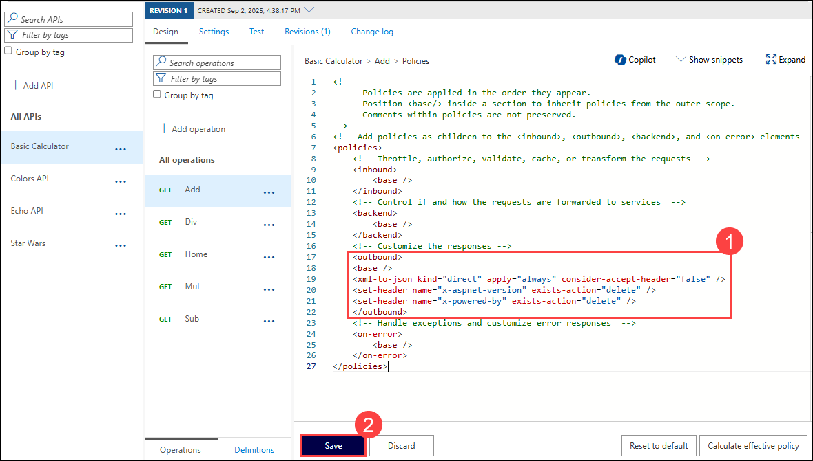

1. Test the same **Add** operation and examine the response.

      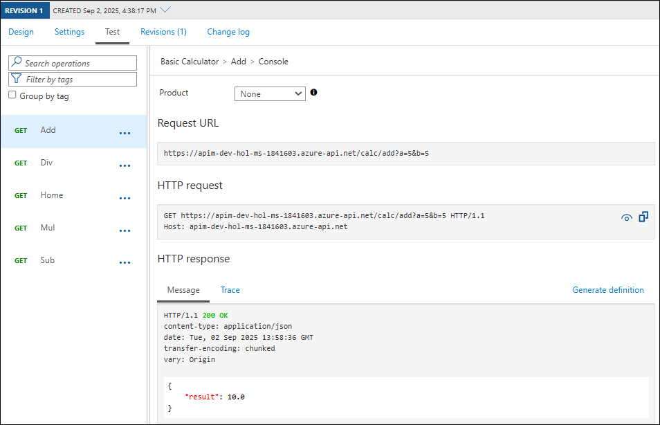

### Task 3.5: Transformation - Amend what's passed to the backend

In this task, you will modify the query string parameters and headers sent to the backend service.

Query string parameters and headers can be easily modified prior to sending the request on to the backend. 

1. Back in the same **Basic Calculator (1)** API operation, from the **Design (2)** tab select the **Add (3)** operation and add **inbound Processing (4)** policies to modify the query string and headers. 

    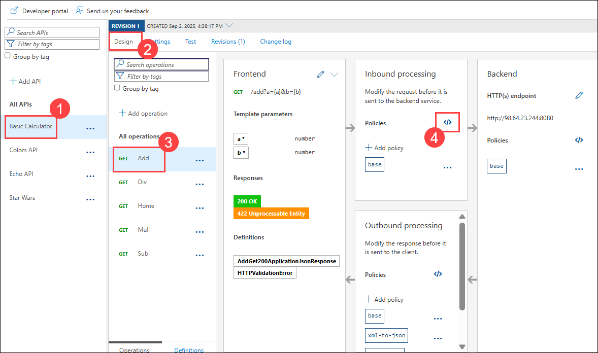

1. Enter the following inbound policy **(1)** to modify the query string and headers and click on **Save (2)**.

    ```xml
    <inbound>
        <base />
        <set-query-parameter name="x-product-name" exists-action="override">
            <value>@(context.Product?.Name ?? "none")</value>
        </set-query-parameter>
        <set-header name="x-request-context-data" exists-action="override">
            <value>@(context.Deployment.Region)</value>
        </set-header>
    </inbound>
    ```

    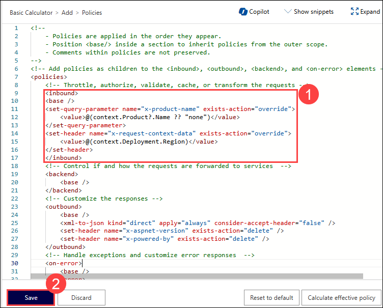

1. Go to the **Test (1)** section. In the Template parameters area, enter any integers **(2)** for parameters **a** and **b**. Then, using either the **Starter** or **Unlimited (3)** product, click **Send (4)** and review the result by selecting **Trace (5)**.

    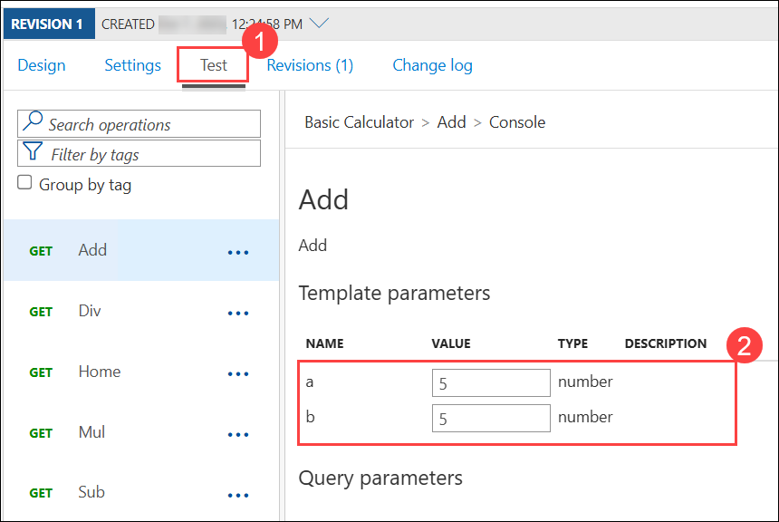

    .png)

    >**Note:** If Tracing is not enabled, you will receive a pop up to enable it, select **Enable Tracing for one hour**.

1. In the **Trace tab (1)**, select **Backend (2)**.

      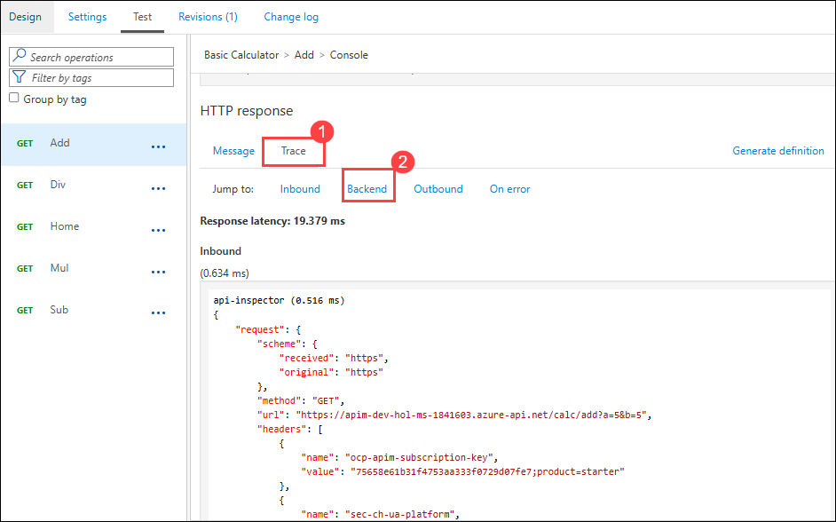

      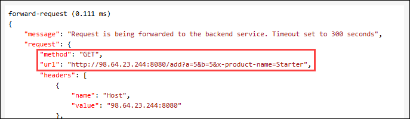

      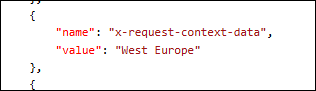


---
## Summary

In the above transformation tasks, you implemented various policies in Azure API Management:

1. You applied find-and-replace policies to modify response strings in the Colors API.

1. Conditional policies were used in the Star Wars API to customize responses based on subscription tiers.

1. You transformed XML to JSON in the Calculator API and removed specific response headers.

1. Query string parameters and headers were dynamically modified using inbound policies in the Calculator API.

### Now, click on Next from the lower right corner to move on to the next page for further tasks of Exercise 4.

  