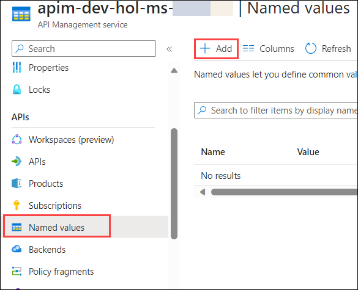
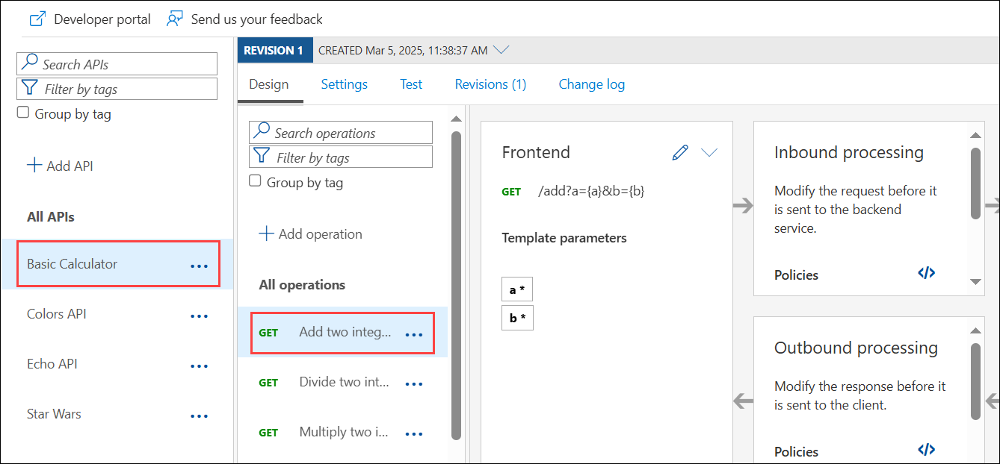
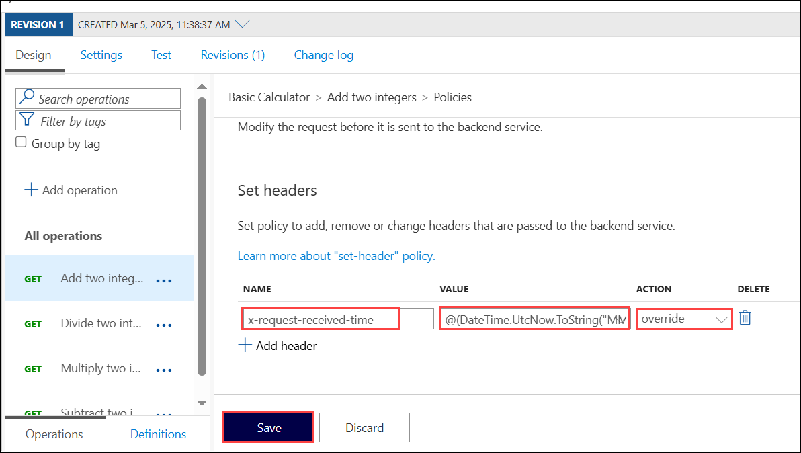
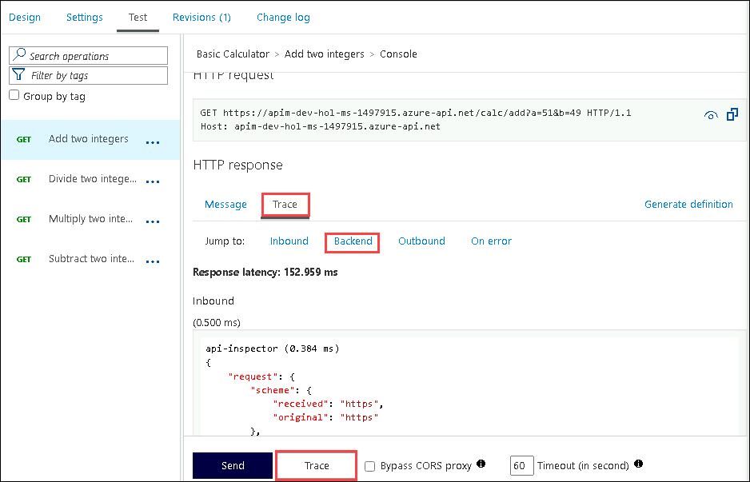
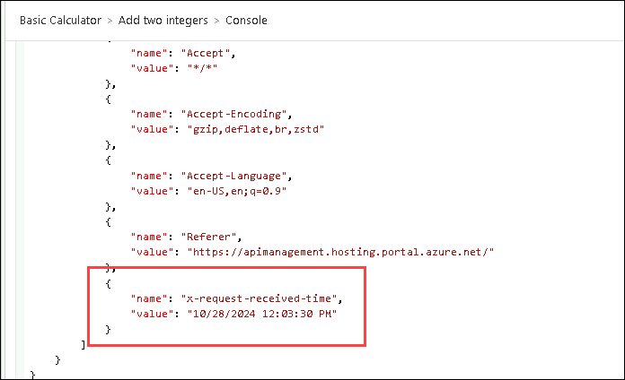

## Continuation for Exercise 4,Task 4: Named Values (Read-Only)

**Named Values** (aka **Properties**) are a collection of key/value pairs that are global to the service instance. These properties can be used to manage `string` constants across all API configurations and policies. Values can be expressions, secrets (encrypted by APIM), or Key Vault, which links to a corresponding secret in Azure Key Vault.

1. Open the `Named values` blade in the resource menu and press **+ Add**.

      
  
1. Create the new property:
    - Name: **TimeNow** **(1)**
    - Display name: **TimeNow** **(2)**
    - Type: **Plain** **(3)**
    - Value: `@(DateTime.Now.ToString())` **(4)**
    - Click on **save** **(5)**

      

1. Back in the **APIs** blade, open the **Add two integers** in the Basic Calculator API.

      
    
1. Amend the inbound `set-header` policy by clicking on the pencil icon.
1. Create a new header by pressing **+ Add header**:
  
    - Name: **x-request-received-time**
    - Value: `@(DateTime.UtcNow.ToString("MM/dd/yyyy h:mm:ss tt"))`
    - Action: **override**
    - Click **Save**

      
      
    - The corresponding XML in the *Code editor* view should look like this: 

      ```xml    
      <inbound>
          <base />
          <set-query-parameter name="x-product-name" exists-action="override">
              <value>@(context.Product?.Name ?? "none")</value>
          </set-query-parameter>
          <set-header name="x-request-context-data" exists-action="override">
              <value>@(context.Deployment.Region)</value>
          </set-header>
          <set-header name="x-request-received-time" exists-action="override">
              <value>@(DateTime.UtcNow.ToString("MM/dd/yyyy h:mm:ss tt"))</value>
          </set-header>
      </inbound>
      ```

1. Test the operation by selecting the **Starter** or **Unlimited** product scope. 

1. Examine the backend trace to find the added header with the evaluated named value:

    ```json
    {
      "name": "x-request-received-time",
      "value": "12/30/2021 6:10:47 PM"
    }
    ```
   

   

   > **Congratulations** on completing the task! Now, it's time to validate it. Here are the steps:
   > - If you receive a success message, you can proceed to the next task.
   > - If not, carefully read the error message and retry the step, following the instructions in the lab guide. 
   > - If you need any assistance, please contact us at cloudlabs-support@spektrasystems.com. We are available 24/7 to help you out.
         
      <validation step="0b2d0949-fa33-4cd3-a097-c56bbc605dcc" />
---

## Summary
In this task, a Named Value (TimeNow) with the current timestamp is created in Azure API Management (APIM). This value is then used to dynamically set the "x-request-received-time" header in the Calculator API's inbound policy, resulting in the header being populated with the current timestamp when testing the API operation.

### You have successfully completed the exercise. Click on **Next >>** to proceed with the next exercise.
