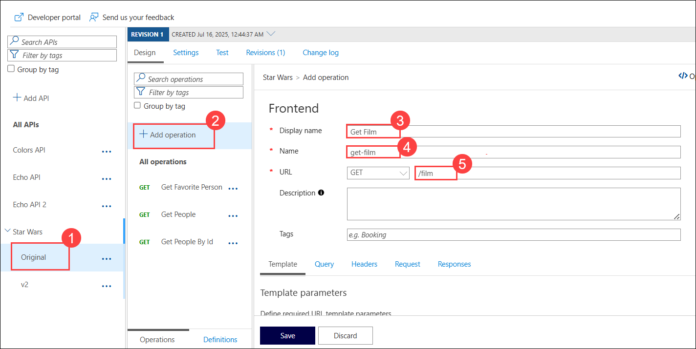
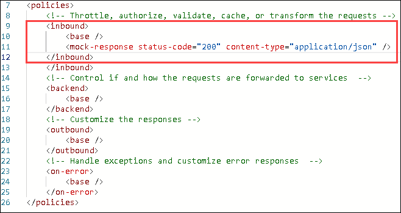

## Continuation for Exercise 4,Task 5: Mock policy

### Mock responses

Mocking in Azure API Management is a useful mechanism for API consumers to interact with APIs without waiting for the backend to be ready. 

1. Open the **Star Wars > Original (1)** API and select **+ Add Operation (2)**

1. Create a new GET operation:
    - Display name: **Get Film** **(3)**
    - Name: **get-film** **(4)**
    - URL: **/film** **(5)**
 
      
  
1. In the **Responses (1)** configuration tab, press **+ Add response (2)**, Select `200 OK` **(3)**.

    

1. Click on **+ Add representation** under Representations, from the content-type  drop-down select `application/json` and add this below sample data under **Sample**:

    ```json
    {
      "count": 1,
      "films": [{ "title": "A New Hope", "release-date": "05/25/1977" }]
    }
    ```
  
      

1. Click on **Save**.
1. Under **Inbound processing** section , click on **Policy code editor** for the **Get Film** Operation.
  
1. Add **Mock Response** under **Other policies** after the `<base />` tag and click on **Save**.

    ```xml    
    <inbound>
        <base />
        <mock-response status-code="200" content-type="application/json" />
    </inbound>
    ```

      

1. Invoke the API from the **Test** tab, click on **Send** to receive a `200` success with the mocked film data .

    

   > **Congratulations** on completing the task! Now, it's time to validate it. Here are the steps:
   > - If you receive a success message, you can proceed to the next task.
   > - If not, carefully read the error message and retry the step, following the instructions in the lab guide. 
   > - If you need any assistance, please contact us at cloudlabs-support@spektrasystems.com. We are available 24/7 to help you out.

      <validation step="3083e0a3-97d5-46ce-bdf3-7c9e6cd526e7" />
---

## Summary 
In Azure API Management, a "Get Film" operation is created for the Star Wars API. This operation returns a mock response with a 200 OK status code and sample JSON data containing film information. An inbound policy is added to simulate the mock response, and when the API is invoked, it returns a 200 success status with the mocked film data.

### Now, click on Next from the lower right corner to move on to the next page for further tasks.
