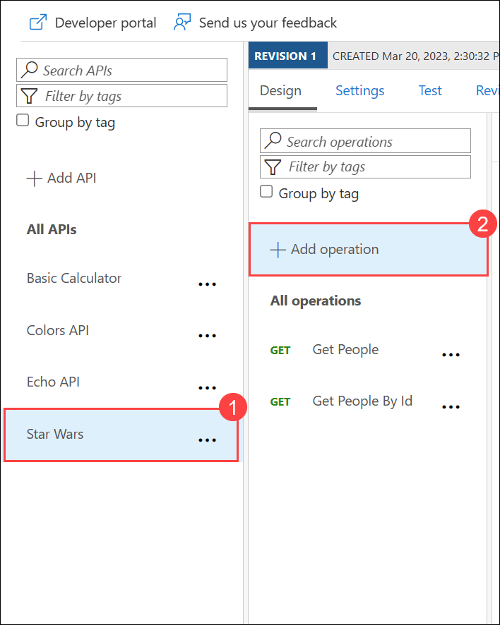
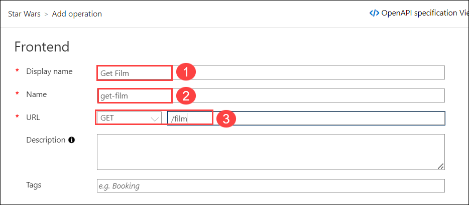
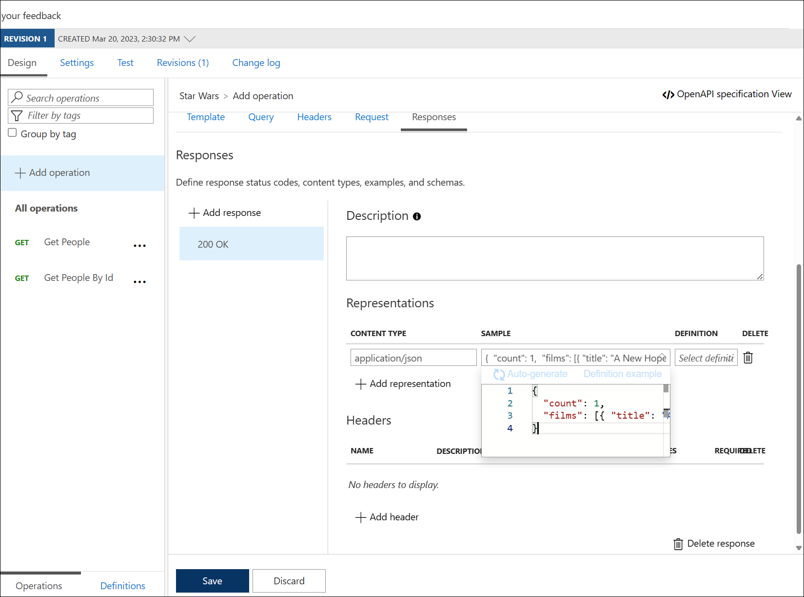
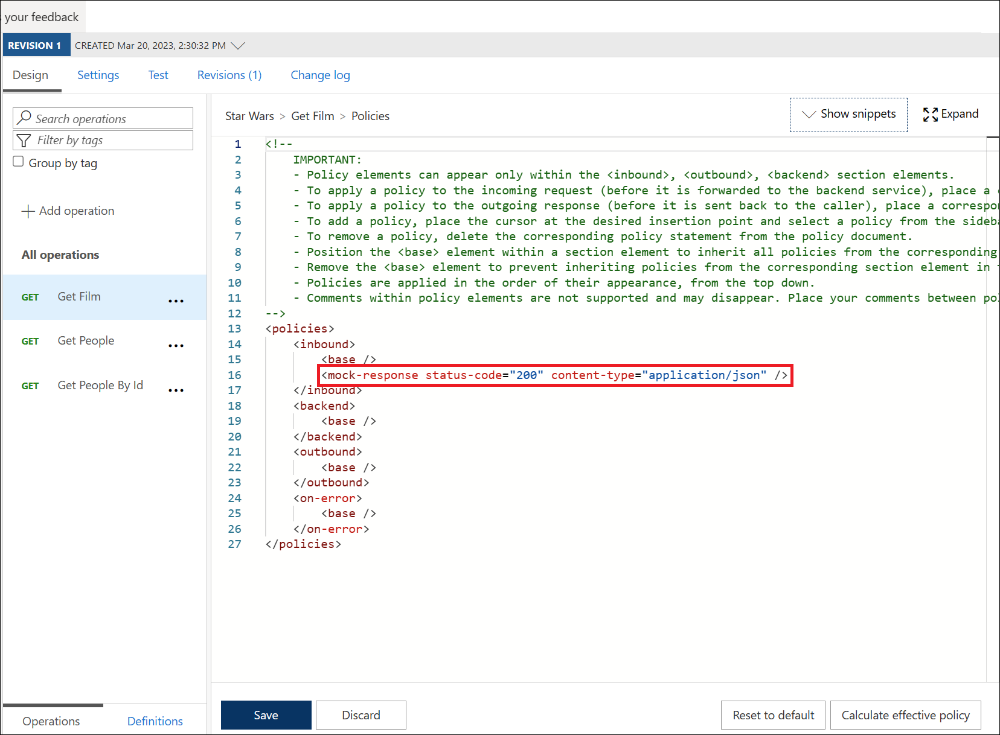
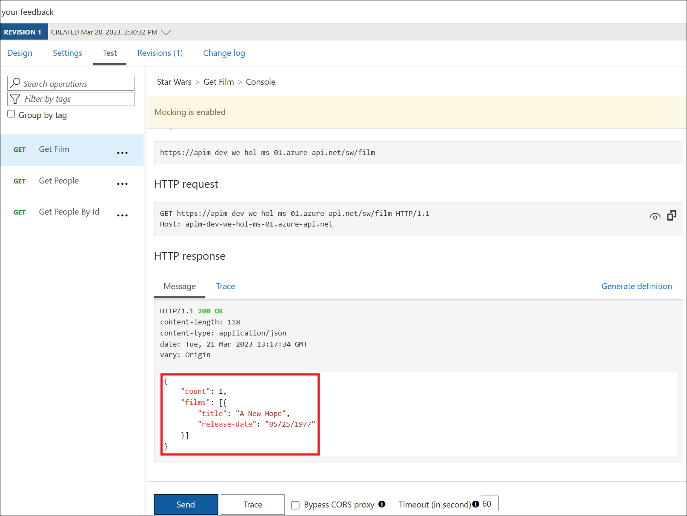

## Task 5: Mock policy

### Mock responses

Mocking in Azure API Management is a useful mechanism for API consumers to interact with APIs without waiting for the backend to be ready. 

- Open the **Star Wars** API and select **+ Add Operation**



- Create a new GET operation:
  - Display name: **Get Film**
  - Name: **get-film**
  - URL: **/film**
 

  
- Under the Design tab, in the **Responses** configuration tab, press **+ Add response**, Select `200 OK`.

- Click on **+ Add representation** under Representations, from the content-type  drop-down select `application/json` and add this below sample data under **Sample**:

  ```json
  {
    "count": 1,
    "films": [{ "title": "A New Hope", "release-date": "05/25/1977" }]
  }
  ```
  
  

- Click on **Save**.
- Under **Inbound processing (1)** section , click on **Policy code editor (2)**

  
  
- Add **Mock Response** under **Other policies** after the `<base />` tag.

  ```xml    
  <inbound>
      <base />
      <mock-response status-code="200" content-type="application/json" />
  </inbound>
  ```

  

- Invoke the API from the **Test** tab to receive a `200` success with the mocked film data .

  
---

### Summary 
In Azure API Management, a "Get Film" operation is created for the Star Wars API. This operation returns a mock response with a 200 OK status code and sample JSON data containing film information. An inbound policy is added to simulate the mock response, and when the API is invoked, it returns a 200 success status with the mocked film data.
- Now, click on Next from the lower right corner to move on to the next page.
