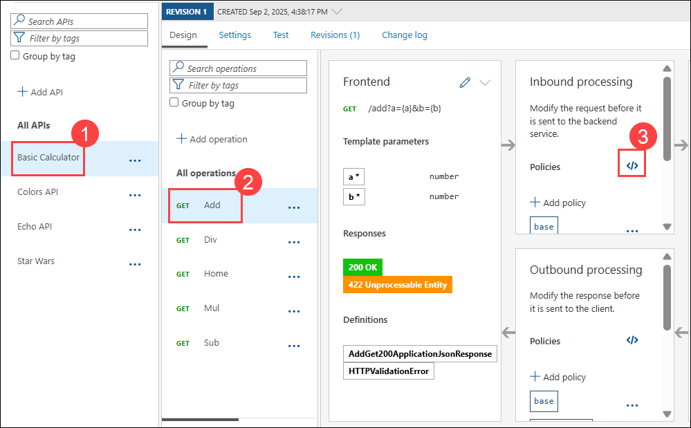
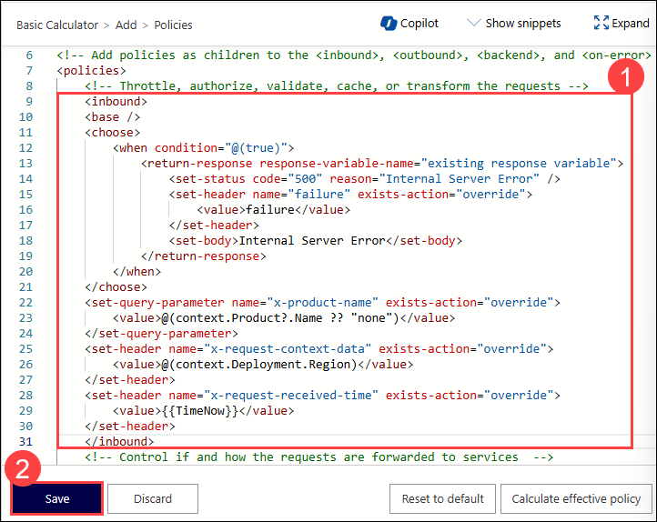
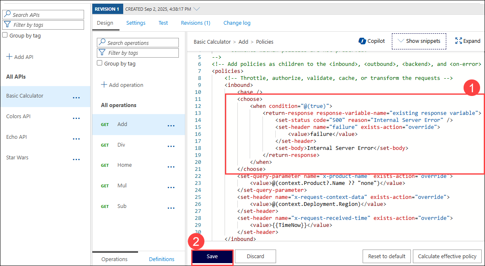

## Exercise 4 Task 7: Abort processing policy

In this task, you will learn how to use the `return-response` policy to abort processing and return a custom response. 

The ability to terminate a response gracefully is of importance in a number of cases such as error handling or business logic. Using the `return-response` policies short-circuits the request and yields a response that often does not originate from the backend. Consider what general situations may make sense without shifting too much business logic into APIM.

1. From the APIM instance, open **Basic Calculator (1)** API and open the **Add (2)** operation from the **Design** Tab

1. Naviage to the **Inbound processing** tab and open the **Code View (3)**.

    

1. Add the **inbound (1)** policy to test for a condition (just `true` for our example) and click on **Save (2)**.
  
    ```xml
    <inbound>
        <base />
        <choose>
            <when condition="@(true)">
                <return-response response-variable-name="existing response variable">
                    <set-status code="500" reason="Internal Server Error" />
                    <set-header name="failure" exists-action="override">
                        <value>failure</value>
                    </set-header>
                    <set-body>Internal Server Error</set-body>
                </return-response>
            </when>
        </choose>
        <set-query-parameter name="x-product-name" exists-action="override">
            <value>@(context.Product?.Name ?? "none")</value>
        </set-query-parameter>
        <set-header name="x-request-context-data" exists-action="override">
            <value>@(context.Deployment.Region)</value>
        </set-header>
        <set-header name="x-request-received-time" exists-action="override">
            <value>{{TimeNow}}</value>
        </set-header>
    </inbound>
    ```

         
     
      > **Note:** Click on **Save** when the warning pop-up appears.

1. Test the operation and observe that you receive a 500 Internal server error. 

    

### Clean Up

  Now that you have seen how to gracefully terminate a request with a response, it is time to clean up the code to prevent a downstream impact in subsequent labs.
  Open the Inbound polic of the **Add** operation and Please remove the `<choose>` logic above to let all requests flow again, then save the changes.

  

## Summary

In this task, you learned how to use the `return-response` policy to abort processing and return a custom response. You successfully tested the policy by simulating an internal server error.

### You have successfully completed the Exercise. Click on **Next >>** to proceed with the next exercise.

  
