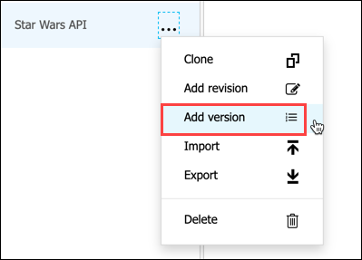
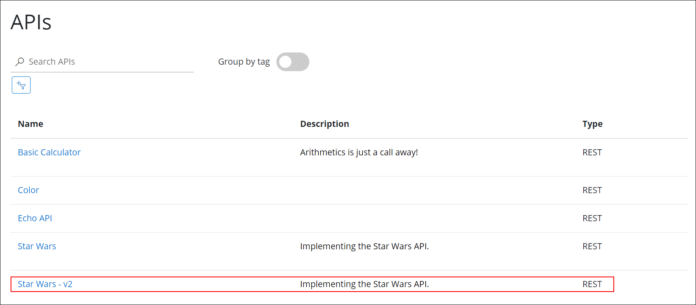
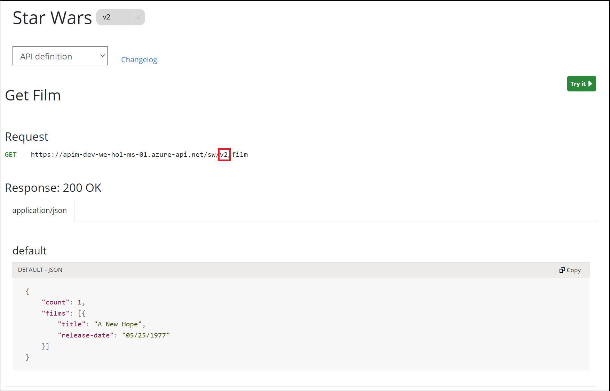
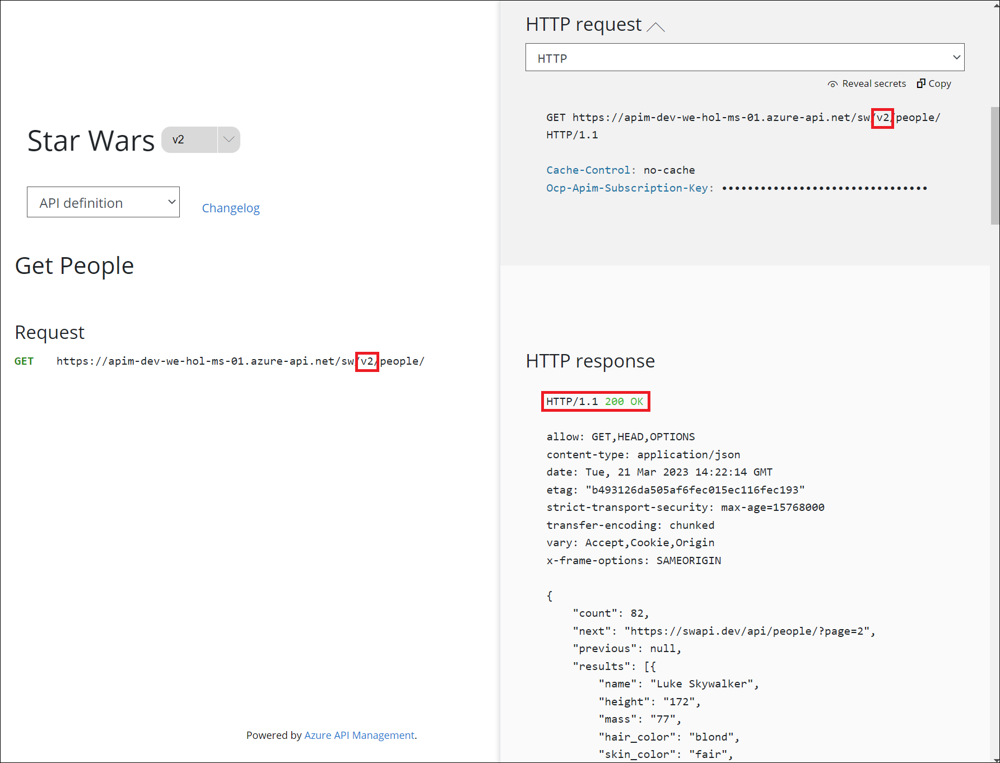

## Task 1: Version

Proper version management not only helps organize your API, it also aids in Azure API Management. In this exercise, we are going to version an existing API.

> Good practice: Integrate version management from the beginning with a **v1** or similar identifier. 

### Task 1.1: Add a new version

- Select the **Star Wars** API.
- Click on the ellipsis and select **Add version.**

   
  
- Add a new version with these values,
  - Version identifier: **v2** **(1)** 
  - Versioning scheme: **Path** **(2)** 
  - Full API version name: **star-wars-v2** **(3)** 
    > This name must be unique across the Azure API Management instance. Therefore, a combination of the API name and its version identifier is both semantic and suitable.
  - Products: **Starter** and **Unlimited** **(41)** 
  -  Click on **Create**: **(5)** 

    

  - The new version, _v2_, is now added to the Star Wars API. 
    > Any previous implementation of the newly-versioned API will simply be set to _Original_. This is a purely organizational change within APIM. The  version continues to operate on the same previous URL without a version identifier - there is no impact on the consumers.

    

### Task 1.2: Test the new version

> Sometimes, the version creation takes just a little bit of time. If you do not see it immediately, please keep refreshing and ensure you select the appropriate version as per the below instructions.

- In the Developer Portal select the `v2` version of the *Star Wars* API.

  

- Notice the request URL and the inclusion of `v2` in the path.

  

- Test the `GetPeople` operation.

  

### What Versions Enable

Now that you have created a new version of the API, you have the ability to introduce breaking changes. Oftentimes times a breaking change in a backend API necessitates an API version change in APIM. Leaving a legacy implementation behind to focus on more contemporary API implementations also is a common versioning use case. Whatever the reason may be, Azure API Management provides means to abstract breaking changes in a responsible and safe manner.  

- Now, click on Next from the lower right corner to move on to the next page.
