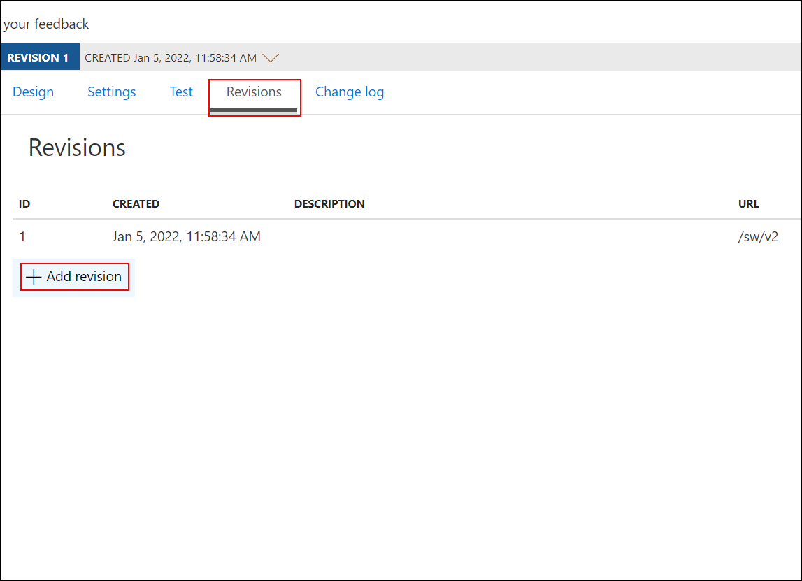
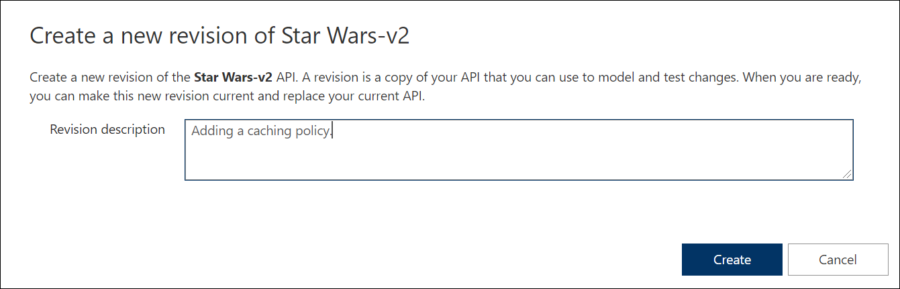
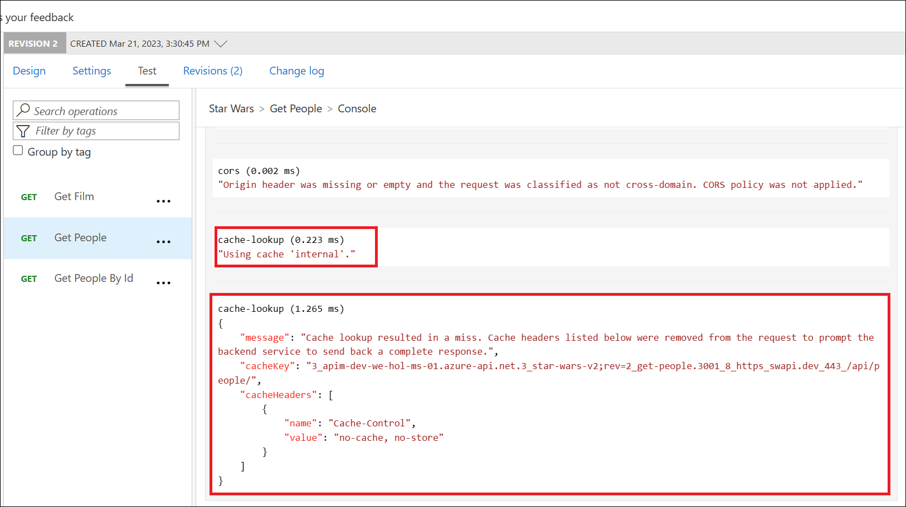
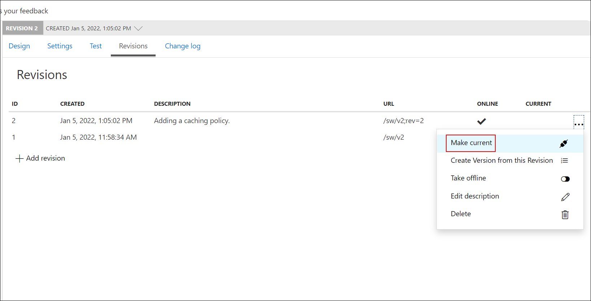
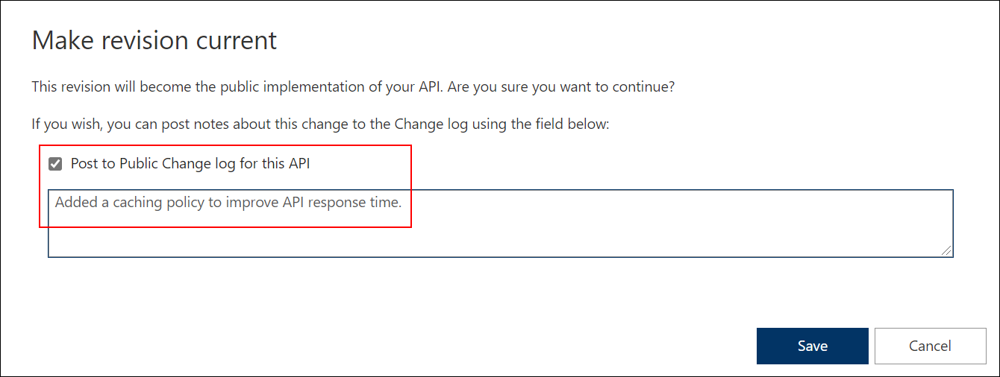

## Continuation for Exercise 5,Task 2: Revisions

### Task 2.1: Add a new revision

1. Select the **Star Wars** API **v2**.

      

1. Select the **Revisions** tab.

      
  
1. Add a new revision with the description `Adding a caching policy.`
  
      

    > The new revision is online but not yet current. The previous revision continues to remain the active default. Having added the new revision has not resulted in any change for your API consumers.

      

### Task 2.2: Add caching

1. Switch to the **Design** tab, then select the `Get People` operation.
    > **Revision 2** automatically became the active revision you are now making changes in. You can also switch between revisions, but **be aware that changes to the *Current* revision are live immediately**.

      

1. Add a 10-second caching policy for the **GET People** operation via the Code editor.

    ```xml
    <inbound>
        <base />
        <cache-lookup vary-by-developer="false" vary-by-developer-groups="false" allow-private-response-caching="false" must-revalidate="false" downstream-caching-type="none" />
    </inbound>
    <backend>
        <base />
    </backend>
    <outbound>
        <base />
        <cache-store duration="10" />
    </outbound>
    ```

      

### Task 2.3: Test the new revision

1. From the Azure portal, select the `Get People` operation and click on **Trace**.
  
  > Note the revision number at the top of the page as well as in the request URL.  
  The request URL should look similar to: `https://<your-apim-name>.azure-api.net/sw/v2;rev=2/people/`.

   

1. Test the API twice. The test trace should then show that the cache lookup occurred. 

      

### Task 2.4: Make current revision

1. Select the **Revisions** tab.
1. Click on the ellipsis for `rev2` and make it the current revision.

      

1. Choose to post to the public change log for the API and provide a meaningful update.

      

1. The new revision is now the current/live one. When you test now, note that the URL no longer contains a specific revision. The old revision is still online and can now be accessed with the `rev` qualifier. 

    > Unlike versioning, revisioning requires no URL updates for the API consumer.

      


> **Congratulations** on completing the task! Now, it's time to validate it.
<validation step="1f315944-8264-47c9-ab2d-6d4fe20e4f6e" />
--- 

### Summary
In this Task, a new revision is added to the Star Wars API in Azure API Management. This revision remains inactive until made current. Then, caching policies are applied to the GET operation of this new revision. Testing the API shows cache-lookup behavior. Finally, the new revision is made the current one, eliminating the need for URL updates for API consumers, illustrating the advantages of revisioning over versioning in APIM.

### Now, click on Next from the lower right corner to move on to the next page.
