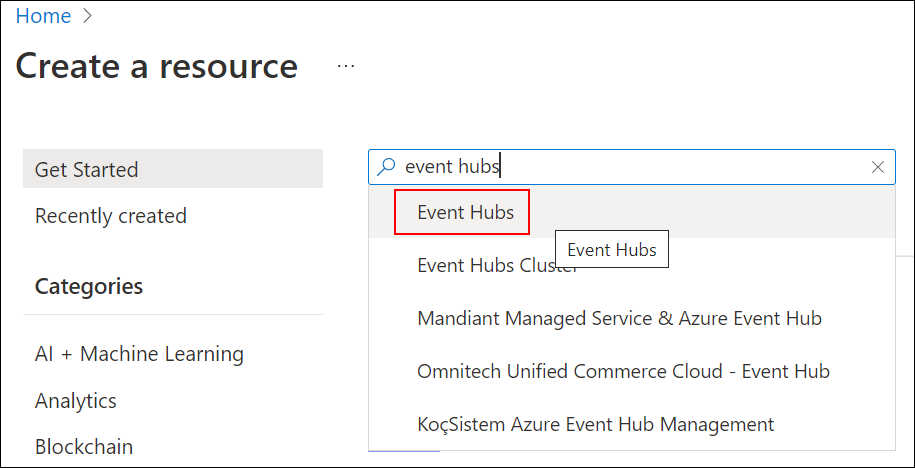
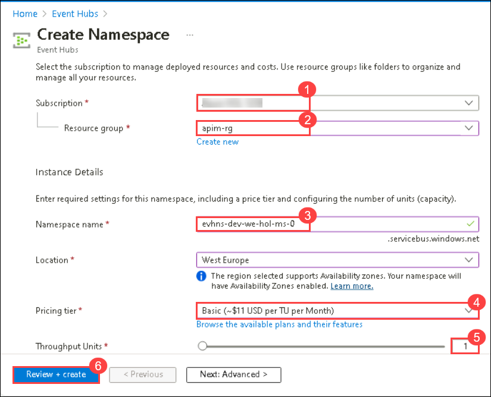
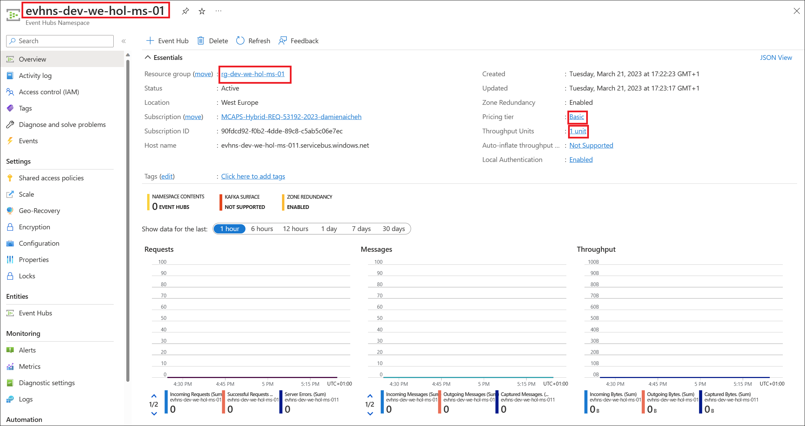
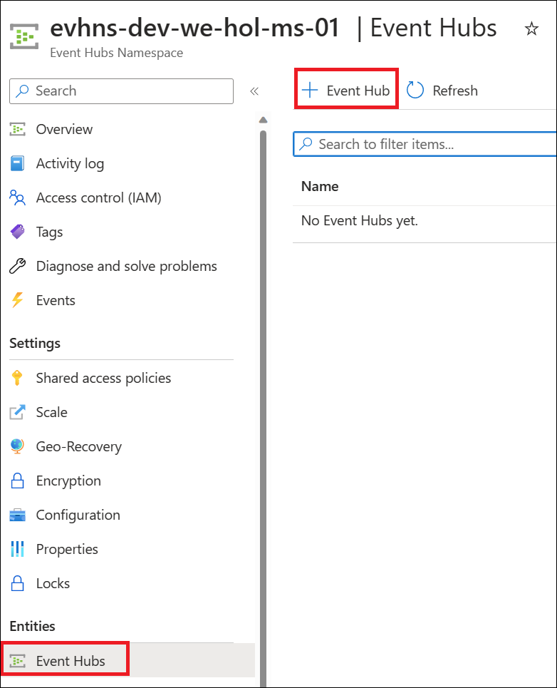
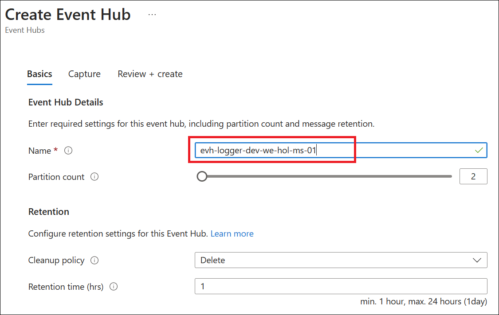
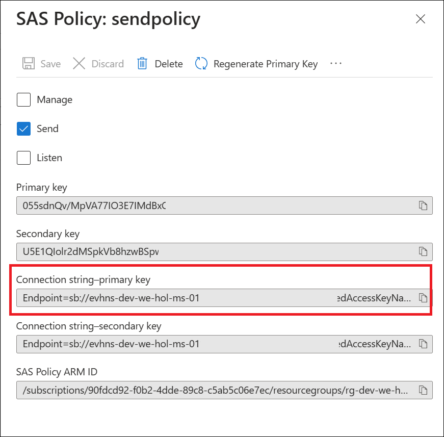
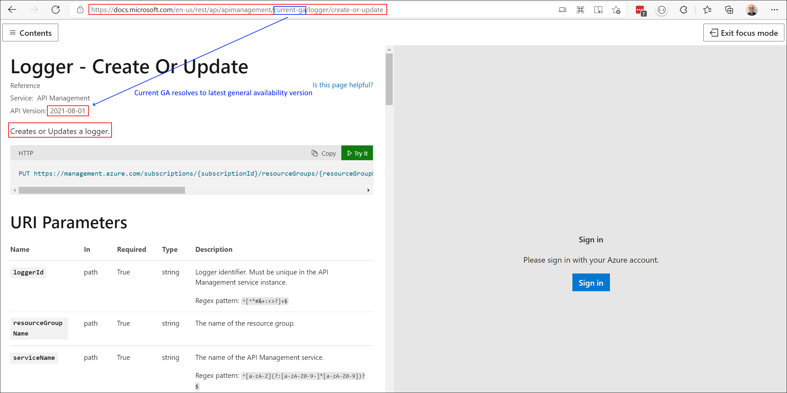
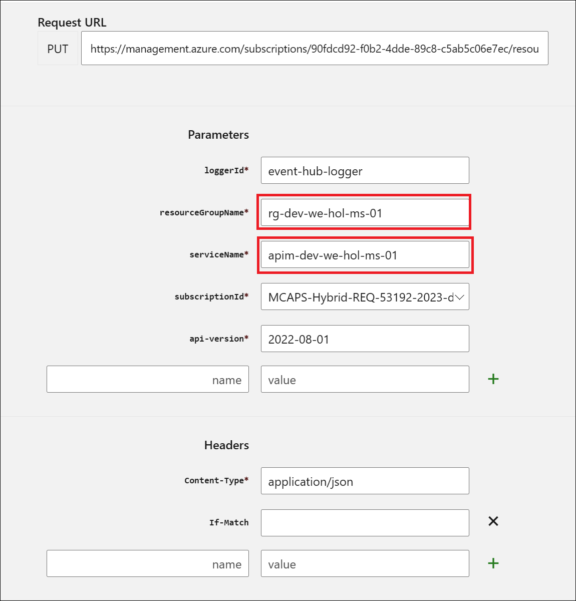
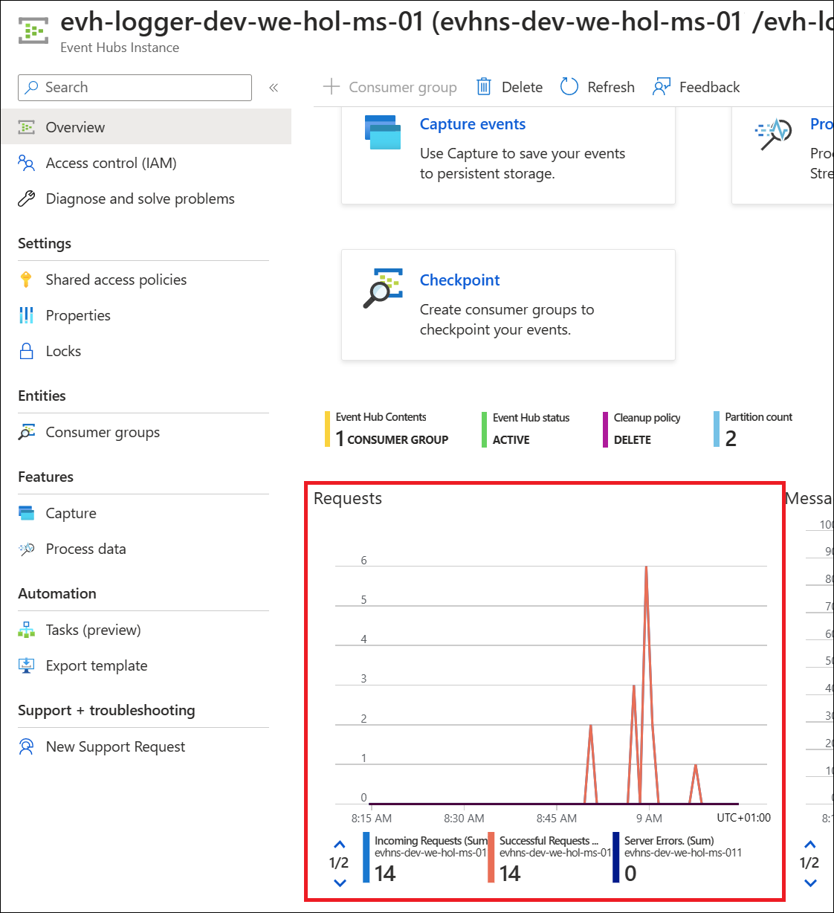

# Task 3: Event Hub Overview

[Azure Event Hubs](https://azure.microsoft.com/en-us/services/event-hubs/#overview) is a fully managed, real-time data ingestion service. Millions of events per second can be aggregated to build dynamic data pipelines. 

We can use Event Hubs with Azure API Management to obtain analytics of our API usage.

## Task 3.1: Create an Event Hubs namespace

An Event Hubs namespace provides a unique scoping container in which you create one or more event hubs. To create a namespace in your resource group using the Azure portal, follow these steps:

1. In the Azure portal select **Create a resource** at the top left of the screen.
1. Search for **Event Hubs**, then click on the resource.  
    >**Note**:*If you cannot find it there, please try the same **Event Hubs** term in the top search bar.*

    

1. Click on **Create** to create the namespace, then enter the following:
   
    - Resource Group : Select **apim-rg**.
   
        > **Note:** The naming convention you can follow for Event Hub Namespace: `evhns-<environment>-<region>-<application-name>-<owner>-<instance>`
   
    - **Namespace name** : **evhns-dev-hol-ms-<inject key="Deployment ID" enableCopy="false" />**
    - **Location** : Select the region you used in previous exercise.
    - **Pricing Tier**: Choose **Basic** for the dropdown.  To learn about differences between tiers, see [Quotas and limits](event-hubs-quotas.md), [Event Hubs Premium](event-hubs-premium-overview.md), and [Event Hubs Dedicated](event-hubs-dedicated-overview.md) articles. 
    - **Throughput Units** : Leave the setting as it is. To learn more about throughput units or processing units: [Event Hubs scalability](event-hubs-scalability.md).  
    - Select **Review + Create** at the bottom of the page, followed by **Create**.
      
        

1. Once it has been created, select **Go to resource**.
      
1. Confirm that you see the **Event Hubs Namespace** page similar to the following example:   
      
    


> **Congratulations** on completing the task! Now, it's time to validate it.
<validation step="8c241828-0198-4596-a1f0-4b70ef4fb3aa" />

---

## Task 3.2: Create an Event Hub

We will create an Event hub to receive logs from our APIM. To create an event hub within the namespace, follow these steps:

1. From the **Event Hubs** blade select **+ Event Hub**
   
    

    >**Note:** The naming convention you can follow for Event Hub `evh-<the-goal>-<environment>-<region>-<application-name>-<owner>-<instance>` 

1. Type a name for your event hub : **evh-logger-dev-hol-ms-<inject key="Deployment ID" enableCopy="false" />** , then select **Review + Create**, and click on the **Create**. 

    The **partition count** setting allows you to parallelize consumption across many consumers. For more information, see [Partitions](https://learn.microsoft.com/en-us/azure/event-hubs/event-hubs-features#partitions).

    The **message retention** setting specifies how long the Event Hubs service keeps data. For more information, see [Event retention](https://learn.microsoft.com/en-us/azure/event-hubs/event-hubs-features#event-publishers).

      

1. After the event hub is created, you see it in the list of event hubs.

    

> **Congratulations** on completing the task! Now, it's time to validate it.
<validation step="3fefc0a6-157b-4820-a57b-5bd7a536f3df" />

---

## Task 3.3: Create Access to the Event Hub

1. Click on the newly-created event hub.
1. Open the **Shared access policies** blade under Setting.
1. Click on **+ Add**.

    

1. On the right side of your screen create a **sendpolicy** with just **Send** permissions

    

1. Click on the new policy created and copy the **Connection string-primary key** to a notepad. Also, copy the **Event Hub namespace**. You will use both values in the next section.

    

---

## Task 3.4: Create an Azure API Management logger

Now that you have an Event Hub, the next step is to configure a [Logger](https://docs.microsoft.com/en-us/rest/api/apimanagement/current-ga/logger) in your Azure API Management service, so that it can log events to the Event Hub.

Azure API Management loggers are configured using the [API Management REST API](https://docs.microsoft.com/en-us/rest/api/apimanagement/ApiManagementREST/API-Management-REST). For this example we are going to use the "REST API Try it" Functionality to create the logger:

1. Open the following link [REST API Try It](https://docs.microsoft.com/en-us/rest/api/apimanagement/current-ga/logger/create-or-update)

    

1. Click on Try It.

       

1. Press **Sign in** and use your Azure credentials, Enter the following email/username and then click on **Next**. 

    - Email/Username: <inject key="AzureAdUserEmail"></inject>

1. Now enter the following password and click on **Sign in**.

     - Password: <inject key="AzureAdUserPassword"></inject>

1. Enter the required details.

1. Fill in the following **Parameters**:
    - LoggerId: **event-hub-logger** (you will use it in the next steps)
    - ResourceGroupName: **apim-rg** 
    - ServiceName: **apim-dev-hol-ms-<inject key="Deployment ID" enableCopy="false" />**
    - SubscriptionId: Select the subscription given by default.

        

1. Replace the request **Body** with the following json. Make sure you replace the parameters appropriately:

    ```json
    {
        "properties": {
            "loggerType": "azureEventHub",
            "description": "adding a new logger",
            "credentials": {
                "name": "<your event hub namespace>",
                "connectionString": "<your Connection string-primary key>"
            }
        }
    }
    ```

1. Your request parameters might then look similar to this: 

    >**Note:** We are deviating intentionally by masking `SharedAccessKey`. Please do not alter your key.

    ```json
        {
            "properties": {
                "loggerType": "azureEventHub",
                "description": "adding a new logger",
                "credentials": {
                    "name": "evhns-dev-we-hol-ms-011/evh-logger-dev-we-hol-ms-01",
                    "connectionString": "Endpoint=sb://evhns-dev-we-hol-ms-011.servicebus.windows.net/;SharedAccessKeyName=sendpolicy;SharedAccessKey******=;EntityPath=evh-logger-dev-we-hol-ms-01"
                }
            }
        }
    ```

1. Press **Run**.
1. You should get a **201** response, confirming that the resource has been created.

    

---

## Task 3.5: Configure log-to-eventhub policies

Once your logger is configured in Azure API Management, you can configure your log-to-eventhub policy to log the desired events. The log-to-eventhub policy can be used in either the **inbound** policy section or the **outbound** policy section.

1. Browse to your Azure API Management instance.
1. Select the **APIs** blade.
1. Select the API to which you want to add the policy.  
   In this example, we're adding a policy to the **Echo API (1)**.
1. Select **All operations (2)**.
1. On the top of the screen, select the **Design (3)** tab.

       
   
1. In the **Inbound** or **Outbound** processing window, enter the Code editor.
1. Enter a new line after the `<base />` tag in the `inbound` or `outbound` policy section.
1. Select **Show snippets**.
1. In the window on the right, select **Advanced policies** > **Log to EventHub**. This inserts the `log-to-eventhub` policy statement template.

    

1. Replace the policy with this snippet:

    ```xml
    <log-to-eventhub logger-id="<your logger id>">
        @{
            return new JObject(
                new JProperty("EventTime", DateTime.UtcNow.ToString()),
                new JProperty("ServiceName", context.Deployment.ServiceName),
                new JProperty("RequestId", context.RequestId),
                new JProperty("RequestIp", context.Request.IpAddress),
                new JProperty("OperationName", context.Operation.Name)
            ).ToString();
        }
    </log-to-eventhub>
    ```

1. Replace `<your logger id>` with the value you used for `{loggerId}` in the request URL to create the logger in the previous step (e.g. `event-hub-logger`).

    > You can use any expression that returns a string as the value for the `log-to-eventhub` element. In this example, a string in JSON format containing the date and time, service name, request ID, request IP address, and operation name is logged.

    

1. Click **Save** to update the policy configuration. As soon as it is saved the policy is active and events are logged to the designated Event Hub.

---

## Task 3.6: Verify Events are logged in Event Hub

1. Issue a handful of test Echo API calls from within Azure API Management (e.g. **Get Retrieve Resource** operation).
1. In the Azure portal open the Event Hub you created earlier. You should see recent events. If not, give it a minute, then refresh.

    

> What to do with the data that is now in Event Hub is beyond the scope of this lab as this lab primarily focused on Azure API Management to Event Hub integration.

---

### Summary 
In this Task, Azure Event Hubs are integrated with Azure API Management (APIM) for API analytics. This involves creating an Event Hubs namespace, configuring an event hub, setting up access, creating an APIM logger, and configuring policies to log events to Event Hubs, providing real-time API usage tracking and monitoring.
- Now, click on Next from the lower right corner to move on to the next page.
