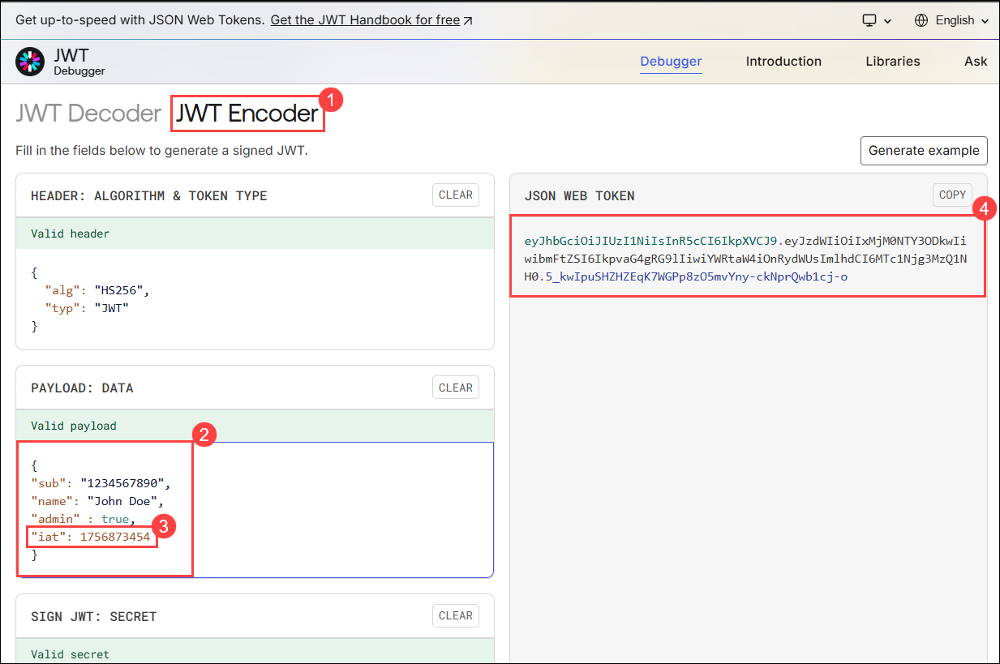
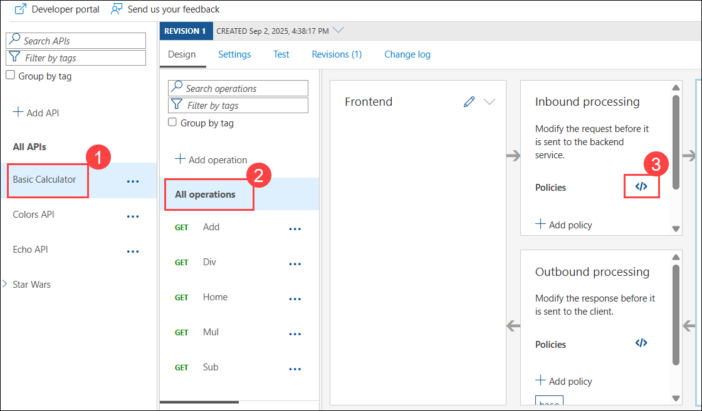
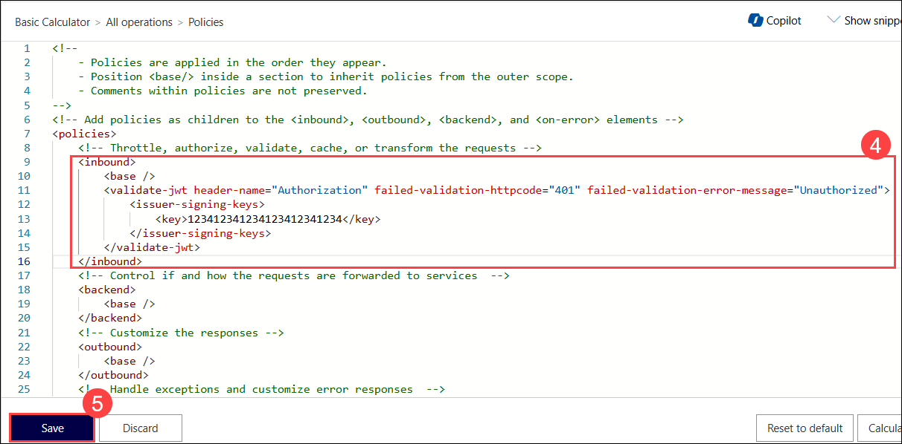
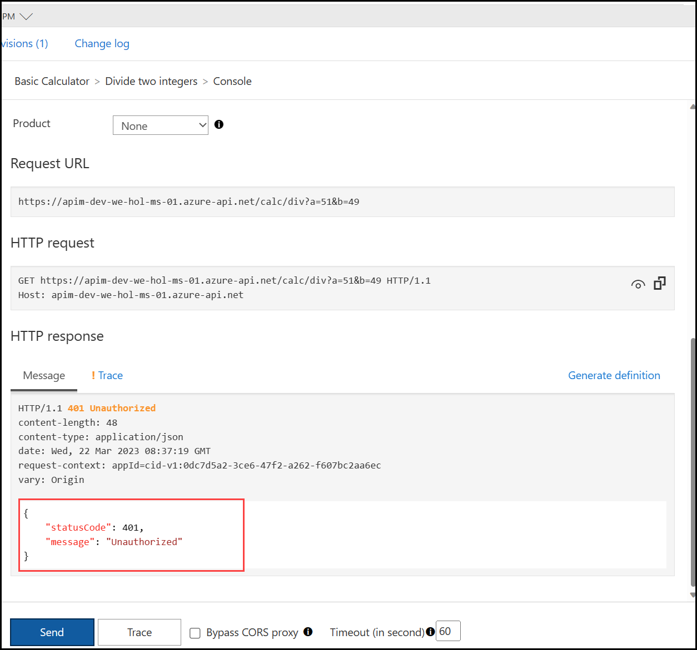
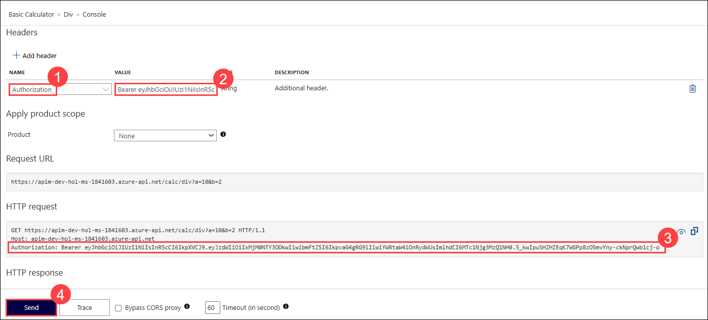
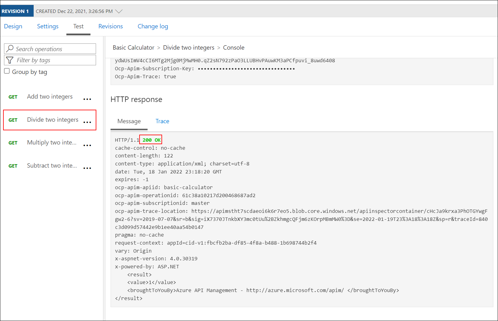
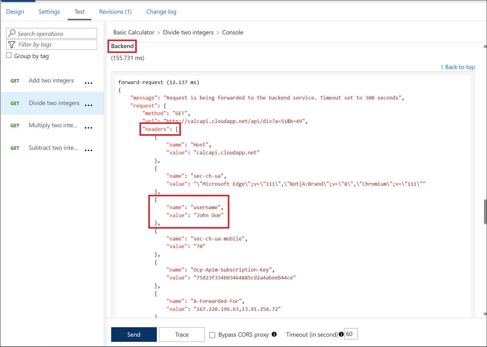

# Exercise 7: Security 

### Estimated Duration: 50 minutes

## Overview

In this exercise, we will explore some of the security features of Azure API Management (APIM).

APIM focuses heavily on security in all three major areas of the product. Going into detail on each aspect is a large topic entirely of its own. Therefore, in this section we will focus more narrowly on one of the common approaches to secure access to an API.

## Objectives

You will be able to complete the following tasks:

- Task 1: JSON Web Tokens (JWT)
    - Task 1.1: Creation
    - Task 1.2: Validation
    - Task 1.3: Check that a Claim Exists
    - Task 1.4: Extract Claim and Pass to Backend
- Task 2: Managed Identities
    - Task 2.1: Register Azure API Management with Active Directory
    - Task 2.2: Create Key Vault and add a secret
    - Task 2.3: Access policy and principal assignment
    - Task 2.4: Azure API Management, Key Vault and Managed Service Identity
    - Task 2.5: Test the operation

## Task 1: JSON Web Tokens (JWT)

In this task, we are going to see how to use JSON Web Tokens with your APIs.

### Task 1.1: Creation

JSON Web Tokens are an open-industry standard method for representing claims securely between two parties. More info at <https://jwt.io>. 

Use the following sites:

1. Copy and open the site <https://www.unixtimestamp.com> in a new browser tab to get a future date using the Epoch Unix Timestamp, **make sure to add the date or time _at least one hour from the current time_** as the JWT will not work otherwise (e.g. 01/11/2029 = `1862842300`).

1. Copy the Unix TImestamp value in a notepad.

   

1. Open the site: <https://jwt.io>, to create a JWT with payload. Scroll down and make the below changes in the **JWT Encoder (1)** section:

    - Leave the **Header** as it is.
    - Use the following **Payload (2)** format and replace the `iat` **(3)** value with your newly-created Unix timestamp:

        ```json
        {
        "sub": "1234567890",
        "name": "John Doe",
        "admin" : true,
        "iat": 1862842300
        }
        ```
        
    - Your configuration should be similar to this now **(4)**:

        

### Task 1.2: Validation

1. Back in APIM instance, open the **Basic Calculator (1)** API and select **All operations (2)**.
  
1. In the **Code View (3)** under Inbound processing, add an inbound `validate-jwt` **(4)** policy with the signing key. Click on **Save (5)**.

    ```xml
        <inbound>
            <base />
            <validate-jwt header-name="Authorization" failed-validation-httpcode="401" failed-validation-error-message="Unauthorized">
                <issuer-signing-keys>
                    <key>123412341234123412341234</key>
                </issuer-signing-keys>
            </validate-jwt>
        </inbound>
    ```

        

    

1. Invoke the **Div** operation on the API from the **Test** tab. Observe the `401` Unauthorized error.

    

1. Click on **+ Add Header** in the same Test tab and add the below details:

    - Name: `Authorization` **(1)**
    - Value: `Bearer <jwt token>` **(2)** 
    - Replace `<jwt token>` with the **JSON Web Token** value from <https://jwt.io>
  
    - Note the bearer token will be shown in the Request payload **(3)** and click on **Send (4)** to test the operation again.

        

1. Execute the test once more to see a `200` Success. 

    

### Task 1.3: Check that a Claim Exists (Read-Only)

Not only is it important that a JWT is valid, but, as we use it for authorization, we must also assert that the token contains expected claims before granting access to our APIs.

1. Open the **Calculator** API and select **All operations**.
1. Modify the inbound `validate-jwt` policy to not only validate the JWT but ensure that a specific `admin` claim exists. Recall that we set `admin`: `true` in our JWT token on <https://jwt.io> above.

    ```xml
    <inbound>
        <base />
        <validate-jwt header-name="Authorization" failed-validation-httpcode="401" failed-validation-error-message="Unauthorized">
            <issuer-signing-keys>
                <key>123412341234123412341234</key>
            </issuer-signing-keys>
            <required-claims>
                <claim name="admin" match="any">
                    <value>true</value>
                </claim>
            </required-claims>
        </validate-jwt>
    </inbound>
    ```

1. Invoke the **Divide two integers** method with the `Authorization` header as above and observe the `200` success. We have not fundamentally changed the test scenario as we only restricted the claims to something that we already had in our payload.

1. Now change the `required-claims` with a claim  that does not exist (e.g. `adminx`)

    ```xml
    <inbound>
        <base />
        <validate-jwt header-name="Authorization" failed-validation-httpcode="401" failed-validation-error-message="Unauthorized">
            <issuer-signing-keys>
                <key>123412341234123412341234</key>
            </issuer-signing-keys>
            <required-claims>
                <claim name="adminx" match="any">
                    <value>true</value>
                </claim>
            </required-claims>
        </validate-jwt>
    </inbound>
    ```

1. Invoke the **Divide two integers** method with the `Authorization` header once more and observe the `401` Unauthorized error as the token specifies `admin` but the policy requires `adminx`.

### Task 1.4: Extract Claim and Pass to Backend (Read-Only)

It may often be necessary to pass (specific) claims onto the backend API to inform further processing. One such way - and this can be tailored to an API's individuality - is to extract a claim and place it into a designated header the backend expects.

Let's add the username contained inside the JSON Web Tokens into a specific header.

1. Open the **Calculator** API and select **All operations**.
1. Append the inbound policy section to extract the `name` claim and place it into a header underneath the `validate-jwt` policy.
1. Change the claim back from `adminx` to `admin` as we are interested in a successful test again.

    ```xml
    <inbound>
        <base />
        <validate-jwt header-name="Authorization" failed-validation-httpcode="401" failed-validation-error-message="Unauthorized">
            <issuer-signing-keys>
                <key>123412341234123412341234</key>
            </issuer-signing-keys>
            <required-claims>
                <claim name="admin" match="any">
                    <value>true</value>
                </claim>
            </required-claims>
        </validate-jwt>
        <set-header exists-action="override" name="username">
            <value>@{
                Jwt jwt;
                context.Request.Headers.GetValueOrDefault("Authorization","scheme param").Split(' ').Last().TryParseJwt(out jwt);
                return jwt.Claims.GetValueOrDefault("name", "?");
            }</value>
        </set-header>
    </inbound>
    ```

1. Invoke the **Divide two integers** method with the `Authorization` header once more and observe the `200` Success.
1. Use the **Trace** feature to inspect what was passed to the backend. You should see the new header and the correct value from the claims.

    

### Improvements

Based on what you have learned thus far, consider how you can improve your policies. For example, you may not want to hard-code the `issuer-signing-key` and instead use a Named Value that you can more easily administer and change outside of an API's policies. If you have time in this exercise, go ahead and give it a try.

### You have successfully completed the exercise. Click on **Next >>** to proceed with the next exercise.
