# Exercise 7: Security 

### Estimated Duration: 30 Minutes

## Overview

In this exercise, we will explore Managed Identities in Azure API Management (APIM) to securely access secrets from Azure Key Vault.

APIM focuses heavily on security in all three major areas of the product. Going into detail on each aspect is a large topic entirely of its own. Therefore, in this section we will focus more narrowly on one of the common approaches to secure access to an API.

In Azure, an Active Directory identity can be assigned to a managed resource such as an Azure Function, App Service or even an Azure API Management instance. Once an identity is assigned, it has many capabilities to work with other resources that leverage Azure AD for authentication, much like a service principal.

## Objectives

You will be able to complete the following tasks:

- Task 1: Register Azure API Management with Active Directory
- Task 2: Create Key Vault and add a secret
- Task 3: Access policy and principal assignment
- Task 4: Azure API Management, Key Vault and Managed Service Identity
- Task 5: Test the operation

### Task 1: Register Azure API Management with Active Directory

In this task, you will enable a system-assigned managed identity for your Azure API Management (APIM) instance. This identity allows APIM to securely authenticate with Azure Active Directory and access other Azure resources, such as Key Vault, without needing to manage credentials manually. 

1. Navigate to your **API management** instance, select **Managed identities** **(1)** under Security from the left menu. In the System assigned tab, set the Status to **On** **(2)**, and click on **Save** **(3)**.

    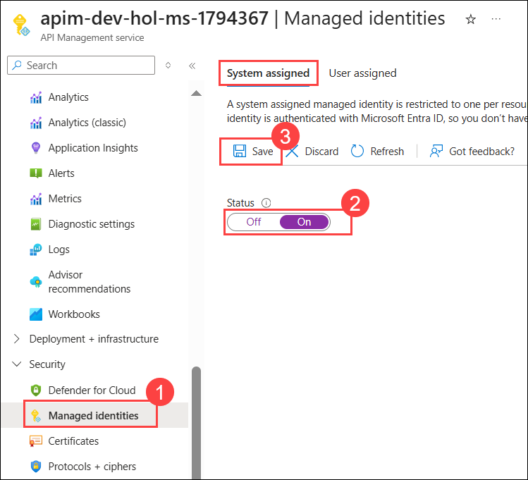

1. On **Enabled system assigned managed identity** pop-up, click on **Yes**.

    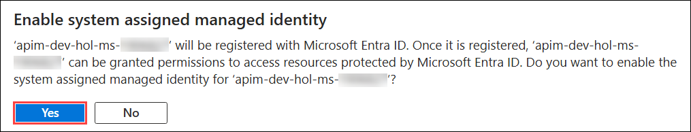

   > **Congratulations** on completing the task! Now, it's time to validate it. Here are the steps:
   > - If you receive a success message, you can proceed to the next task.
   > - If not, carefully read the error message and retry the step, following the instructions in the lab guide. 
   > - If you need any assistance, please contact us at cloudlabs-support@spektrasystems.com. We are available 24/7 to help you out.
         
    <validation step="114baa5f-6313-469d-932a-033f7744f3d2" />

### Task 2: Create Key Vault and add a secret

In this task, you will create an Azure Key Vault and add a secret to it. This secret will later be accessed securely by your Azure API Management instance using its managed identity.

1. In the Azure portal search bar, search and select **Key Vaults (1)** and click on **+ Create (2)**.

    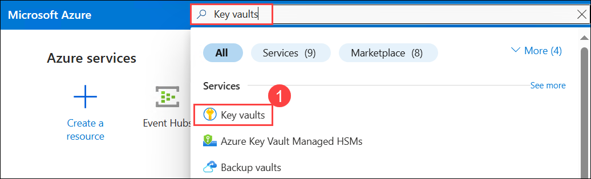

    .png)

1. On the Create a key vault page, in the **Basics (1)** tab enter the following details and click on **Next (5)**: 

    - Resource Group: **apim-rg (2)**

    - Key Vault Name: **kv-dev-hol-ms-<inject key="Deployment ID" enableCopy="false" />** **(3)**

    - Pricing tier: **Standard (4)**

      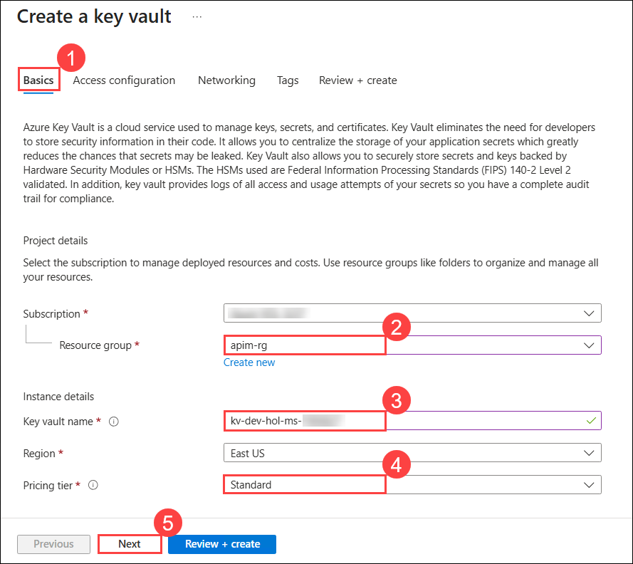

1. In the **Access configuration** tab, check the box for **vault access policy (1)** and click on **Review + create (2)**.

    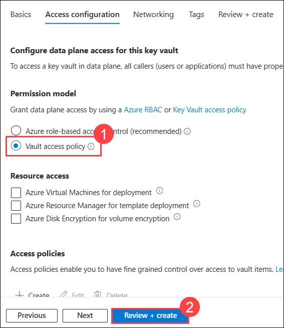

1. In **Review + create** tab, click on **Create**.

    

1. Once created, click on **Go to resource**, this will open recently created **key-vault**.
  
1. Next, select **Secrets (1)** under Objects on the left hand pane, and click on **Generate/Import (2)**.

      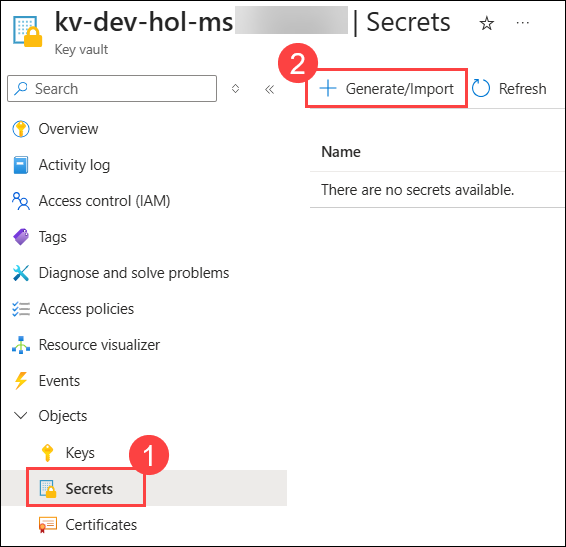

1. On the Create a secret page, provide the below details and click on **Create (3)**.
   
    - **Name (1)**:`favoritePerson`
    - **Secret value (2)**: `3`

        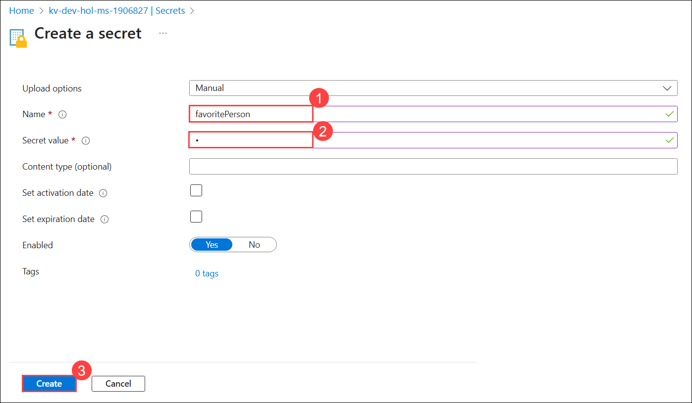

   > **Congratulations** on completing the task! Now, it's time to validate it. Here are the steps:
   > - If you receive a success message, you can proceed to the next task.
   > - If not, carefully read the error message and retry the step, following the instructions in the lab guide. 
   > - If you need any assistance, please contact us at cloudlabs-support@spektrasystems.com. We are available 24/7 to help you out.
         
    <validation step="c496182a-286f-4509-b2e7-43d5c1dd6403" />

### Task 3: Access policy and principal assignment

In this task, you will configure an access policy in Azure Key Vault to allow your Azure API Management instance to access the secret you created earlier. This is done by assigning the necessary permissions to the managed identity of your APIM instance.

1. In the Key vault, select **Access policies (1)** from the left pane and click on **+ Create (2)**.

      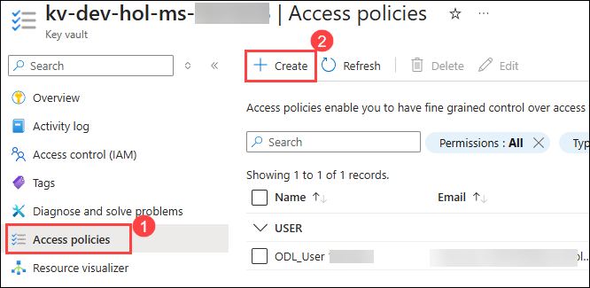

1. Select the `Get` operation from the list of Secret permissions and click on **Next**.

      

1. In the Principal tab and search for **apim-dev-hol-ms-<inject key="Deployment ID" enableCopy="false" /> (1)** which is the name of your **Azure API Management instance** and select it **(2)**. Click on **Next (3)** twice.

    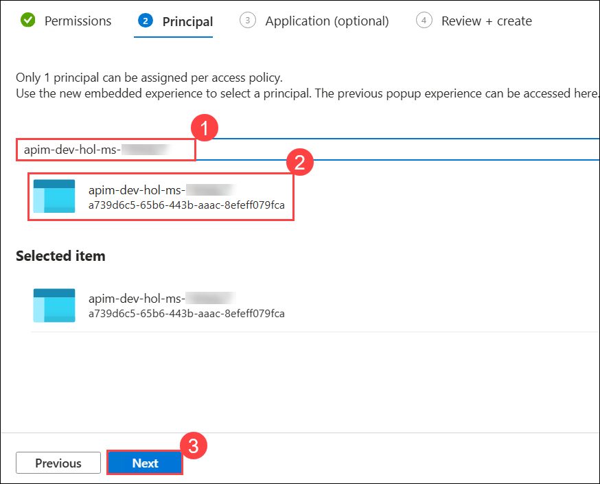

1. On the Review + create tab, click on **Create**.

    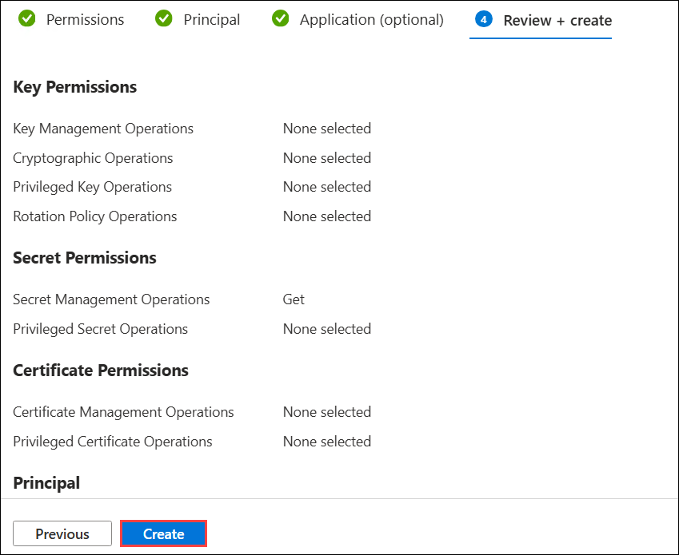

1. You should see something like this:

    

### Task 4: Azure API Management, Key Vault and Managed Service Identity

In this task, you will configure your Azure API Management instance to access the secret stored in Azure Key Vault using its managed identity. This involves setting up a policy in APIM to retrieve the secret and use it in an API operation.

1. Go back to your **APIM instance**.

1. Navigate to the **APIs (1)** tab from the left pane, select the **Original (2)** version of the Star Wars API, and then click **+ Add operation (3)**.

    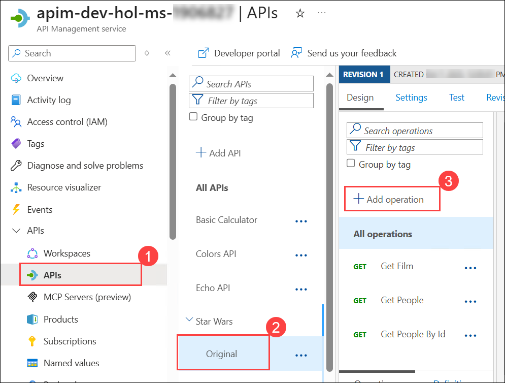

1. In the **Add operation** tab, provide the following details and click on **Save (3)**:
  
    - Display Name: **Get Favorite Person (1)**
    - URL: **/favorite (2)** 

      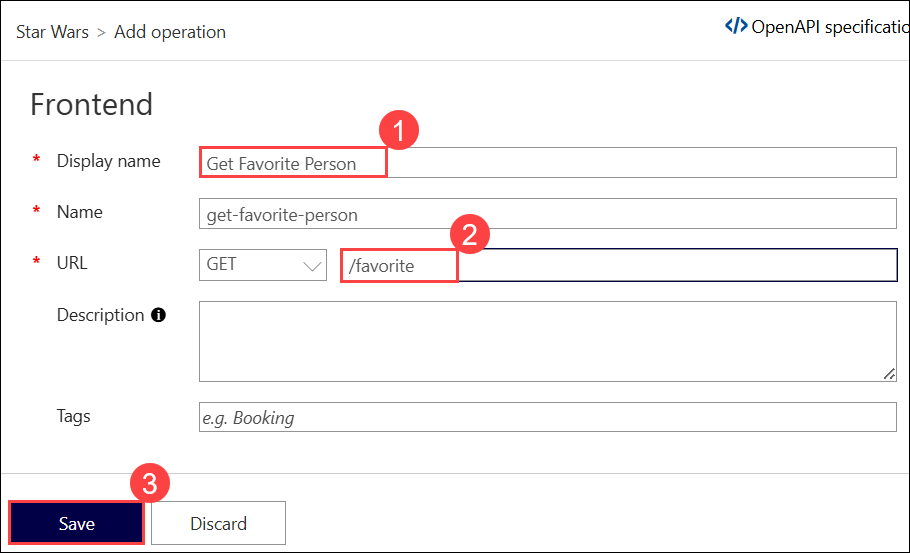

1. Navigate to the **Inbound processing (1)** tab and select **Policy code editor (2)** in this operation.

    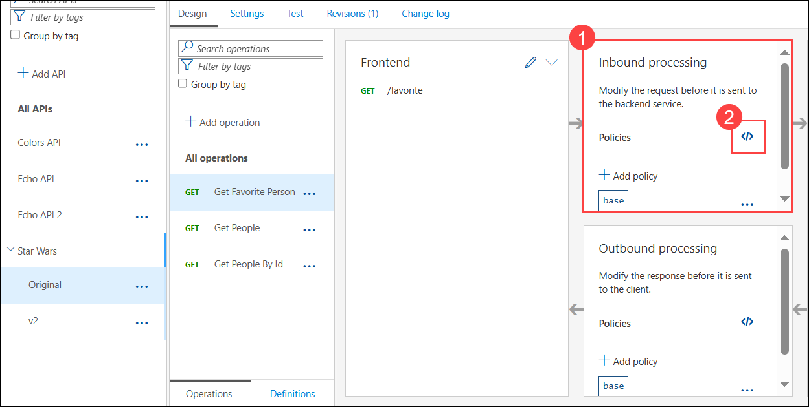
   
1. Update the policies for this new operation, change the **Key vault name (1)** in the `set-url` value, and then click **Save (2)**.

    ```xml
    <!--
        - Policies are applied in the order they appear.
        - Position <base/> inside a section to inherit policies from the outer scope.
        - Comments within policies are not preserved.
    -->
    <!-- Add policies as children to the <inbound>, <outbound>, <backend>, and <on-error> elements -->
    <policies>
        <!-- Throttle, authorize, validate, cache, or transform the requests -->
        <inbound>
        <base />
        <send-request mode="new" response-variable-name="secretResponse" timeout="20" ignore-error="false">
            <set-url>https://{your-keyvault-name}.vault.azure.net/secrets/favoritePerson/?api-version=7.0</set-url>
            <set-method>GET</set-method>
            <authentication-managed-identity resource="https://vault.azure.net" />
        </send-request>
        <set-variable name="favoritePersonRequest" value="@{
            var secret = ((IResponse)context.Variables["secretResponse"]).Body.As<JObject>();
            return "/people/" + secret["value"].ToString() + "/";
        }" />
        <rewrite-uri template="@((string)context.Variables["favoritePersonRequest"])" />
        </inbound>
        <!-- Control if and how the requests are forwarded to services  -->
        <backend>
            <base />
        </backend>
        <!-- Customize the responses -->
        <outbound>
            <base />
        </outbound>
        <!-- Handle exceptions and customize error responses  -->
        <on-error>
            <base />
        </on-error>
    </policies>
    ```

    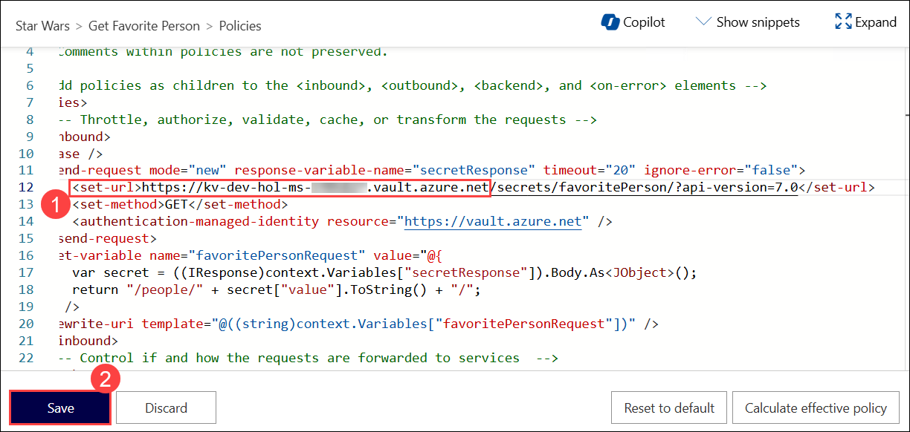

### Task 5: Test the operation

In this task, you will test the newly created operation in the developer portal to ensure that your Azure API Management instance can successfully retrieve the secret from Azure Key Vault using its managed identity and use it in the API operation.

1. Sign in to the developer portal and test this new operation.

1. Notice the request URL will be similar to: **https://apim-dev-hol-ms-<inject key="Deployment ID" enableCopy="false" />.azure-api.net/sw/favorite**

   >**Note:** Ensure to select the product as **Unlimited** while testing.

---
### Summary 

In this exercise, Azure API Management (APIM) is configured to securely access secrets from Azure Key Vault using Managed Service Identity (MSI), enhancing security and enabling the retrieval of secrets for API management operations, as demonstrated during testing in the developer portal.

### You have successfully completed the Exercise. Click on **Next >>** to proceed with the next exercise.

  