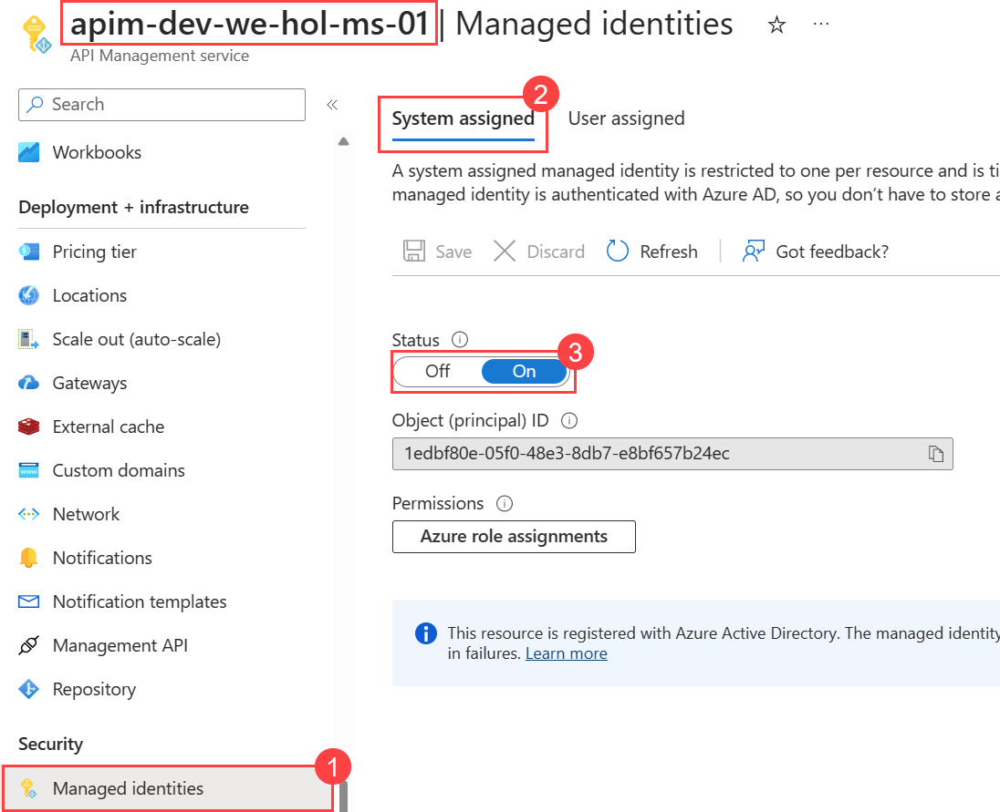

## Task 2: Managed Identities

In Azure, an Active Directory identity can be assigned to a managed resource such as an Azure Function, App Service or even an Azure API Management instance. Once an identity is assigned, it has many capabilities to work with other resources that leverage Azure AD for authentication, much like a service principal.

### Task 2.1: Register Azure API Management with Active Directory
- Navigate to your API management instance, select Managed identities from the pan, and enable system-assigned identity.



## Key Vault 

### Task 2.2: Create Key Vault and add a secret

- Search for Key Vault in Azure portal, Select Create.
- Select Resource Group: **apim-rg**
- You can follow this naming convention for key vualt: `kv-<environment>-<region>-<application-name>-<owner>-<instance>`
- Enter Key Vault Name: **kv-dev-hol-ms-<inject key="Deployment ID" enableCopy="false" />**


- In the Access configuration tab, select the vault access policy and click on create.

 

  
- Next, add a [secret](https://docs.microsoft.com/en-us/azure/key-vault/secrets/quick-create-portal#add-a-secret-to-key-vault) to the Key Vault instance
  - Name:`favoritePerson`
  - Secret value: `3`
 


### Task 2.3: Access policy and principal assignment

Create an access policy


Select the `Get` operation from the list of Secret permissions


Select the principal and search for the name of your Azure API Management instance


Remember to click **Create**

You should see something like this:


### Task 2.4: Azure API Management, Key Vault and Managed Service Identity

- Go back to your APIM
- Add a new operation to the **Star Wars** API (if you did the previous parts of the labs, choose the version of the API you want)
  
- **Display Name: Get Favorite Person**

- **URL: /favorite** 


- Update the policies for **this** new operation

```xml
<inbound>
  <base />
  <send-request mode="new" response-variable-name="secretResponse" timeout="20" ignore-error="false">
      <set-url>https://{your-keyvault-name}.vault.azure.net/secrets/favoritePerson/?api-version=7.0</set-url>
      <set-method>GET</set-method>
      <authentication-managed-identity resource="https://vault.azure.net" />
  </send-request>
  <set-variable name="favoritePersonRequest" value="@{
      var secret = ((IResponse)context.Variables["secretResponse"]).Body.As<JObject>();
      return "/people/" + secret["value"].ToString() + "/";
  }" />
  <rewrite-uri template="@((string)context.Variables["favoritePersonRequest"])" />
</inbound>
```

Don't forget to change the `set-url` value with your Key Vault name.

### Test 2.5: Test the operation

- Sign in to the developer portal and test this new operation
- Notice the request URL will be similar to: **https://apim-dev-hol-ms-<inject key="Deployment ID" enableCopy="false" />.azure-api.net/sw/favorite**

---
### Summary 
In this Task, Azure API Management (APIM) is configured to securely access secrets from Azure Key Vault using Managed Service Identity (MSI), enhancing security and enabling the retrieval of secrets for API management operations, as demonstrated during testing in the developer portal.
- Now, click on Next from the lower right corner to move on to the next page.
