# Exercise 9: Fusion Dev (Optional)

### Estimated Duration: 30 Minutes

## Overview

In this exercise, you will create a Power Apps Canvas application that uses an Excel worksheet as the primary data source and integrates with the Star Wars API via a custom connector exported from Azure API Management. This application will allow users to view and search for information about Star Wars characters.

## Objectives

In this exercise, you will perform:

- Task 1: Power Apps and APIM
- Task 2: View your custom connector in Power Platform
- Task 3: Generate the Star Wars Fan Club Application
- Task 4: Add the Star Wars API Data Source

### Task 1: Power Apps and APIM

The *premier* Star Wars Fan club is growing and the club officers would like to upgrade from their existing member tracking worksheet to a mobile application that would be available to their members all over the world. The members would also like to see information about their favorite Star Wars movies and characters in the application that would update as new shows and movies are released.

In this exercise, you will be using [Star Wars API](https://swapi.dev/) with the Azure API Management instance that you created [in part three](../3-adding-apis/adding-apis-3-1-from-scratch.md) of this lab. The Excel worksheet of member profiles will serve as the primary backing data source and will be used to generate a base application. You will export the Star Wars API from Azure API Management as a Power Platform Custom Connector so that the Canvas App can access real-time Star Wars character information. 

> *Note: This exercise requires access to Power Apps Premium connectors. Sign up for a [free Developer Plan](https://powerapps.microsoft.com/en-us/developerplan/).* Use the credentials given in the lab environment to sign up for a Developer Plan.

#### Task 1.1: Update CORS policy

In this task, you will update the CORS policy in your Azure API Management instance to allow requests from Power Apps.

1. IN your Azure API management instance, navigate to API section. 
 
1. Click on **All APIs (1)**, and click on **edit icon (2)** from the Inbound Processing tab.

   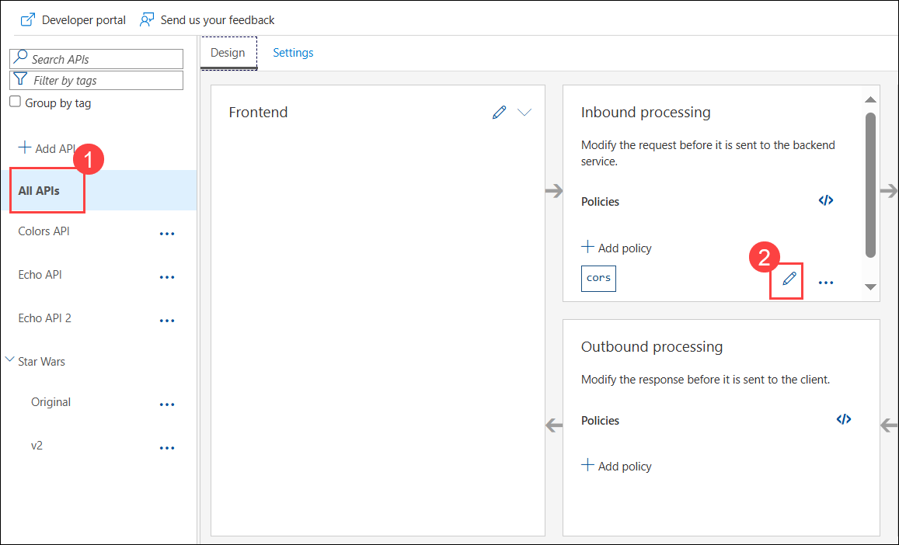

1. Click on **+ Add Allowed origin (1)** and add **`https://flow.microsoft.com` and `https://make.powerapps.com` (2)** as allowed origins, and click on **Save (3)**.

   

#### Task 1.2: Create a custom connector

1. Navigate to the following link: [Power Platform](https://www.microsoft.com/en-us/power-platform/products/power-apps/free) in a new browser tab.

1. Click on **Start Free**.

   

1. Select your mail: <inject key="AzureAdUserEmail"></inject> and check the Agreement checkbox **(2)**, then click on **Start free (3)**.

   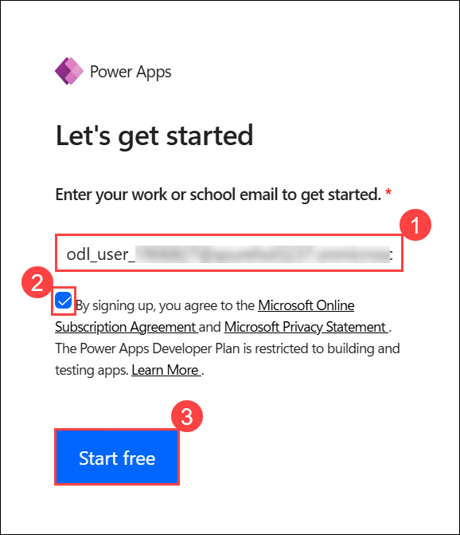

1. On the Welcome to Power Apps page, select the country/region and click on **Get started**.

   

1. Navigate back to your API management service, from the left pane, click on **Power platform (1)** present under APIs section and click on **Create connector (2)**.

   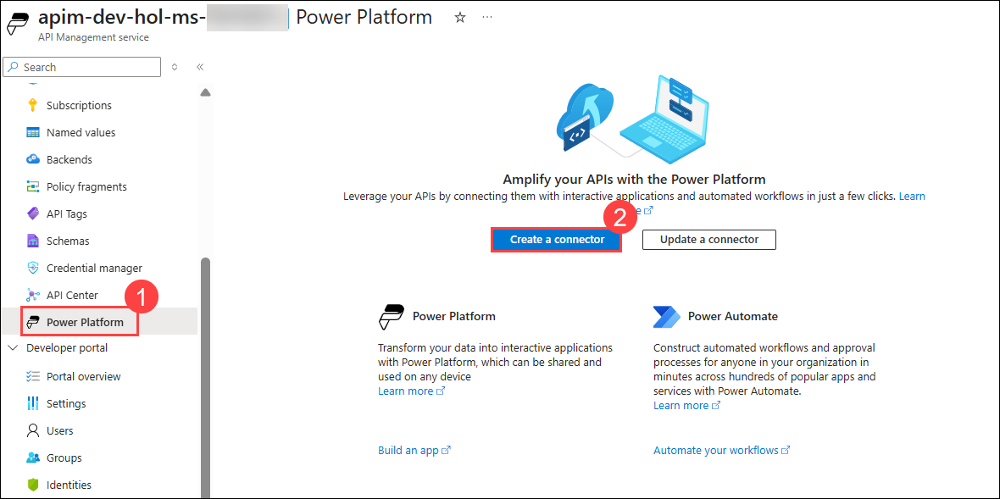

   >**Note:** If you see **Activate account** button, then click on it to activate your Power Platform account and then click on **Create connector**.

   > **Note:** The option is expected to appear within an hour. Kindly proceed with the subsequent exercises and revisit this section afterward.

1. On the **Create a Connector** page, enter the following details:

   - API : Select the **Star Wars (1)** API.
   - Power Platform Environment: From the dropdown select **ODL_User <inject key="DeploymentID" enableCopy="false"/>'s Environment (2)**.
   - API display name: **Star Wars API (3)**.
   - Click on **Create (4)**.

        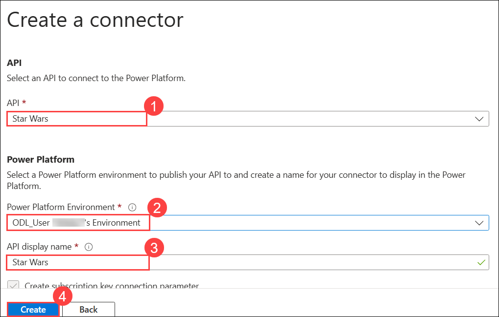

### Task 2: View your custom connector in Power Platform

In this task, you will view and edit the custom connector that you created in the previous task in Power Platform.

1. Once the connector is created, go to [https://make.powerapps.com](https://make.powerapps.com/) and sign in.

1. Select **More (1)** from the left pane, and click on **Discover all (2)** to see your generated custom connector to your Azure API Management API.
   
   

1. Scroll down and select **Custom connectors**.

   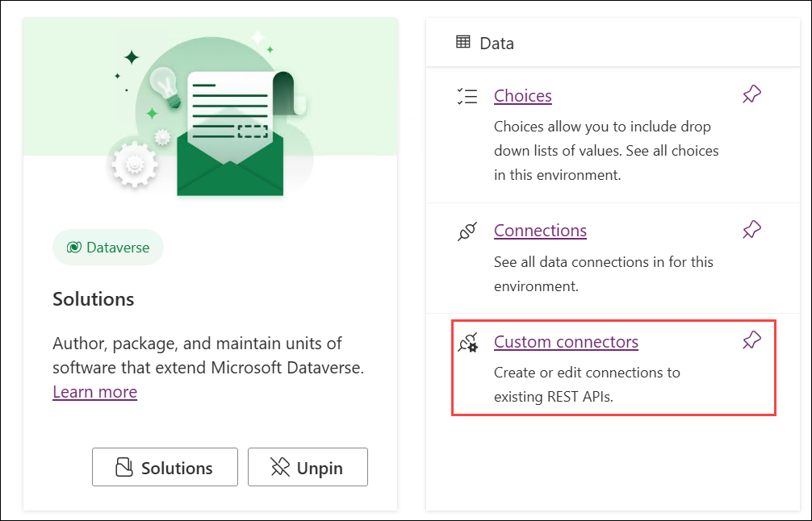

1. On the Custom connectors page, click on **New cusom connector (1)** dropdown and select Create from **Azure service (Preview) (2)**.

   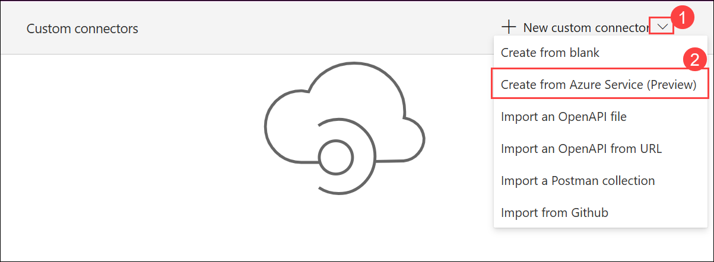
 
1. In the top left corner, click on **1. General** from the drop-down and select **Definition** screen, we need to define a search query string for people so that the Power App can search for character records by name.

   

1. In the **Request** section, select **+ Import from sample (1)**. Enter a sample request **URL (2)** with the search query string, and select **Import (3)**:

   - **https://apim-dev-hol-ms-<inject key="Deployment ID" enableCopy="false" />.azure-api.net/sw/people?search=Luke**
       
       

1. In the **Response** section of the `getpeople` action, select the `200` response and then select **+ Import from sample**. To get the sample JSON response, follow the steps below:

   - Navigate back to the **API Management service** in Azure Portal.
   
   - On the **API Management service** page, from the left menu, under **APIs**, select **APIs**. Select **Star Wars** drop-down and select **v2 (1)**. Select `Get People (2)`, and from the top menu select **Test (3)**, select the product scope as **Unlimited** and now select **Send (4)** and **copy (5)** the Response into a notepad.  

      

   - Paste the response into the `Body` section of the response, and select **Import**.

      

      

1. Repeat step 7 to import for the `getpeoplebyid` action. Provide the ID as `1`.

   >**Note:** Delete if you have other **Actions** Apart from `getpeople` and `getpeoplebyid`.

1. In the left pane, select **+ New policy** under the **Policies** section.

   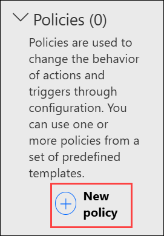

1. Fill out the new policy with the following information:

     - **Name: set-origin-header (1)**
  
     - **Template: Set HTTP header (2)**
  
     - **Header name: Origin (3)**
  
     - **Header value: https://make.powerapps.com (4)**
  
     - **Action if the header exists: override (5)**
  
     - **Run policy on: request (6)**

       
      
       

1. Click on the **tick** mark on the top right, which will update the Connector.

1. Select **5.Test (2)**, from the top left corner **(1)**, and click on **+New connection (3)** in the **Connections** section.

      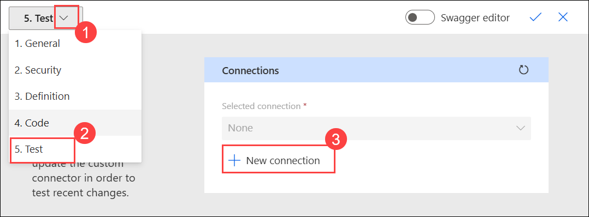

      > **Note:** If prompted to provide the subscription key, navigate to Azure Portal, and you can find the subscription key in the API Management Service, from the left menu under APIs click on **Subscriptions (1)**, choose **Unlimited**, click on **... > Show/hide keys (2)**. Copy the **Primary key (3)**.  

      

1. Navigate back to the Power Apps page, paste the **subscription key (1)**, and select **Create (2)**.

      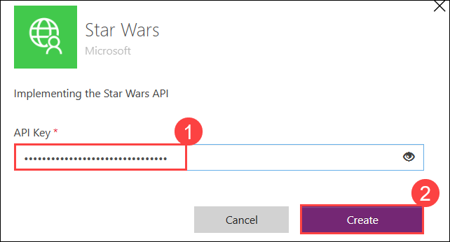

1. Navigate back to the **Custom Connectors** page in Power apps portal and click on the pencil icon i.e **Edit**.

1. Return to the **Test** page and test each of the API actions, in **getpeople** in the search section type **Luke** and select **Test operations**.

   

   

### Task 3: Generate the Star Wars Fan Club Application**

In this task, you will create a Canvas App in Power Apps using the Excel worksheet as the primary data source.

1. In the Power Apps portal, click on **+ Create** from the left navigation list and select **Start with data (2).**

   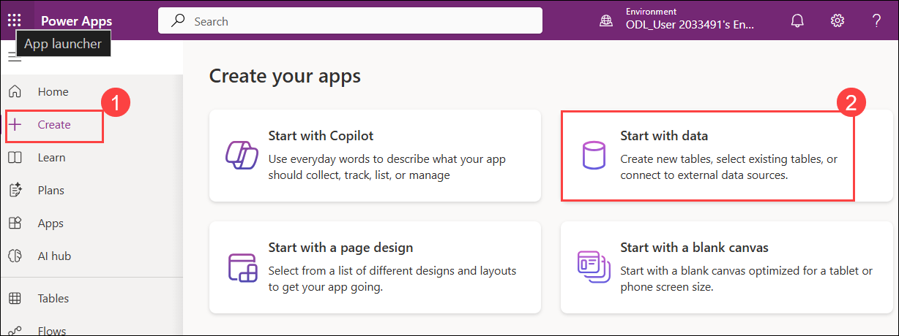

1. On the Start with data page click on **Create new tables**.

   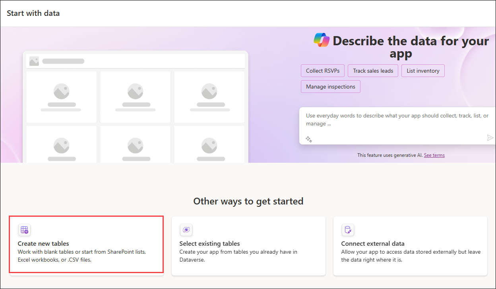

1. On the Choose an option to create table page, select **Import and Excel or .CSV (1)**, and click on **Select from device (2)**.

   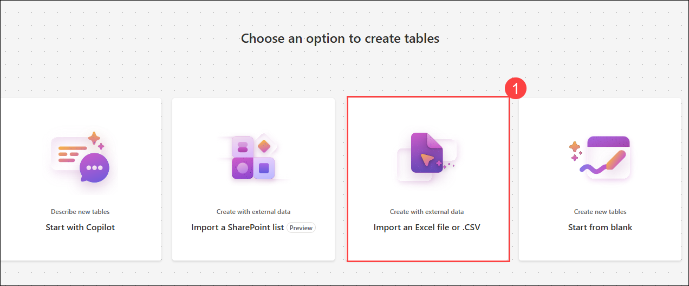

   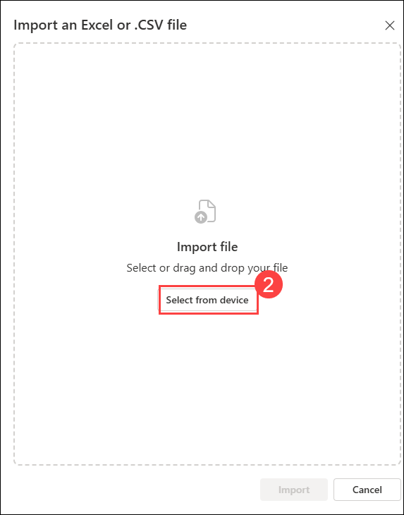

1. Navigate to **C:\LabFiles (1)** path, select the **fanclubmembers.xlsx (2)** and click on **Open (3)** to upload the file. Then click on **Import (4)**.

   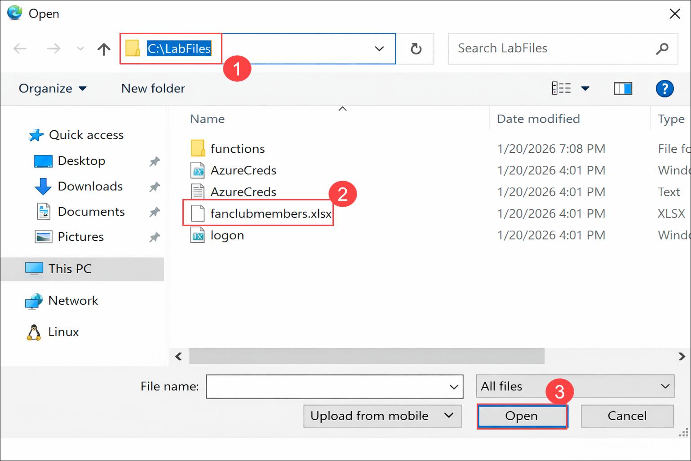

   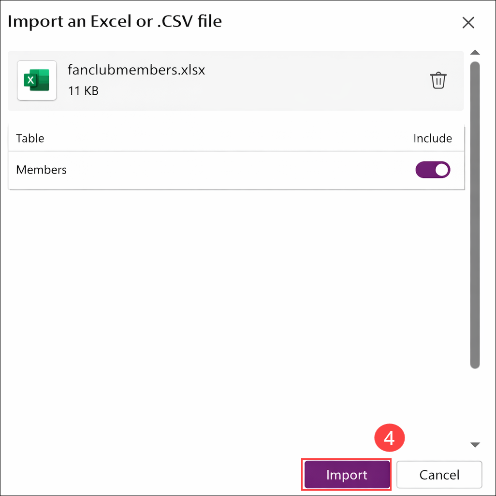

1. Click on **Save and open app**. On the **Done working?** pop-up, click on **Save and open app**.

   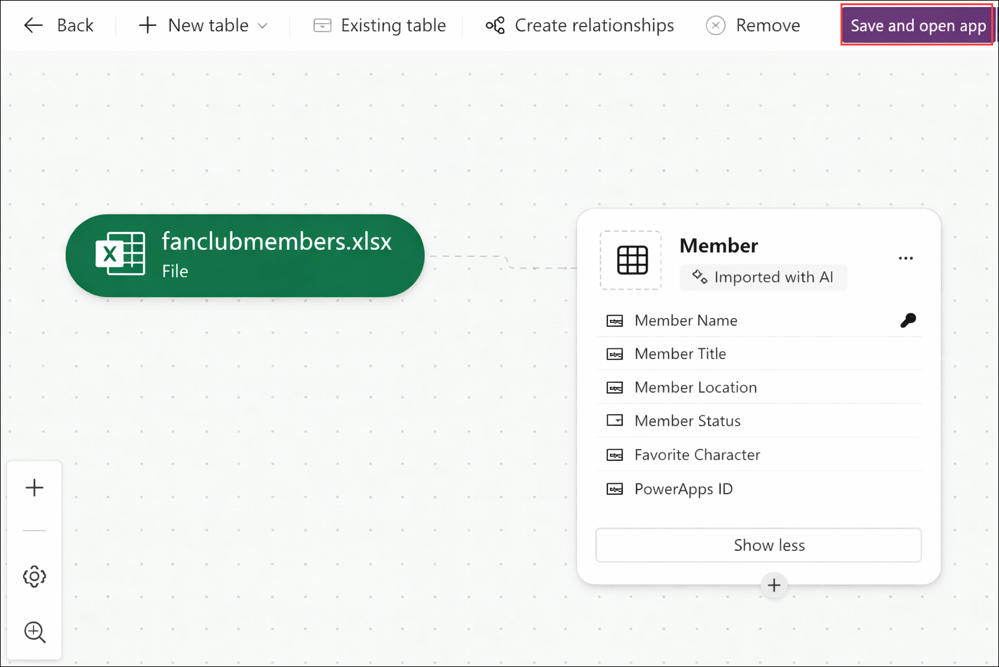

1. Click on **Skip** on the Welcom to Power Apps Studio pop-up window. 

1. The App will be open in Editing mode in Power Apps editor. You can click on the Play button at the top right corner to use the app. 

   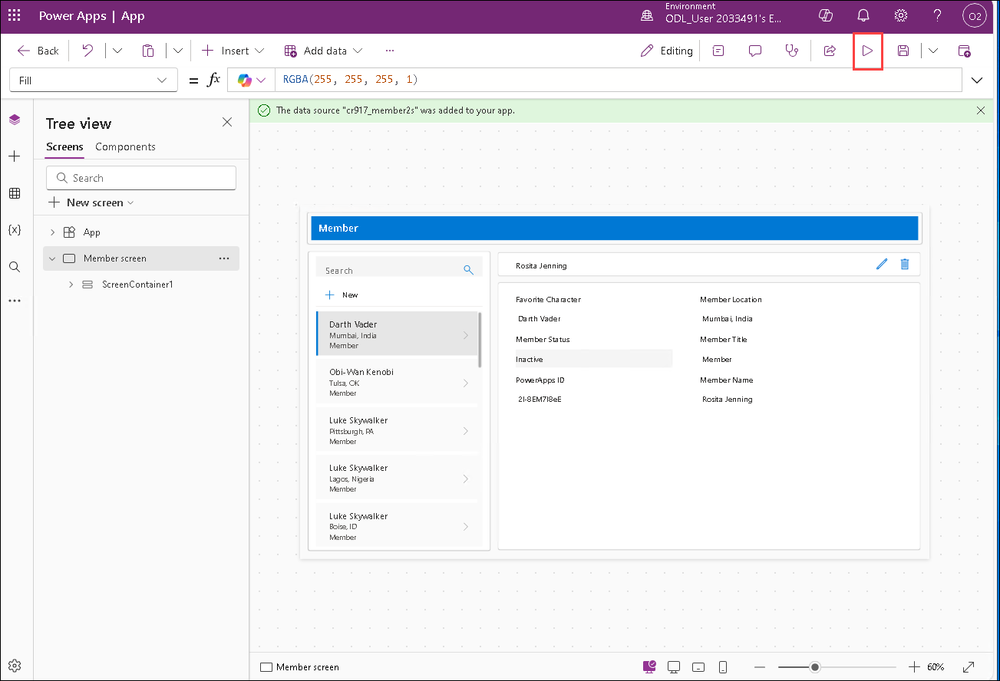

### Task 4: Add the Star Wars API Data Source

In this task, you will add the Star Wars API custom connector as a data source to your Canvas App.

1. Select **Data (1)** from the left pane and then select **+ Add data (2)** from the drop-down menu.

2. Search for **Star Wars API (3)** in the search field and choose the connection to the **Star Wars API (4)**.

     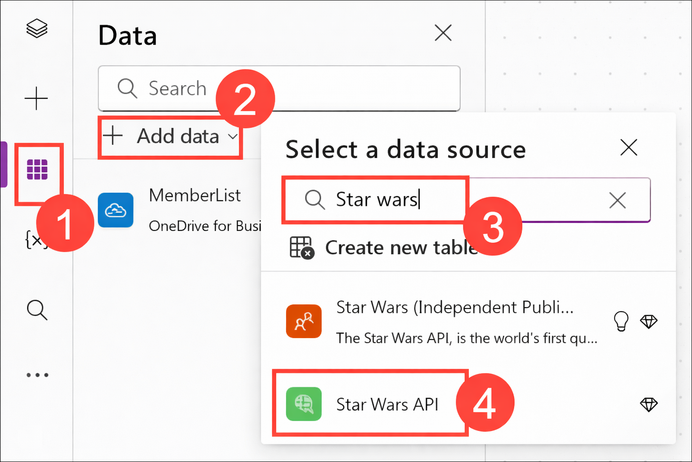

1. Click on Play button to open the app and the app will look like this

     

1. After the app is generated, you can customize it to match your requirements. This includes changing the app theme and branding, renaming labels and headers, reordering or hiding fields, adjusting the layout of lists and details, and applying conditional formatting based on data values. You can also enhance the app by adding search capabilities, buttons, and integrating external APIs using connectors to extend the app’s functionality.
--- 

## Summary

In this exercise, you created a Power Apps Canvas application that uses an Excel worksheet as the primary data source and integrates with the Star Wars API via a custom connector exported from Azure API Management. This application allows users to view and search for information about Star Wars characters.

## Conclusion

By completing this **Azure API Management** hands-on lab, you have gained hands-on experience in deploying and managing APIs using Azure API Management. You have learned how to create and configure an API Management instance, import and manage APIs, apply policies for security and transformation, and monitor API usage. Additionally, you have explored advanced features such as versioning and self-hosted gateways. This knowledge equips you with the skills needed to effectively manage APIs in a cloud environment, ensuring secure and efficient access to your services.

### Congratulations! You've successfully completed the Hands-on lab.
