## Exercise 8:  Fusion Dev(Read Only)

## Estimated Duration : 30 minutes

In this exercise, you'll create a Star Wars Fan Club mobile application using Power Apps and Azure API Management. You'll connect your member data from an Excel worksheet, integrate Star Wars character information through a custom connector, and customize the app to display favorite character details for each member.

## Lab objectives

You will be able to complete the following tasks:

**Task 1**: Power Apps and APIM

Task 1.1: Update CORS policy

Task 1.2: Create a custom connector

**Task 2**: View your custom connector in Power Platform

**Task 3**: Generate the Star Wars Fan Club Application

Task 3.1: Connect to the backing data source

**Task 4**: Add Favorite Character information

Task 4.1: Add the Star Wars API Data Source

Task 4.2: Customize the generated app

Task 4.3: Add controls to the View Detail screen

Task 4.4: Connect the Detail Screen to the Star Wars API

Task 4.5: Show the Star Wars character information on the Detail Screen

## Task 1: Power Apps and APIM

The *premier* Star Wars Fan club is growing and the club officers would like to upgrade from their existing member tracking worksheet to a mobile application that would be available to their members all over the world. The members would also like to see information about their favorite Star Wars movies and characters in the application that would update as new shows and movies are released.

In this exercise, you will be using [Star Wars API](https://swapi.dev/) with the Azure API Management instance that you created [in part three](../3-adding-apis/adding-apis-3-1-from-scratch.md) of this lab. The Excel worksheet of member profiles will serve as the primary backing data source and will be used to generate a base application. You will export the Star Wars API from Azure API Management as a Power Platform Custom Connector so that the Canvas App can access real-time Star Wars character information. For each of the Fan Club members, you can then search the Star Wars API character data and show information about their favorite character in the Canvas App.

> *Note: This exercise requires access to Power Apps Premium connectors. Sign up for a [free Developer Plan](https://powerapps.microsoft.com/en-us/developerplan/).* Use the credentials given in the lab environment to sign up for a Developer Plan.

### Task 1.1: Update CORS policy

1. In your Azure API Management resource, navigate to the **Portal Overview** under **Developer Portal** from the left pane to verify if CORS has been enabled globally. Here's what the Portal overview will look like if CORS has been enabled:

   
 
1. Now go to **All APIs (1)**, and click on **edit icon (2)** from the Inbound Processing tab.

   

1. Click on **+ Add Allowed origin** and add https://flow.microsoft.com and https://make.powerapps.com as allowed origins, and click on **Save**.

   

### Task 1.2: Create a custom connector

1. Navigate to the following link: [Power Platform](https://www.microsoft.com/en-us/power-platform/products/power-apps/free)

1. Click on **Start Free**.

   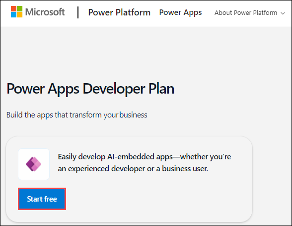

1. Select your mail: <inject key="AzureAdUserEmail"></inject> and click on **Start free**.

   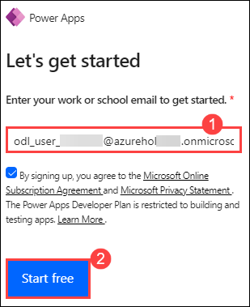

1. Enter your password: <inject key="AzureAdUserPassword"></inject> and ensure you are signed up for the free trial.

1. Navigate back to your API management service, from the left pane, click on **Power platform** present under APIs tab and click on **Activate Account**.

   
  
1. Select **Create a connector.**

   

   > **Note:** The option is expected to appear within an hour. Kindly proceed with the subsequent exercises and revisit this section afterward.

1. On the **Create a Connector** page, enter the following details:

   - API : Select the **Star Wars (1)** API.
   - Power Platform Environment: From the dropdown select **ODL_User <inject key="DeploymentID" enableCopy="false"/>'s Environment (2)**.
   - API display name: **Star Wars API (3)**.
   - Click on **Create (4)**.

        

### Task 2: View your custom connector in Power Platform

1. Go to [https://make.powerapps.com](https://make.powerapps.com/) and sign in.

1. Select **More (1)** from the left pane, and click on **Discover all (2)** to see your generated custom connector to your Azure API Management API.
   
   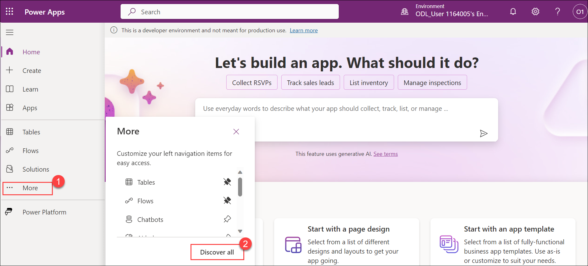

1. Scroll down and select **Custom Connectors**.

   

1. You can view the recently created **Star Wars API** custom connecter. From here, select the pencil icon to edit the custom connector.

   
 
1. On the top left corner, select **1. General** from the drop-down select **Definition** screen, we need to define a search query string for people so that the Power App can search for character records by name.

   

1. In the **Request** section, select **+ Import from sample (1)**. Enter a sample request **URL (2)** with the search query string, and select **Import (3)**:

   - **https://apim-dev-hol-ms-<inject key="Deployment ID" enableCopy="false" />.azure-api.net/sw/people?search=Luke**
       
      

1. In the **Response** section of the `getpeople` action, select the `200` response and then select **+ Import from sample**. To get the sample JSON response, follow the below steps:

   - Navigate back to the **API Management service** in Azure Portal.
   
   - On the **API Management service** page, from the left menu, under **APIs**, select **APIs**. Select **Star Wars** drop-down and select **v2 (1)**. Select `Get People (2)`, and from the top menu select **Test (3)**, select the product scope as **Unlimited** and now select **Send (4)** and **copy (5)** the Response into a notepad.  

      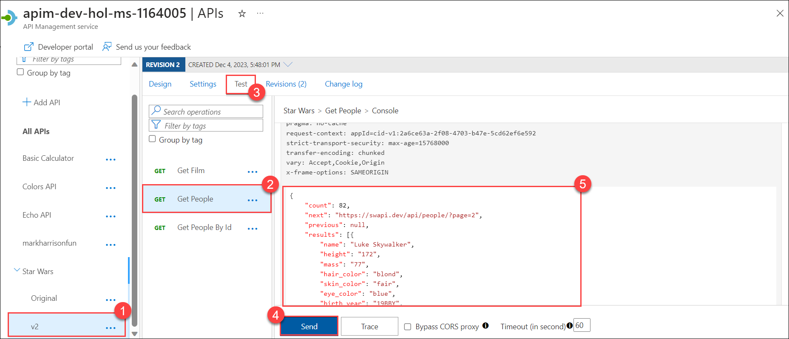

   - Paste the response into the `Body` section of the response, and select **Import**.

      

      

1. Repeat the step-7 to import for the `getpeoplebyid` action. Provide the id as `1`.

   >**Note:** Delete if you have other **Actions** Apart from `getpeople` and `getpeoplebyid`.

1. In the left pane, select **+ New policy** under the **Policies** section.

   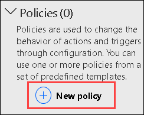

1. Fill out the new policy with the following information:

     - **Name: set-origin-header (1)**
  
     - **Template: Set HTTP header (2)**
  
     - **Header name: Origin (3)**
  
     - **Header value: https://make.powerapps.com (4)**
  
     - **Action if the header exists: override (5)**
  
     - **Run policy on: request (6)**

       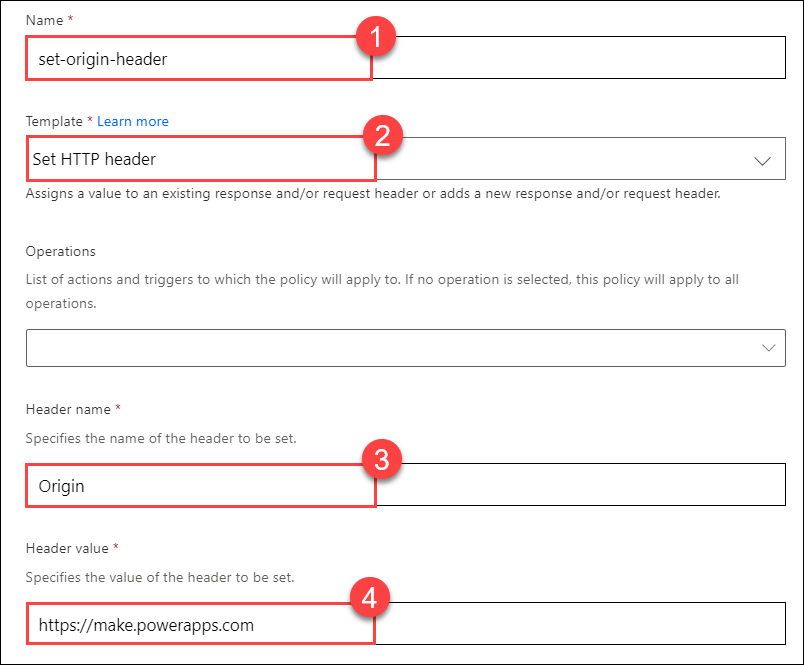
      
       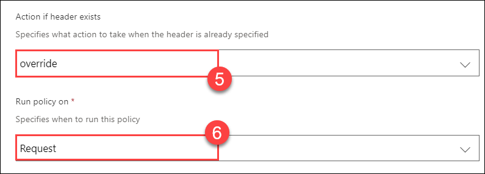

       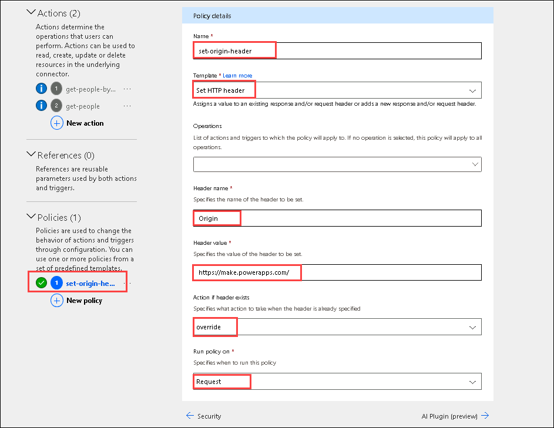

1. Click on the **tick** mark on the top right which will update the Connector.

1. Select **6.Test**, from the top left corner and click on **+New connection** in the **Connections** section.

      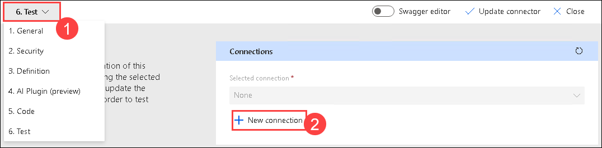

      > **Note:** If prompted to provide the subscription key, navigate to Azure Portal and you can find the subscription key in the API Management Service, from the left menu under APIs click on **Subscriptions (1)**, choose **Unlimited**, click on **... > Show/hide keys (2)**. Copy the **Primary key (3)**.  

      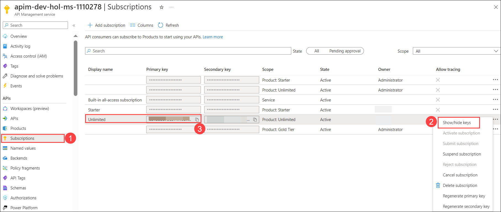

   - Navigate back to the Power apps page, and paste the subscription key, select **Create**.

      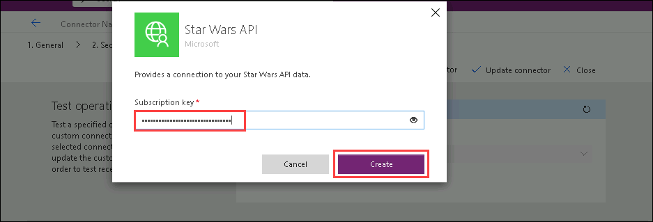

1. Navigate back to the **Custom Connectors** page and click on the pencil icon i.e **Edit**.

1. Return to the **Test** page and test each of the API actions, in **getpeople** in the search section type **Luke** and select **Test operations**.

   

   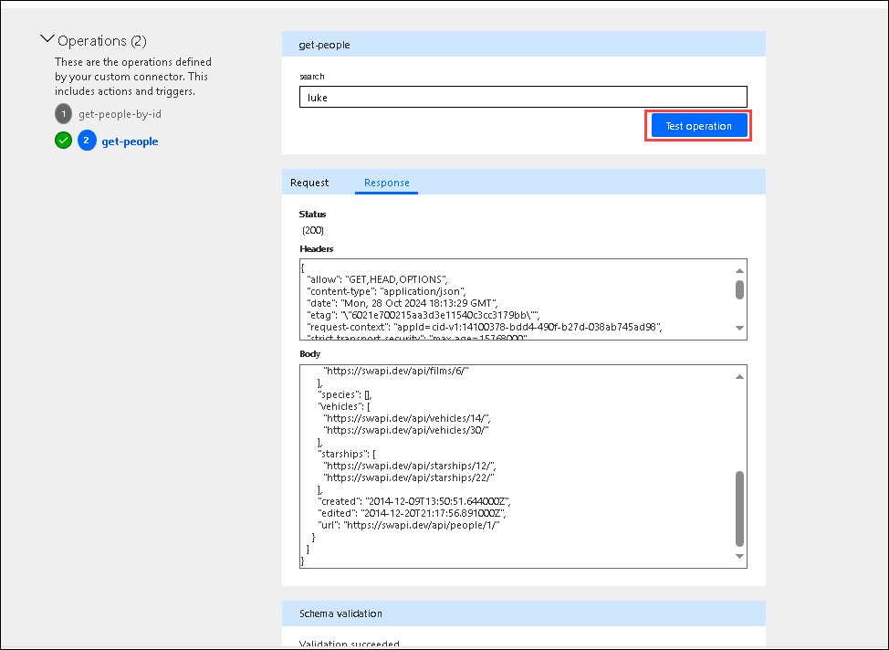

## **Task 3: Generate the Star Wars Fan Club Application**

### Task 3.1: Connect to the backing data source

1. Login to [Onedrive](https://onedrive.live.com/login/).

   > **Note:** Use the following credentials for Onedrive for business.
    
    * Email/Username: <inject key="AzureAdUserEmail"></inject>

    * Password: <inject key="AzureAdUserPassword"></inject>

1. On **Securely store and share files** page, select **Your OneDrive is ready**.

1. Select **+ Add new (1)**, click on **Files Upload (2)**, in the Jump VM, navigate to **C:\LabFiles\fanclubmembers.xlsx** path, and upload **fanclubmembers.xlsx**  to your OneDrive for Business account.

   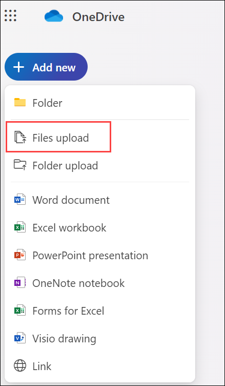
 
3. Navigate back to Power Apps Editor, in the left pane, select **Home**.

4. Select **Create (1)** , select **Excel (2)** and then click on **+ New connection**.

   
   
5. Under **Connections** , select **OneDrive for Business**, select **Create**, and select **<inject key="AzureAdUserEmail"></inject>**. On **Confirmation required** page, select **Allow access**. 

6. Under **Choose an Excel file** , select the **fanClubMembers.xlsx** file.

7. Under **Choose a table** , select the **MemberList** table.

8. Select **Connect** on the bottom right.

9. Power Apps will generate the app by inspecting your data and matching it with Power Apps screens.

   >**Note:** On **Welcome to Power Apps Studio** page, select **Skip**.

## **Task 4: Add Favorite Character information**

Your generated app will now be in edit mode in the Power Apps Studio.

### Task 4.1: Add the Star Wars API Data Source

1. Select **Data (1)** from the left pane and then select **+ Add data (2)** from the drop-down menu.

2. Search for **Star Wars (3)** in the search field and choose the connection to the **Star Wars API (4)**.

     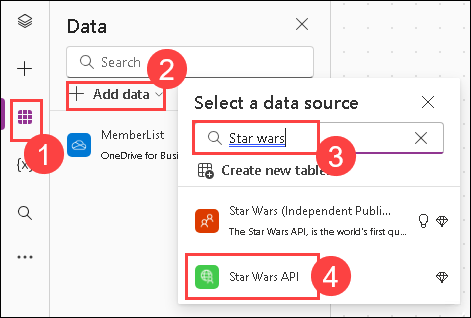

### Task 4.2: Customize the generated app

Your generated app will now be in edit mode in the Power Apps Studio.

You can customize your app theme using the **Theme** drop-down menu and selecting an option. You can change or format the fields that are shown in the Gallery by selecting **Tree view** in the left pane, clicking on BrowseGallery1, and making edits in the right formatting pane.


### Task 4.3: Add controls to the View Detail screen

1. In the Tree view, select **DetailScreen1**.

   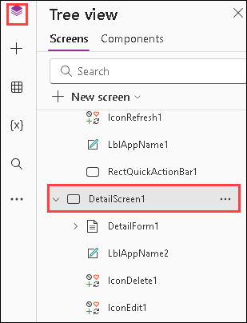

1. Select the **+** icon on the left side of the screen to bring up the **Insert** panel.

1. Select **Text Label** and add labels for the **Favorite Character:** section header and for each one of the character description fields.

1. For each label control, change the **Text** property in the right-side **Properties** panel to describe each field.

1. Drag the controls on the screen so they are below the header and are aligned with the center of the screen.

   

### Task 4.4: Connect the Detail Screen to the Star Wars API

1. In the left pane, select the **Tree view** and then the **BrowseGallery1** under **Browsescreen1**.

2. Using the drop-down menu, select the **OnSelect** action that will be executed when a user selects a Fan Club member from the gallery.

3. In the **OnSelect** function, we will navigate to **DetailScreen1** and call the Star Wars API to get the character details for the member&#39;s favorite character.

    ```
    Navigate(DetailScreen1, ScreenTransition.None);

    ClearCollect(characterCollection, StarWars.getpeople({search: ThisItem.MemberFavoriteCharacter}).results);
    ```
    
    

### Task 4.5: Show the Star Wars character information on the Detail Screen

1. For each of the description labels on **DetailScreen1** , change the **Text** property in the right-side **Properties** panel to include the data from the API. For example, for the **Name:** label: `&quot;Name:&quot; &amp; &quot; &quot; &amp; First(characterCollection).name`

    - Select `Name` Label and Enter `"Name: " & First(characterCollection).name`

       

    - Likewise, you can enter the following for each label:
    - Mass: `"Mass: " & Text(First(characterCollection).mass, "[$-en-US]0") & " kg"`
    - Height: `"Height: " & Text(First(characterCollection).height, "[$-en-US]0") & " cm"`
    - Birth year: `"Birth Year: " & First(characterCollection).birth_year`
    - Gender: `"Gender: " & First(characterCollection).gender`
   
2. Select **Play** in the upper-right corner to practice using the app.
 
   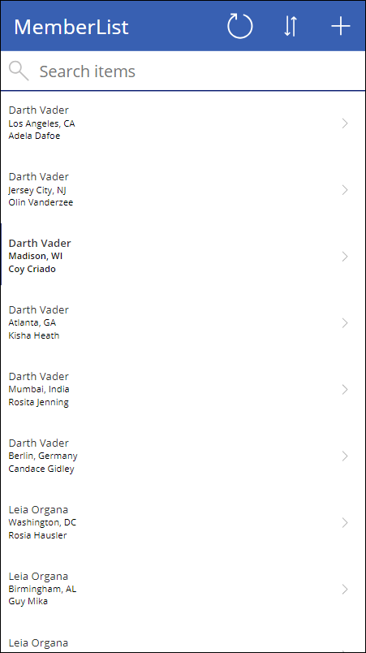

   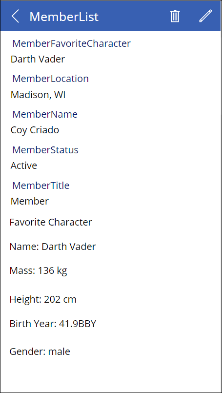


   > **Congratulations** on completing the task! Now, it's time to validate it. Here are the steps:
   > - If you receive a success message, you can proceed to the next task.
   > - If not, carefully read the error message and retry the step, following the instructions in the lab guide. 
   > - If you need any assistance, please contact us at cloudlabs-support@spektrasystems.com. We are available 24/7 to help you out.
         
      <validation step="42b46870-763d-4674-95dd-eec0430e096d" />
--- 

### Summary
In this exercise, you have integrated the Star Wars API with Azure API Management, exported it as a Power Platform Custom Connector, and created a Canvas App to allow Fan Club members to search and view information about their favorite Star Wars characters.

### Now, click on Next from the lower right corner to move on to the next page.
