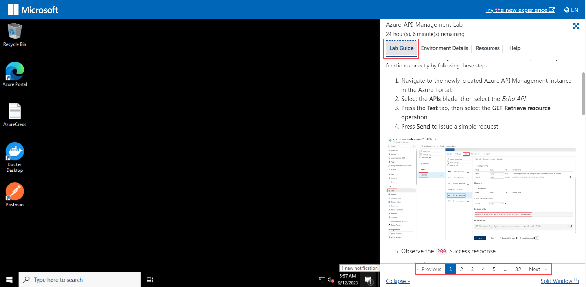
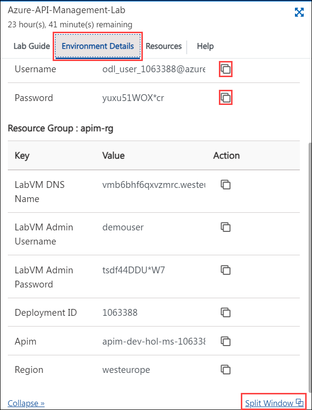

# Azure API Management
---

### Overall Estimated Duration: 7 Hours

## Overview

## Objective

## Pre-requisites

## Architecture

## Architecture Diagram

## Explanation of Components

# Getting Started with Lab

1. Once the environment is provisioned, a virtual machine (JumpVM) and lab guide will get loaded in your browser. Use this virtual machine throughout the workshop to perform the lab. You can see the number on the bottom of lab guide to switch to different exercises of the lab guide.

   

1. To get the lab environment details, you can select the **Environment Details** tab. Additionally, the credentials will also be emailed to your registered email address. You can also open the Lab Guide on separate and full window by selecting the **Split Window** from the lower right corner. Also, you can start, stop, and restart virtual machines from the **Resources** tab.

   
 
    > You will see the DeploymentID value on **Environment Details** tab, use it wherever you see SUFFIX or DeploymentID in lab steps.

## Login to Azure Portal

1. In the JumpVM, click on Azure portal shortcut of Microsoft Edge browser which is created on desktop.

   
   
1. On **Sign into Microsoft Azure** tab you will see login screen, in that enter following email/username and then click on **Next**. 
   * Email/Username: <inject key="AzureAdUserEmail"></inject>
   
     
     
1. Now enter the following password and click on **Sign in**.
   * Password: <inject key="AzureAdUserPassword"></inject>
   
     
     
      >**Note**: If you see the **Action Required** dialog box, then select **Ask Later** option.

      
  
1. If you see the pop-up **Stay Signed in?**, click No

1. If you see the pop-up **You have free Azure Advisor recommendations!**, close the window to continue the lab.

1. If a **Welcome to Microsoft Azure** popup window appears, click **Cancel** to skip the tour.
      
1. Now, click on the **Next** from lower right corner to move on next page.

## Support Contact
 
1. The CloudLabs support team is available 24/7, 365 days a year, via email and live chat to ensure seamless assistance at any time. We offer dedicated support channels tailored specifically for both learners and instructors, ensuring that all your needs are promptly and efficiently addressed.
 
   Learner Support Contacts:
 
   - Email Support: labs-support@spektrasystems.com
   - Live Chat Support: https://cloudlabs.ai/labs-support
 
1. Now, click on Next from the lower right corner to move on to the next page.
## Happy Learning!!